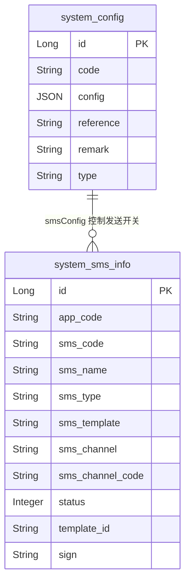
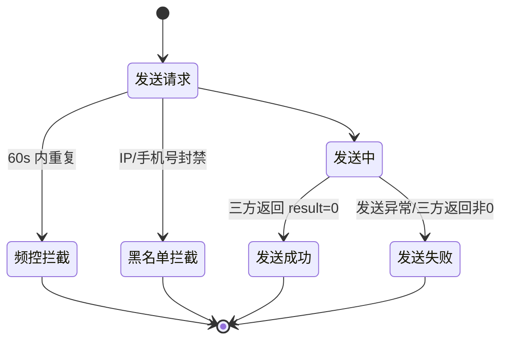

# 外部系统-短信 模块文档

> **文档目的**: 帮助 AI 大模型快速理解本模块业务逻辑和代码结构
> **更新时间**: 2026-01-27

---

## 模块职责

提供“短信验证码/短信通知”的发送能力，并对短信发送进行基础防刷与频控控制：
- 对外暴露短信验证码获取接口（注册/登录/密码相关/联系方式验证/银行卡预留手机号验证/忘记密码）
- 基于 Redis 做发送频控（60s 内不可重复触发）与防刷封禁（按 IP/手机号在一定时间窗口内超阈值加入黑名单集合）
- 基于 system_config 读取短信开关配置（`smsConfig`），控制验证码/变量短信是否允许发送
- 通过数据库表 `system_sms_info` 管理短信模板配置（按 `sms_code` + `app_code` 查询启用模板）
- 通过 HTTP 调用第三方短信服务商接口（当前实现为“大汉三通”，通过 Forest 发起请求）

边界：本文档聚焦“短信发送/验证码获取”这条链路；短信模板/渠道的后台管理 CRUD（若存在）不在此文档展开。

## 目录结构

```
lcyf-module-base/
└── lcyf-module-system-api/
    └── src/main/java/com/lcyf/cloud/module/system/api/
        ├── constants/
        │   └── SystemConstants.java
        ├── enums/system/sms/
        │   └── SmsCodeEnum.java
        └── pojo/
            ├── cmd/system/sms/
            │   └── SmsVerifyCodeCmd.java
            └── dto/
                ├── config/
                │   └── SmsConfig.java
                └── system/sms/
                    └── SystemSmsDTO.java

lcyf-module-system/
├── lcyf-module-system-adapter/
│   └── src/main/java/com/lcyf/cloud/module/system/adapter/
│       └── web/system/sms/
│           └── SmsController.java
│
└── lcyf-module-system-biz/
    └── src/main/java/com/lcyf/cloud/module/system/biz/
        ├── properties/
        │   └── SmsProperties.java
        ├── service/system/sms/
        │   └── ISmsServiceV2.java
        ├── service/impl/system/sms/
        │   ├── SmsServiceImplV2.java
        │   └── SmsServiceImpl.java  ← 已标记 @Deprecated（旧短信通道实现）
        └── infrastructure/
            ├── gateway/system/base/
            │   └── SystemConfigGateway.java
            └── gateway/system/sms/
                └── SystemSmsGateway.java
            └── entity/system/sms/
                └── SystemSmsDO.java
```

## 功能清单

| 功能 | 描述 | 入口 Controller | 核心 Service |
|------|------|-----------------|--------------|
| 获取短信验证码 | 根据 verifyType 选择模板与 Redis key，发送验证码并写入 Redis（5 分钟有效） | `SmsController.getLoginSms()` | `ISmsServiceV2.sendSmsVerifyCode()` |
| 发送频控 | 60s 内同一业务 key 不允许重复发送（防止“点太快”） | `SmsController.getLoginSms()` | `RedissonObject.trySetValue()` |
| 防刷封禁 | 根据短信类型（SmsCodeEnum）设定阈值与时间窗，超过阈值将 IP/手机号加入封禁集合 | `SmsServiceImplV2.sendSmsVerifyCode()` | `SmsServiceImplV2.recordForbidden()` |
| 模板配置查询 | 根据 `sms_code` + `app_code` 查询启用模板（status=SUCCESS） | - | `SystemSmsGateway.selectByCode()` |
| 系统配置开关 | 从 `system_config` 读取 `smsConfig`，控制验证码/变量短信开关 | - | `SmsServiceImplV2.getSystemConfig()` |

## 核心入口文件

### Controller 层

| 文件 | 路径 | 职责 |
|------|------|------|
| `SmsController.java` | `lcyf-module-system/lcyf-module-system-adapter/src/main/java/com/lcyf/cloud/module/system/adapter/web/system/sms/SmsController.java` | 对外提供“获取短信验证码”接口，做手机号校验、黑名单拦截、发送频控，并触发 Service 发送 |

### Service 层

| 文件 | 路径 | 职责 |
|------|------|------|
| `ISmsServiceV2.java` | `lcyf-module-system/lcyf-module-system-biz/src/main/java/com/lcyf/cloud/module/system/biz/service/system/sms/ISmsServiceV2.java` | 短信发送 V2 接口（验证码/变量短信） |
| `SmsServiceImplV2.java` | `lcyf-module-system/lcyf-module-system-biz/src/main/java/com/lcyf/cloud/module/system/biz/service/impl/system/sms/SmsServiceImplV2.java` | V2 实现：读取系统配置开关、查询模板、生成验证码、Redis 落库、防刷、通过 Forest 调第三方短信接口 |
| `SmsServiceImpl.java` | `lcyf-module-system/lcyf-module-system-biz/src/main/java/com/lcyf/cloud/module/system/biz/service/impl/system/sms/SmsServiceImpl.java` | 旧实现（`@Deprecated`），保留用于短信通道切换期间兼容 |

### Gateway 层

| 文件 | 路径 | 职责 |
|------|------|------|
| `SystemConfigGateway.java` | `lcyf-module-system/lcyf-module-system-biz/src/main/java/com/lcyf/cloud/module/system/biz/infrastructure/gateway/system/base/SystemConfigGateway.java` | 读取 `system_config` 配置（本文用到 `smsConfig`） |
| `SystemSmsGateway.java` | `lcyf-module-system/lcyf-module-system-biz/src/main/java/com/lcyf/cloud/module/system/biz/infrastructure/gateway/system/sms/SystemSmsGateway.java` | 查询短信模板配置（`system_sms_info`） |

### 实体层

| 文件 | 对应表 | 说明 |
|------|--------|------|
| `SystemSmsDO.java` | `system_sms_info` | 短信模板配置（按 appCode+smsCode 查询启用模板；含 templateId/sign 等大汉三通字段） |

## 核心流程

### 流程1: 获取验证码并发送短信

**触发条件**: 登录/注册/重置密码等场景，客户端请求获取短信验证码
**入口**: `SmsController.getLoginSms()`

```
请求入口
│
├─ 1. Controller 接收请求
│     └─ SmsController.getLoginSms(request, SmsVerifyCodeCmd)
│         ├─ 校验手机号: ValidationUtils.isMobile(cmd.getPhone())
│         ├─ 黑名单拦截:
│         │   ├─ RedisKeyConstants.SMS_BLOCKED_IP set contains(realIp)
│         │   └─ RedisKeyConstants.SMS_BLOCKED_MOBILE set contains(mobile)
│         ├─ 根据 verifyType 选择业务 key 与模板枚举 SmsCodeEnum
│         │   ├─ 1 注册: REDIS_KEY_SMS_REGISTER + appCode + phone, SmsCodeEnum.SMS_REGISTER
│         │   ├─ 2 登录: REDIS_KEY_SMS_LOGIN + appCode + phone, SmsCodeEnum.SMS_LOGIN
│         │   ├─ 3 密码相关(已登录): REDIS_KEY_SMS_PASSWORD + appCode + phone, SmsCodeEnum.SMS_PASSWORD
│         │   ├─ 4 联系方式验证(已登录): REDIS_KEY_SMS_CONTACT_MOBILE + appCode + phone, SmsCodeEnum.SMS_VERIFY_CONTACT_PHONE
│         │   ├─ 5 绑卡手机号验证(已登录): REDIS_KEY_SMS_BANK_MOBILE + appCode + phone, SmsCodeEnum.SMS_VERIFY_BANK_PHONE
│         │   └─ 6 忘记密码(未登录): REDIS_KEY_SMS_PASSWORD + appCode + phone, SmsCodeEnum.SMS_PASSWORD
│         ├─ 发送频控: redissonObject.trySetValue(key + SMS_FAST_KEY, "", SMS_KEY_FAST_EXPIRED)
│         └─ 调用发送: smsService.sendSmsVerifyCode(appCode, templateCode, phone)
│
└─ 2. Service 发送验证码
      └─ SmsServiceImplV2.sendSmsVerifyCode(appCode, code, phone)
          ├─ 读取系统配置开关: system_config[SystemConstants.SYSTEM_CONFIG_SMS_CODE="smsConfig"] -> SmsConfig
          ├─ 防刷校验: recordForbidden(code, ip, phone)
          ├─ 查询模板: SystemSmsGateway.selectByCode(code.getCode(), appCode)
          ├─ 生成验证码: generateVerifyCode() (6 位数字)
          ├─ 调第三方接口: sendMessage(templateId, phone, [verifyCode, code.getDesc()])
          └─ 写入验证码 Redis: redissonObject.setValue(redisKey, verifyCode, 5min)
```

### 流程2: 防刷封禁（按 IP/手机号）

**触发条件**: 在 `SmsCodeEnum` 指定的时间窗口内请求次数超过阈值（`blockThreshold`）
**入口**: `SmsServiceImplV2.recordForbidden()`

```
防刷记录
│
├─ 1. 组装统计 key
│     ├─ ipMapKey = realIp + ":" + code.getCode()
│     └─ mobileMapKey = phone + ":" + code.getCode()
│
├─ 2. 读取并更新频率记录（RMap 存储 "times:firstTimestamp"）
│     └─ doRecordFrequency(...)
│         ├─ 读取 RedisKeyConstants.SMS_IP_FREQUENCY_RECORD / SMS_MOBILE_FREQUENCY_RECORD
│         ├─ 超过窗口则重置次数
│         └─ times+1 写回
│
└─ 3. 超阈值则加入封禁集合
      ├─ RedisKeyConstants.SMS_BLOCKED_IP set add(realIp)
      └─ RedisKeyConstants.SMS_BLOCKED_MOBILE set add(phone)

Controller 在入口处读取封禁集合，命中则直接返回（不再发送）。
```

## 数据模型

### 核心实体关系



### 状态流转



## 依赖关系

### 依赖的模块

| 模块 | 调用方式 | 用途 |
|------|----------|------|
| Redis/Redisson | `RedissonObject` / `RedissonCollection` | 发送频控、验证码缓存、防刷黑名单与频率记录 |
| MyBatis-Plus | `SystemSmsGateway`(ServiceImpl) | 查询短信模板配置表 `system_sms_info` |
| system_config | `SystemConfigGateway.selectSystemConfig()` | 读取 `smsConfig`（`SmsConfig`：normal/variable/verify 开关） |
| Forest HTTP 客户端 | `Forest.post(...)` | 调用第三方短信服务（大汉三通） |
| 告警框架 | `AlertClient.alertByLevel(P0, ...)` | 短信发送失败时告警 |

### 被依赖的模块

| 模块 | 调用方式 | 提供能力 |
|------|----------|----------|
| auth/login | Controller 注入 `ISysUserLoginService` | 校验账户是否存在（部分 verifyType 分支） |

## RPC 接口

### 对外提供的接口

| 接口 | 方法 | 用途 |
|------|------|------|
| （未发现本子域对外 RPC） | - | - |

### 调用的外部接口

| 接口 | 方法 | 来源模块 |
|------|------|----------|
| 大汉三通短信 HTTP 接口 | `Forest.post(smsProperties.getSmsSendUrlDh3t())` | 第三方短信服务商 |

## 关键设计决策

| 决策点 | 选择 | 原因 |
|--------|------|------|
| 三方通道切换 | 保留 `SmsServiceImpl`，新增 `SmsServiceImplV2` 并在 Controller 使用 V2 | 兼容旧通道，平滑迁移，避免一次性替换导致风险 |
| 频控 key 策略 | `业务redisKey + "fast"`，TTL=60s | 简单通用，阻止短时间内重复点击/重复请求 |
| 防刷封禁策略 | 超阈值加入封禁 Set（IP/手机号） | 拦截明显异常流量，保护三方短信额度 |
| 模板配置来源 | `system_sms_info` 按 `sms_code` + `app_code` 取启用模板 | 支持多应用、多模板动态配置，无需发版 |

## 扩展指南

| 场景 | 操作步骤 |
|------|----------|
| 新增一种验证码场景 | 1) 在 `SmsController` 的 `verifyType` 分支增加映射（redis key + `SmsCodeEnum`） 2) 在 `system_sms_info` 配置对应 `sms_code` + `app_code` 的模板（启用状态） |
| 调整防刷阈值/窗口 | 修改 `SmsCodeEnum` 中对应枚举项的 `time` / `blockThreshold`（注意枚举 code 与数据库配置关联） |
| 切换短信服务商 | 在 `SmsServiceImplV2.sendMessage()` 内替换 Forest 请求与返回码解析；保留 `system_sms_info.template_id/sign` 以及配置字段与新通道的映射 |
| 关闭验证码短信 | 在 `system_config` 的 `smsConfig` 中设置 `verifyCodeSwitch` 为 N（对应 `SmsConfig`） |

## 常见问题

| 问题 | 解决方案 |
|------|----------|
| 为什么请求返回成功但没收到短信？ | 可能命中黑名单拦截（Controller 命中封禁集合会直接返回），或 `smsConfig.verifyCodeSwitch` 关闭，或模板 `system_sms_info` 未配置/未启用（`status != SUCCESS`） |
| 验证码存在哪？有效期多久？ | Redis：`oauth:sms-login:`/`oauth:sms-reg:`/`oauth:sms-pw:` 等前缀 + appCode + phone，TTL=5 分钟（`MIN_5`） |
| “发送过于频繁”怎么触发？ | Controller 使用 `redissonObject.trySetValue(key + "fast", "", 60s)` 做频控，60s 内重复触发返回 `SMS_CODE_SEND_TOO_FAST` |
