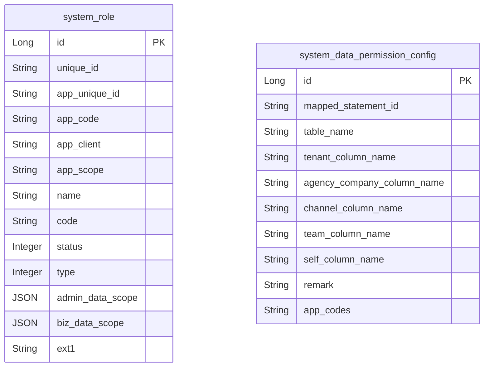
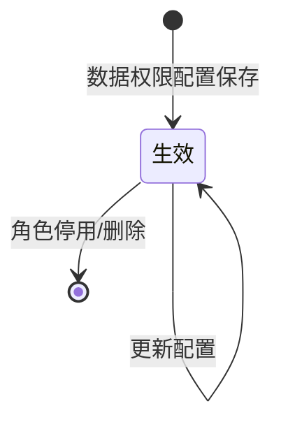

# 系统账号用户、组织架构以及权限-数据 模块文档

> **文档目的**: 帮助 AI 大模型快速理解本模块业务逻辑和代码结构
> **更新时间**: 2026-01-27

---

## 模块职责

提供“角色数据权限（数据范围）”的配置与读取，并通过框架层的数据权限组件在查询时自动注入过滤条件：
- 管理后台：后台角色/业务角色分别配置数据权限（update/query dataAuth）
- 数据权限模型存储于 `system_role.admin_data_scope` / `system_role.biz_data_scope`（JSON）
- 运行时：`lcyf-framework-starter-dataPermission` 根据当前用户角色汇总数据权限条件，并在 BeanSearcher/MyBatis 查询参数中生效

边界：本文档不展开各业务模块如何使用数据权限，只描述 system 模块的配置入口与 framework 的执行机制（参数过滤、角色解析）。

## 目录结构

```
lcyf-module-system/
├── lcyf-module-system-adapter/
│   └── src/main/java/com/lcyf/cloud/module/system/adapter/
│       └── web/system/role/
│           ├── RoleAdminController.java
│           └── RoleBizController.java
│
└── lcyf-module-system-biz/
    └── src/main/java/com/lcyf/cloud/module/system/biz/
        └── service/system/role/
            ├── IRoleService.java
            └── impl/system/role/
                └── RoleServiceImpl.java

lcyf-framework/
└── lcyf-framework-starter-dataPermission/
    └── src/main/java/com/lcyf/cloud/framework/dataPermission/
        ├── api/pojo/dto/
        │   ├── DataPermissionDto.java
        │   └── DataPermissionRoleRelDto.java
        ├── infrastructure/
        │   ├── entity/
        │   │   ├── DataPermissionConfigDo.java
        │   │   └── DataPermissionRoleRelDo.java
        │   ├── gateway/
        │   │   └── DataPermissionConfigGateway.java
        │   └── mapper/
        │       └── DataPermissionConfigMapper.java
        ├── interceptor/
        │   └── BsPermissionParamsInterceptor.java
        └── service/impl/
            └── DataPermissionServiceImpl.java
```

## 功能清单

| 功能 | 描述 | 入口 Controller | 核心 Service |
|------|------|-----------------|--------------|
| 更新后台角色数据权限 | 校验 AppScope=ADMIN；校验各 scope level 的 range 要求；写回 role | `RoleAdminController.updateDataAuth()` | `IRoleService.adminRoleUpdateDataAuth()` |
| 获取后台角色数据权限 | 返回 `system_role.admin_data_scope` | `RoleAdminController.queryDataAuth()` | `IRoleService.getAdminRoleDataAuth()` |
| 更新业务角色数据权限 | 校验 AppScope=BUSINESS；按 appCode(LCYF/JI_ZHAN) 校验 level 与 range | `RoleBizController.updateDataAuth()` | `IRoleService.bizRoleUpdateDataAuth()` |
| 获取业务角色数据权限 | 返回 `system_role.biz_data_scope` | `RoleBizController.queryDataAuth()` | `IRoleService.getBizRoleDataAuth()` |
| 汇总当前用户数据权限（运行时） | 读取当前用户角色并合并数据范围（多角色合并） | （无 Controller） | `IDataPermissionService.getDataPermissions()` |
| BeanSearcher 参数注入 | 在 BeanSearcher 查询参数中注入 tenant/agency/dept/user 等过滤条件 | （框架拦截器） | `BsPermissionParamsInterceptor.doFilter()` |

## 核心入口文件

### Controller 层
| 文件 | 路径 | 职责 |
|------|------|------|
| `RoleAdminController.java` | `lcyf-module-system/lcyf-module-system-adapter/src/main/java/com/lcyf/cloud/module/system/adapter/web/system/role/RoleAdminController.java` | 后台角色数据权限配置/查询入口 |
| `RoleBizController.java` | `lcyf-module-system/lcyf-module-system-adapter/src/main/java/com/lcyf/cloud/module/system/adapter/web/system/role/RoleBizController.java` | 业务角色数据权限配置/查询入口 |

### Service 层
| 文件 | 路径 | 职责 |
|------|------|------|
| `IRoleService.java` | `lcyf-module-system/lcyf-module-system-biz/src/main/java/com/lcyf/cloud/module/system/biz/service/system/role/IRoleService.java` | 角色与数据权限服务接口 |
| `RoleServiceImpl.java` | `lcyf-module-system/lcyf-module-system-biz/src/main/java/com/lcyf/cloud/module/system/biz/service/impl/system/role/RoleServiceImpl.java` | 数据权限校验与写回 role（admin/biz 两套模型） |
| `IDataPermissionService.java` | `lcyf-framework/lcyf-framework-starter-dataPermission/src/main/java/com/lcyf/cloud/framework/dataPermission/service/IDataPermissionService.java` | 运行时汇总数据权限条件 |
| `DataPermissionServiceImpl.java` | `lcyf-framework/lcyf-framework-starter-dataPermission/src/main/java/com/lcyf/cloud/framework/dataPermission/service/impl/DataPermissionServiceImpl.java` | 多角色合并数据范围，提供 dept/agency 等集合 |

### Gateway 层
| 文件 | 路径 | 职责 |
|------|------|------|
| `DataPermissionConfigGateway.java` | `lcyf-framework/lcyf-framework-starter-dataPermission/src/main/java/com/lcyf/cloud/framework/dataPermission/infrastructure/gateway/DataPermissionConfigGateway.java` | 根据 userCode 查询角色/部门等；加载数据权限配置 |

### 实体层
| 文件 | 对应表 | 说明 |
|------|--------|------|
| `RoleDo.java` | `system_role` | role 持久化（含 `admin_data_scope` / `biz_data_scope` JSON） |
| `DataPermissionConfigDo.java` | `system_data_permission_config` | 数据权限配置（mapped_statement_id/table/字段映射/应用码等） |

## 核心流程

### 流程1: 更新后台角色数据权限

**触发条件**: 管理后台编辑后台角色的数据权限
**入口**: `RoleAdminController.updateDataAuth()`

- HTTP：`PUT /api/v1/system/auth/role/admin/update/dataAuth`

```
请求入口
│
├─ 1. Controller
│     └─ RoleAdminController.updateDataAuth(cmd)
│
├─ 2. Service 校验与写回
│     └─ RoleServiceImpl.adminRoleUpdateDataAuth(cmd)
│         ├─ roleGateway.selectById(cmd.id)
│         ├─ 校验 role.appScope == ADMIN
│         ├─ tenant/agency/channel/team 各 scope level 校验：ASSIGN/ASSIGN_DOWN 必须有 range
│         ├─ channel level 为 CHANNEL_ALL 时，会读取字典(lcyfChannelGroup)并写入 role.ext1
│         └─ roleGateway.update(roleUpdateCmd)
│
└─ 3. 返回
      └─ CommonResult.success(true)
```

### 流程2: 运行时汇总数据权限（多角色合并）

**触发条件**: 触发数据权限过滤的查询（例如 BeanSearcher 参数过滤）
**入口**: `DataPermissionServiceImpl.getDataPermissions()`

```
运行时
│
├─ 1. 获取登录上下文
│     └─ UserInfoContextHolder.getUserCode/tenantCode/rootDeptCode/loginUniqueId/appCode
│
├─ 2. 查用户绑定的角色
│     └─ DataPermissionConfigGateway.selectRoleUniqueIdsByUserCode(userCode)
│         (SQL: system_user_role_rel + system_role)
│
├─ 3. 加载角色数据权限模型
│     └─ DataPermissionConfigGateway.selectRoleListById(roleUniqueIds)
│         -> DataPermissionRoleRelDto(adminDataScope/bizDataScope)
│
├─ 4. 合并数据范围
│     ├─ ADMIN 角色：按 agency/channel/team 等 scope 计算并合并集合
│     └─ BUSINESS 角色：按 bizDataScope level 合并 userCode/loginUniqueId/deptCodeSet
│
└─ 5. 返回 DataPermissionDto
      └─ appCode/userCode/loginUniqueId/tenantCodeSet/agencyCompanyCodeSet/deptCodeSet
```

### 流程3: BeanSearcher 参数注入（示例）

**触发条件**: BeanSearcher 执行查询
**入口**: `BsPermissionParamsInterceptor.doFilter()`

```
BeanSearcher 参数处理
│
├─ 1. 判断是否需要数据权限
│     └─ BsDataTableScope 标注存在时处理
│
├─ 2. 获取 DataPermissionDto
│     └─ dataPermissionService.getDataPermissions()
│
├─ 3. 解析字段上的 BsDataFieldScope
│     └─ 根据 dataType(TENANT/AGENCY_COMPANY/LCYF_CHANNEL/JZ_TEAM/SELF/LOGIN_ID) 注入 InList/Equal 条件
│
└─ 4. 构造 groupExpr
      ├─ SELF/LOGIN_ID 用 OR
      └─ 业务条件(团队/渠道/机构/商户)用 AND
```

## 数据模型

### 核心实体关系



### 状态流转



## 依赖关系

### 依赖的模块
| 模块 | 调用方式 | 用途 |
|------|----------|------|
| 角色模块 | 本地 Service/Gateway | 存储与校验 role 的数据权限 JSON |
| dataPermission starter | 框架组件 | 运行时汇总权限并注入查询条件 |
| 字典模块 | 本地 Gateway | 后台角色 CHANNEL_ALL 时读取 `lcyfChannelGroup` 并写入 role.ext1 |

### 被依赖的模块
| 模块 | 调用方式 | 提供能力 |
|------|----------|----------|
| 各业务查询接口 | BeanSearcher/MyBatis 查询 | 自动追加数据权限过滤条件 |

## RPC 接口

### 对外提供的接口
| 接口 | 方法 | 用途 |
|------|------|------|
| （本子域未发现对外 Dubbo RPC） | - | - |

### 调用的外部接口
| 接口 | 方法 | 来源模块 |
|------|------|----------|
| （本子域未发现直接外部接口） | - | - |

## 关键设计决策

| 决策点 | 选择 | 原因 |
|--------|------|------|
| 数据权限模型存储 | role 表 JSON 字段（admin_data_scope/biz_data_scope） | 与角色绑定，便于管理后台统一配置 |
| 多角色合并 | union 合并集合（dept/agency 等） | 满足用户拥有多个角色时的权限叠加 |
| BeanSearcher 注入 | 通过 ParamFilter 在 Map 参数层注入 | 对业务查询零侵入，统一生效 |

## 扩展指南

| 场景 | 操作步骤 |
|------|----------|
| 新增数据权限维度 | 扩展 `DataPermissionDto` 字段与 `DataPermissionServiceImpl` 计算逻辑；同步 `BsPermissionParamsInterceptor` 注入 |
| 增加 MyBatis 映射配置 | 在 `system_data_permission_config` 增加 mappedStatementId 与字段映射；在执行侧读取使用 |
| 调整 OR/AND 组合规则 | 修改 `BsPermissionParamsInterceptor` 中 groupExpr 构造 |

## 常见问题

| 问题 | 解决方案 |
|------|----------|
| 为什么后台角色更新会要求 range？ | `RoleServiceImpl.adminRoleUpdateDataAuth` 对 ASSIGN/ASSIGN_DOWN 场景要求 `range` 非空，否则抛 `NEED_DATA_SCOPE_RANGE` |
| 为什么 role.ext1 会被写入？ | 后台角色渠道权限（CHANNEL_ALL/ASSIGN）会把渠道组别写入 ext1（逗号分隔），供下游使用 |
