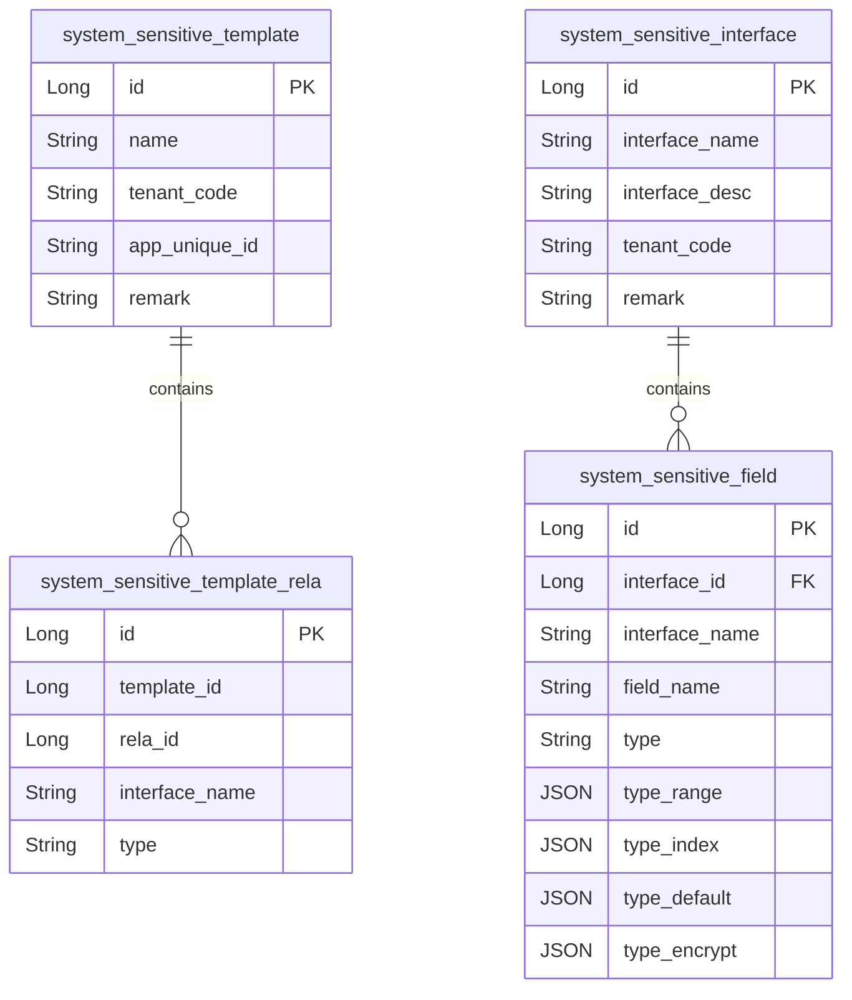
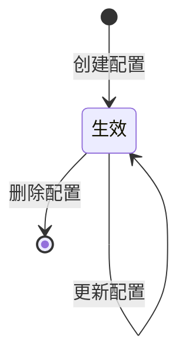

# 系统账号用户、组织架构以及权限-脱敏 模块文档

> **文档目的**: 帮助 AI 大模型快速理解本模块业务逻辑和代码结构
> **更新时间**: 2026-01-27

---

## 模块职责

提供“接口级字段脱敏”配置与获取能力：
- 管理后台维护脱敏模板、接口脱敏明细
- 业务侧根据当前用户、接口 URL 获取应当应用的脱敏字段配置（支持交集查询）
- 底层依赖 `lcyf-framework-starter-sensitive-dataChange` 提供表结构与通用能力

边界：
- 本文档不展开具体的脱敏执行（如何在序列化/返回时生效），只覆盖配置与查询链路在 system 模块的入口与数据模型。

## 目录结构

```
lcyf-module-system/
├── lcyf-module-system-adapter/
│   └── src/main/java/com/lcyf/cloud/module/system/adapter/
│       └── web/system/
│           ├── sensitive/
│           │   └── SensitiveController.java
│           └── permission/
│               └── PermissionController.java
│
└── lcyf-module-system-biz/
    └── src/main/java/com/lcyf/cloud/module/system/biz/
        └── service/system/sensitive/
            ├── ISensitiveTemplateService.java
            └── ISensitiveInterfaceService.java

lcyf-framework/
└── lcyf-framework-starter-sensitive-dataChange/
    └── src/main/java/com/lcyf/cloud/framework/sensitiveDataChange/
        └── infrastructure/
            ├── entity/
            │   ├── SensitiveTemplateDo.java
            │   ├── SensitiveInterfaceDo.java
            │   ├── SensitiveFieldDo.java
            │   └── SensitiveTemplateRelaDo.java
            └── mapper/
                ├── SensitiveTemplateMapper.java
                ├── SensitiveInterfaceMapper.java
                ├── SensitiveFieldMapper.java
                └── SensitiveTemplateRelaMapper.java
```

## 功能清单

| 功能 | 描述 | 入口 Controller | 核心 Service |
|------|------|-----------------|--------------|
| 脱敏模板分页 | 按 tenantCode 分页查询模板 | `SensitiveController.queryTemplatePage()` | `ISensitiveTemplateService.getSensitiveTemplatePage()` |
| 脱敏模板详情（编辑用） | 仅用于编辑的 simple 详情 | `SensitiveController.queryTemplate()` | `ISensitiveTemplateService.getSimple()` |
| 脱敏模板详情 | 详情查询 | `SensitiveController.queryTemplateDetails()` | `ISensitiveTemplateService.get()` |
| 新建脱敏模板 | tenantCode 从登录态注入 | `SensitiveController.addTemplate()` | `ISensitiveTemplateService.create()` |
| 更新脱敏模板 | 标注“需要记录数据变更” | `SensitiveController.updateTemplate()` | `ISensitiveTemplateService.modify()` |
| 删除脱敏模板 | 删除模板 | `SensitiveController.deleteTemplate()` | `ISensitiveTemplateService.delete()` |
| 查询模板关联角色 | 查询模板绑定的角色 | `SensitiveController.queryTemplateRole()` | `ISensitiveTemplateService.getTemplateRole()` |
| 角色可选模板 | 根据 roleUniqueId 返回可选模板 | `SensitiveController.queryTemplateRoleSelect()` | `ISensitiveTemplateService.getTemplateRoleSelect()` |
| 接口脱敏分页 | 按 tenantCode 分页查询接口脱敏 | `SensitiveController.queryInterfacePage()` | `ISensitiveInterfaceService.getSensitiveInterfacePage()` |
| 接口脱敏列表（带字段） | 查询某 tenant 的接口脱敏明细（带字段） | `SensitiveController.queryInterfaceSelect()` | `ISensitiveInterfaceService.getSelect()` |
| 接口脱敏详情 | 查询单条接口脱敏配置 | `SensitiveController.queryInterface()` | `ISensitiveInterfaceService.get()` |
| 新建接口脱敏 | tenantCode 从登录态注入 | `SensitiveController.addInterface()` | `ISensitiveInterfaceService.create()` |
| 更新接口脱敏 | 标注“需要记录数据变更” | `SensitiveController.updateInterface()` | `ISensitiveInterfaceService.modify()` |
| 删除接口脱敏 | 删除接口脱敏配置 | `SensitiveController.deleteInterface()` | `ISensitiveInterfaceService.delete()` |
| 查询接口关联模板 | 查询接口关联的模板信息 | `SensitiveController.queryInterfaceRelaTemplate()` | `ISensitiveInterfaceService.getInterfaceRelaTemplate()` |
| 导入接口脱敏配置 | 导入云服接口脱敏配置 | `SensitiveController.importInterface()` | `ISensitiveInterfaceService.importInterface()` |
| 获取接口脱敏配置（运行时） | 根据 userCode/userId + url 获取脱敏字段 | `PermissionController.acquireSensitive()` | `IPermissionService.getSensitivePermission()` |
| 获取接口脱敏配置（交集） | 交集方式获取脱敏字段 | `PermissionController.acquireSensitiveToOverlap()` | `IPermissionService.getSensitivePermissionToOverlap()` |

## 核心入口文件

### Controller 层
| 文件 | 路径 | 职责 |
|------|------|------|
| `SensitiveController.java` | `lcyf-module-system/lcyf-module-system-adapter/src/main/java/com/lcyf/cloud/module/system/adapter/web/system/sensitive/SensitiveController.java` | 管理后台：脱敏模板与接口脱敏明细的 CRUD + 导入 |
| `PermissionController.java` | `lcyf-module-system/lcyf-module-system-adapter/src/main/java/com/lcyf/cloud/module/system/adapter/web/system/permission/PermissionController.java` | 运行时：按 URL 获取当前用户的脱敏字段配置 |

### Service 层
| 文件 | 路径 | 职责 |
|------|------|------|
| `ISensitiveTemplateService.java` | `lcyf-module-system/lcyf-module-system-biz/src/main/java/com/lcyf/cloud/module/system/biz/service/system/sensitive/ISensitiveTemplateService.java` | 脱敏模板服务接口 |
| `ISensitiveInterfaceService.java` | `lcyf-module-system/lcyf-module-system-biz/src/main/java/com/lcyf/cloud/module/system/biz/service/system/sensitive/ISensitiveInterfaceService.java` | 接口脱敏明细服务接口 |

### Gateway 层
| 文件 | 路径 | 职责 |
|------|------|------|
| （底层表与 Mapper 在 framework starter 内） | - | - |

### 实体层
| 文件 | 对应表 | 说明 |
|------|--------|------|
| `SensitiveTemplateDo.java` | `system_sensitive_template` | 脱敏模板（tenant/appUniqueId 维度） |
| `SensitiveInterfaceDo.java` | `system_sensitive_interface` | 接口脱敏配置主体 |
| `SensitiveFieldDo.java` | `system_sensitive_field` | 接口字段级脱敏规则（type + typeRange/typeIndex/typeDefault/typeEncrypt） |
| `SensitiveTemplateRelaDo.java` | `system_sensitive_template_rela` | 模板与接口/字段的关联关系 |

## 核心流程

### 流程1: 管理后台创建脱敏模板

**触发条件**: 管理员新建脱敏模板
**入口**: `SensitiveController.addTemplate()`

- HTTP：`POST /api/v1/system/auth/sensitive/template/add`

```
请求入口
│
├─ 1. Controller
│     └─ SensitiveController.addTemplate(cmd)
│         └─ cmd.tenantCode = LoginUtil.tenantCode()
│
├─ 2. Service
│     └─ ISensitiveTemplateService.create(cmd)
│
└─ 3. 返回
      └─ CommonResult.success(templateId)
```

### 流程2: 运行时按 URL 获取接口脱敏字段

**触发条件**: 接口调用前/返回前，需要知道该 URL 对应的脱敏字段
**入口**: `PermissionController.acquireSensitive()`

- HTTP：`POST /api/v1/system/auth/permission/acquireSensitive`

```
请求入口
│
├─ 1. Controller
│     └─ PermissionController.acquireSensitive(cmd)
│         └─ permissionService.getSensitivePermission(userCode, userId, cmd.url)
│
└─ 2. Service
      └─ IPermissionService.getSensitivePermission(...)
          （具体如何匹配模板/接口/字段，需继续在 PermissionService 实现与 framework starter 内定位）
```

## 数据模型

### 核心实体关系



### 状态流转



## 依赖关系

### 依赖的模块
| 模块 | 调用方式 | 用途 |
|------|----------|------|
| `lcyf-framework-starter-sensitive-dataChange` | Maven/本地依赖 | 提供脱敏配置的表结构、Mapper 与通用 DTO/Cmd |
| system 权限模块 | 本地 Service 调用 | 通过 `PermissionController` 暴露运行时查询能力 |

### 被依赖的模块
| 模块 | 调用方式 | 提供能力 |
|------|----------|----------|
| 业务模块（各 API） | 本地依赖/拦截器 | 通过运行时查询获取字段脱敏规则（最终在返回时生效） |

## RPC 接口

### 对外提供的接口
| 接口 | 方法 | 用途 |
|------|------|------|
| （本子域未发现对外 Dubbo RPC） | - | - |

### 调用的外部接口
| 接口 | 方法 | 来源模块 |
|------|------|----------|
| （本子域未发现直接外部 RPC） | - | - |

## 关键设计决策

| 决策点 | 选择 | 原因 |
|--------|------|------|
| 脱敏配置下沉到 framework starter | system 仅提供管理/查询入口 | 多业务模块复用同一套脱敏配置与表结构 |
| tenantCode 注入方式 | 创建/分页时由登录态注入 | 防止前端伪造 tenantCode，保证租户隔离 |
| 运行时获取入口放在 PermissionController | 与权限体系同入口 | 便于在登录后/接口调用前统一获取权限与脱敏规则 |

## 扩展指南

| 场景 | 操作步骤 |
|------|----------|
| 新增脱敏类型 | 扩展 `SensitiveFieldDo.type` 可选值，并在执行侧（框架/处理器）实现对应策略 |
| 按应用维度隔离 | 使用 `SensitiveTemplateDo.app_unique_id` 约束模板范围，并在查询侧加入过滤 |
| 提供更细的匹配规则 | 在 framework starter 内扩展 URL 匹配、模板关系模型（`system_sensitive_template_rela`） |

## 常见问题

| 问题 | 解决方案 |
|------|----------|
| 为什么 addTemplate/addInterface 不让前端传 tenantCode？ | Controller 会用 `LoginUtil.tenantCode()` 覆盖 cmd.tenantCode，保证租户隔离 |
| acquireSensitive 和 acquireSensitive/overlap 有什么区别？ | `PermissionController` 分别调用 `getSensitivePermission` 与 `getSensitivePermissionToOverlap`（交集逻辑在 service 内实现） |
