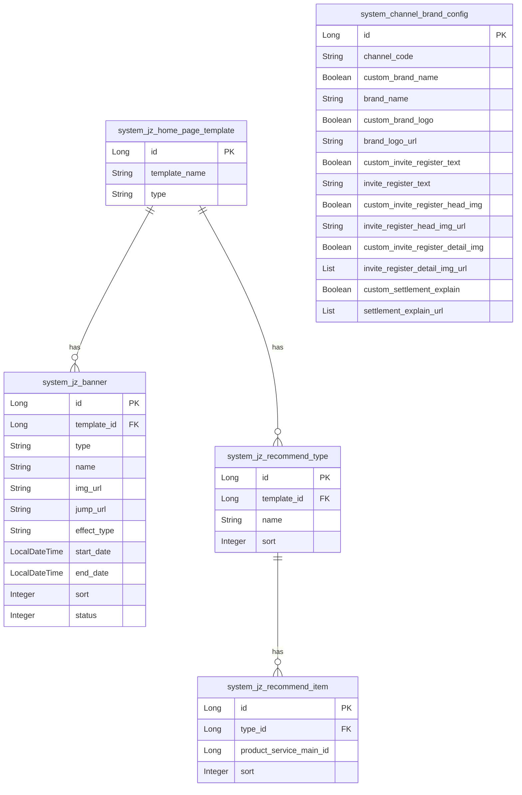
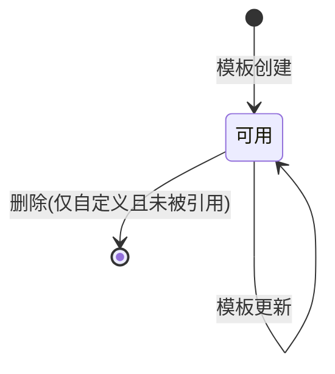

# 配置管理-即展 模块文档

> **文档目的**: 帮助 AI 大模型快速理解本模块业务逻辑和代码结构
> **更新时间**: 2026-01-27

---

## 模块职责

提供“即展（JZ）端”相关的配置管理能力，核心包括：
- 即展首页模板管理：模板列表/新增/详情/更新/删除
- 模板分配：将模板分配给团队（ToA 渠道）使用
- 渠道端查询：根据登录态/渠道信息获取当前生效的首页模板详情
- 品牌设置：橙芯后台与渠道端查询/保存渠道品牌配置（品牌名、logo、邀请注册文案与图片、结算说明等）

边界：本文档聚焦“即展配置”子域；其他配置（system_config、字典、渠道 banner）在对应文档中描述。

## 目录结构

```
lcyf-module-system/
├── lcyf-module-system-adapter/
│   └── src/main/java/com/lcyf/cloud/module/system/adapter/
│       └── web/system/base/
│           └── JzConfigController.java
│
└── lcyf-module-system-biz/
    └── src/main/java/com/lcyf/cloud/module/system/biz/
        ├── service/system/base/
        │   ├── IJzConfigService.java
        │   └── impl/system/base/
        │       └── JzConfigServiceImpl.java
        │
        └── infrastructure/
            ├── entity/system/base/
            │   ├── JzHomePageTemplateDo.java
            │   ├── JzBannerDo.java
            │   ├── JzRecommendTypeDo.java
            │   ├── JzRecommendItemDo.java
            │   └── ChannelBrandConfigDo.java
            ├── gateway/system/base/
            │   ├── JzHomePageTemplateGateway.java
            │   ├── JzBannerGateway.java
            │   ├── JzRecommendTypeGateway.java
            │   ├── JzRecommendItemGateway.java
            │   └── ChannelBrandConfigGateway.java
            └── mapper/system/base/
                ├── JzHomePageTemplateMapper.java
                ├── JzBannerMapper.java
                ├── JzRecommendTypeMapper.java
                ├── JzRecommendItemMapper.java
                └── ChannelBrandConfigMapper.java
```

## 功能清单

| 功能 | 描述 | 入口 Controller | 核心 Service |
|------|------|-----------------|--------------|
| 首页模板查询 | 查询即展首页模板列表 | `JzConfigController.queryHomePageTemplate()` | `IJzConfigService.getHomePageTemplate()` |
| 新增首页模板 | 创建自定义模板（校验名称唯一） | `JzConfigController.addHomePageTemplate()` | `IJzConfigService.createHomePageTemplate()` |
| 首页模板详情 | 查询模板详情（含 banner、推荐分类、推荐产品） | `JzConfigController.queryHomePageTemplateDetails()` | `IJzConfigService.getHomePageTemplateDetails()` |
| 删除首页模板 | 仅允许删除非默认模板；且不能被渠道使用 | `JzConfigController.deleteHomePageTemplate()` | `IJzConfigService.deleteHomePageTemplate()` |
| 更新模板详情 | 更新 banner、推荐分类/产品等 | `JzConfigController.updateHomePageTemplateDetails()` | `IJzConfigService.updateHomePageTemplateDetails()` |
| 模板分配 | 设置团队（ToA 渠道）首页模板 | `JzConfigController.assignHomePageTemplate()` | `IJzConfigService.assignHomePageTemplate()` |
| 渠道端模板详情 | 渠道端获取首页模板详情（可匿名/已登录） | `JzConfigController.queryHomePageTemplateDetailsChannel()` | `IJzConfigService.getHomePageTemplateDetailsChannel()` |
| 橙芯后台品牌设置查询 | 后台按渠道编码查询品牌设置 | `JzConfigController.queryBrandConfig()` | `IJzConfigService.getBrandConfig()` |
| 保存/更新品牌设置 | 保存/更新渠道品牌设置 | `JzConfigController.brandConfig()` | `IJzConfigService.brandConfig()` |
| 渠道端品牌设置查询 | 渠道端查询品牌设置 | `JzConfigController.queryBrandConfigChannel()` | `IJzConfigService.getBrandConfigChannel()` |

## 核心入口文件

### Controller 层
| 文件 | 路径 | 职责 |
|------|------|------|
| `JzConfigController.java` | `lcyf-module-system/lcyf-module-system-adapter/src/main/java/com/lcyf/cloud/module/system/adapter/web/system/base/JzConfigController.java` | 即展配置对外 HTTP 入口：模板/分配/品牌设置 |

### Service 层
| 文件 | 路径 | 职责 |
|------|------|------|
| `IJzConfigService.java` | `lcyf-module-system/lcyf-module-system-biz/src/main/java/com/lcyf/cloud/module/system/biz/service/system/base/IJzConfigService.java` | 即展配置服务接口 |
| `JzConfigServiceImpl.java` | `lcyf-module-system/lcyf-module-system-biz/src/main/java/com/lcyf/cloud/module/system/biz/service/impl/system/base/JzConfigServiceImpl.java` | 即展配置业务实现（模板/推荐/bannner/品牌设置） |

### Gateway 层
| 文件 | 路径 | 职责 |
|------|------|------|
| `JzHomePageTemplateGateway.java` | `lcyf-module-system/lcyf-module-system-biz/src/main/java/com/lcyf/cloud/module/system/biz/infrastructure/gateway/system/base/JzHomePageTemplateGateway.java` | 首页模板 CRUD/分页/默认模板查询 |
| `JzBannerGateway.java` | `lcyf-module-system/lcyf-module-system-biz/src/main/java/com/lcyf/cloud/module/system/biz/infrastructure/gateway/system/base/JzBannerGateway.java` | banner CRUD 与按模板查询（含启用时间过滤） |
| `JzRecommendTypeGateway.java` | `lcyf-module-system/lcyf-module-system-biz/src/main/java/com/lcyf/cloud/module/system/biz/infrastructure/gateway/system/base/JzRecommendTypeGateway.java` | 推荐分类 CRUD 与按模板查询 |
| `JzRecommendItemGateway.java` | `lcyf-module-system/lcyf-module-system-biz/src/main/java/com/lcyf/cloud/module/system/biz/infrastructure/gateway/system/base/JzRecommendItemGateway.java` | 推荐产品 CRUD 与按分类查询 |
| `ChannelBrandConfigGateway.java` | `lcyf-module-system/lcyf-module-system-biz/src/main/java/com/lcyf/cloud/module/system/biz/infrastructure/gateway/system/base/ChannelBrandConfigGateway.java` | 渠道品牌设置按渠道查询与保存 |

### 实体层
| 文件 | 对应表 | 说明 |
|------|--------|------|
| `JzHomePageTemplateDo.java` | `system_jz_home_page_template` | 首页模板（tenant + 模板名 + 类型） |
| `JzBannerDo.java` | `system_jz_banner` | 模板 banner（PC/H5、启用时间、状态、排序） |
| `JzRecommendTypeDo.java` | `system_jz_recommend_type` | 推荐分类（templateId + name + sort） |
| `JzRecommendItemDo.java` | `system_jz_recommend_item` | 推荐产品（typeId + productServiceMainId + sort） |
| `ChannelBrandConfigDo.java` | `system_channel_brand_config` | 渠道品牌设置（品牌名、logo、邀请注册文案/图片、结算说明等） |

## 核心流程

### 流程1: 查询模板详情（含 banner + 推荐）

**触发条件**: 管理后台查看模板详情
**入口**: `JzConfigController.queryHomePageTemplateDetails()`

- HTTP：`GET /api/v1/system/jz/auth/homePage/template/details/{id}`

```
请求入口
│
├─ 1. Controller
│     └─ JzConfigController.queryHomePageTemplateDetails(id)
│
├─ 2. Service
│     └─ JzConfigServiceImpl.getHomePageTemplateDetails(id)
│         ├─ homePageTemplateGateway.selectByIdToDetails(id)
│         ├─ bannerGateway.selectByTemplateIdAll(id) -> sort
│         ├─ recommendTypeGateway.selectByTemplateId(id) -> sort
│         ├─ recommendItemGateway.selectInTypeIds(typeIds) -> groupBy(typeId)
│         └─ productServiceApi.getProductServiceMainInfoListByIds(...) 组装产品信息
│
└─ 3. 返回
      └─ CommonResult.success(JzHomePageTemplateDetailsDto)
```

### 流程2: 删除模板（限制默认模板与被引用模板）

**触发条件**: 管理后台删除自定义模板
**入口**: `JzConfigController.deleteHomePageTemplate()`

- HTTP：`DELETE /api/v1/system/jz/auth/homePage/template/{id}`

```
请求入口
│
├─ 1. Controller
│     └─ JzConfigController.deleteHomePageTemplate(id)
│
├─ 2. Service
│     └─ JzConfigServiceImpl.deleteHomePageTemplate(id)
│         ├─ homePageTemplateGateway.selectById(id) 不存在直接 true
│         ├─ 默认模板(HomePageTemplateTypeEnum.DEFAULT)禁止删除
│         ├─ channelToAGateway.selectByHomePageTemplateId(id) 非空禁止删除
│         ├─ homePageTemplateGateway.removeById(id)
│         ├─ bannerGateway.deleteByTemplateId(id)
│         ├─ recommendTypeGateway.deleteByTemplateId(id)
│         └─ recommendItemGateway.removeByTypeIds(typeIds)
│
└─ 3. 返回
      └─ CommonResult.success(true)
```

## 数据模型

### 核心实体关系



### 状态流转



## 依赖关系

### 依赖的模块
| 模块 | 调用方式 | 用途 |
|------|----------|------|
| 产品模块 | `@DubboReference ProductServiceApi/ProductV2Api/ProductSalesApi` | 模板详情组装推荐产品信息 |
| 财务模块 | `@DubboReference FinanceApi/FinanceApiV2` | （即展配置实现中依赖，用于费率/基本法相关逻辑） |
| 签单员模块 | `@DubboReference SignerApi` | （即展配置实现中依赖，具体用途需在后续流程中补充定位） |

### 被依赖的模块
| 模块 | 调用方式 | 提供能力 |
|------|----------|----------|
| 即展渠道端/管理后台 | HTTP | 读取模板详情与品牌配置 |

## RPC 接口

### 对外提供的接口
| 接口 | 方法 | 用途 |
|------|------|------|
| （本子域未发现对外 Dubbo RPC） | - | - |

### 调用的外部接口
| 接口 | 方法 | 来源模块 |
|------|------|----------|
| `FinanceApi/FinanceApiV2` | 多个 | `lcyf-module-finance-api` |
| `ProductServiceApi/ProductV2Api/ProductSalesApi` | 多个 | `lcyf-module-product-api` |
| `SignerApi` | 多个 | `lcyf-module-system-api` |

## 关键设计决策

| 决策点 | 选择 | 原因 |
|--------|------|------|
| 模板删除限制 | 默认模板不可删、被渠道引用不可删 | 避免线上默认模板缺失或渠道首页配置失效 |
| 渠道端模板详情获取 | 支持匿名访问（StpUtil.isLogin 分支） | 允许未登录场景获取配置，同时登录态会写入 tenantCode |
| banner 生效过滤 | Gateway 按 startDate<=now + status=ENABLE 过滤 | 防止未到生效时间的 banner 提前展示 |

## 扩展指南

| 场景 | 操作步骤 |
|------|----------|
| 增加新的首页模块（推荐区类型） | 扩展 `system_jz_recommend_type/item` 模型与 `JzConfigServiceImpl` 组装逻辑 |
| 增加 banner 类型 | 扩展 `system_jz_banner.type` 取值与前端展示逻辑；Gateway 查询规则按需调整 |
| 增加品牌配置字段 | 扩展 `system_channel_brand_config` 与 `ChannelBrandConfigDo`，并更新 assembler/gateway/service |

## 常见问题

| 问题 | 解决方案 |
|------|----------|
| 为什么不能删除默认模板？ | `JzConfigServiceImpl.deleteHomePageTemplate` 对 `HomePageTemplateTypeEnum.DEFAULT` 直接抛错 |
| 为什么模板被渠道使用时不能删除？ | 删除前会检查 `channelToAGateway.selectByHomePageTemplateId(id)`，非空则拒绝 |
