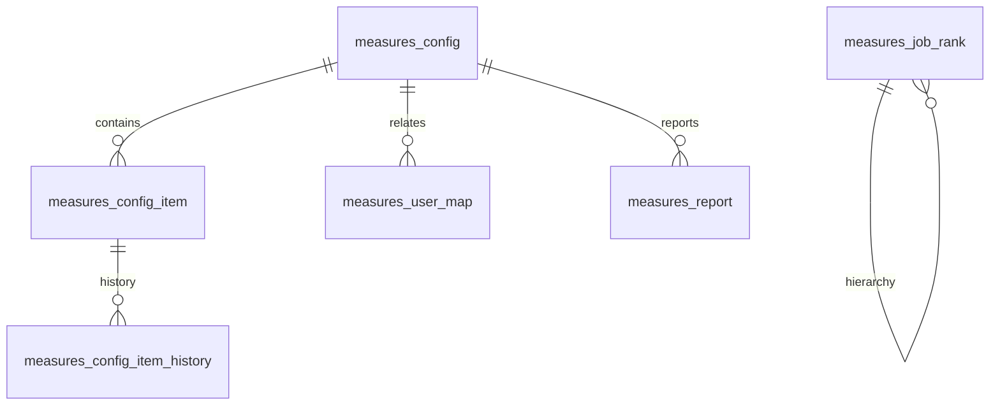

# Finance模块 业务逻辑详细文档（基本法及职级管理）

**文档创建时间**: 2026-01-28
**文档版本**: V1.0

---

## 模块职责

负责基本法配置与职级体系管理，包含基本法创建、子项配置、用户关联、报表生成，以及职级模板/子项维护。

## 核心功能入口

### Controller
- `MeasureConfigController.java` - 基本法配置与子项管理入口
- `MeasureJobRankController.java` - 职级模板与子项管理入口

### Service
- `IMeasureConfigService.java` - 基本法配置服务接口
- `IMeasureUserConfigService.java` - 用户关联基本法查询接口
- `IMeasureUserMapService.java` - 基本法关联用户接口
- `IMeasureReportService.java` - 基本法报表服务接口
- `IMeasureJobRankService.java` - 职级体系服务接口

## 功能清单

| 功能 | 描述 | Controller |
|------|------|-----------|
| 基本法分页查询 | 基本法分页列表查询 | `MeasureConfigController` |
| 创建基本法 | 新增基本法配置 | `MeasureConfigController` |
| 编辑基本法 | 更新基本法配置 | `MeasureConfigController` |
| 删除基本法 | 删除基本法配置 | `MeasureConfigController` |
| 关联用户 | 基本法关联用户 | `MeasureConfigController` |
| 基本法子项 | 获取/更新基本法子项 | `MeasureConfigController` |
| 基本法报表 | 生成基本法考核报表 | `MeasureConfigController` |
| 职级模板维护 | 新增/编辑/删除职级模板 | `MeasureJobRankController` |
| 职级模板查询 | 职级模板分页/详情/子项查询 | `MeasureJobRankController` |

## 数据模型

## 关键设计决策

| 决策点 | 选择 | 原因 |
|--------|------|------|
| 子项配置 | JSON Schema | 子项内容结构化存储与动态渲染 |
| 用户关联 | 显式用户映射表 | 支撑按用户维度绑定基本法 |
| 职级维护 | 模板/子项分层 | 统一维护职级体系与子级内容 |

---

**文档版本**: V1.0
