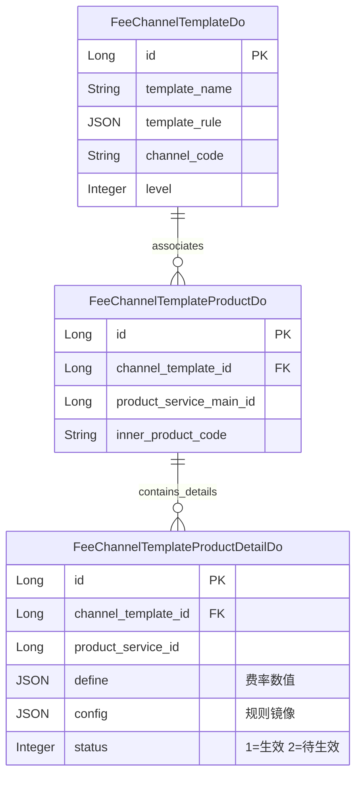
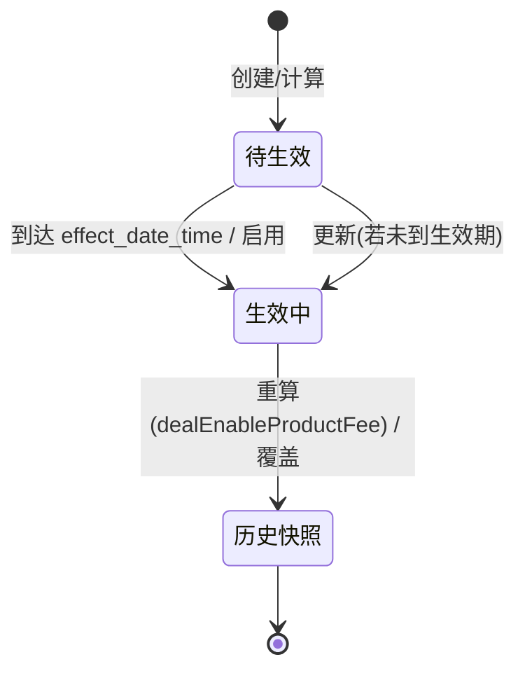

# Finance模块 业务逻辑详细文档（渠道产品费率）

**文档创建时间**: 2026-01-28
**文档版本**: V1.0

---

## 目录

- [一、模块职责](#一模块职责)
- [二、目录结构](#二目录结构)
- [三、功能清单](#三功能清单)
- [四、核心流程](#四核心流程)
- [五、数据模型](#五数据模型)
- [六、依赖关系](#六依赖关系)
- [七、RPC接口](#七rpc接口)
- [八、关键设计决策](#八关键设计决策)

---

## 一、模块职责

管理渠道侧产品的费率查看能力。

- 渠道主账号：直接查看渠道关联产品的基础费率（实时从产品侧获取）
- 渠道子账号：查看基于"渠道费率模板"预计算后的个性化费率（从模板费率明细表读取）

边界与鉴权：
- 入口类型：client，basePath：`/api/v1/auth/lcyf/client/finance/product`
- 该接口位于 `auth` 路径下，需已登录并携带有效的认证信息（例如 token/会话），否则网关/安全组件会拦截
- 数据范围以当前登录用户 `LoginUtil.userCode()` 为准；主账号仅能查看其关联渠道的产品费率，子账号仅能查看其绑定模板范围内的产品费率

## 二、目录结构

```
lcyf-module-base/
└── lcyf-module-finance-api/              ← API 层（在 base 仓库）
    └── src/main/java/com/lcyf/cloud/module/finance/api/
        └── pojo/
            └── dto/
                └── fee/
                    └── channel/          ← 渠道费率相关 DTO
                        └── FeeChannelTemplateServiceInfoDto.java

lcyf-module-finance/
├── lcyf-module-finance-biz/              ← 业务层
│   └── src/main/java/com/lcyf/cloud/module/finance/biz/
│       ├── service/
│       │   └── fee/
│       │       └── channel/              ← 渠道费率服务接口
│       │           ├── IFeeChannelTemplateProductService.java
│       │           └── impl/
│       │               └── FeeChannelTemplateProductServiceImpl.java
│       └── infrastructure/
│           ├── gateway/
│           │   ├── FeeChannelTemplateProductGateway.java
│           │   └── FeeChannelTemplateProductDetailGateway.java
│           └── entity/                   ← DO 实体
│               ├── FeeChannelTemplateDo.java
│               ├── FeeChannelTemplateProductDo.java
│               └── FeeChannelTemplateProductDetailDo.java
│
└── lcyf-module-finance-adapter/           ← 适配层
    └── src/main/java/com/lcyf/cloud/module/finance/adapter/
        └── web/
            └── fee/
                └── channel/              ← 渠道费率 Controller
                    └── FeeChannelProductController.java
```

## 三、功能清单

| 功能 | 描述 | 入口 Controller | 核心 Service |
|------|------|-----------------|--------------|
| 查看费率 | 渠道侧查看产品费率详情（主账号实时查询/子账号模板费率） | `FeeChannelProductController` | `IFeeChannelTemplateProductService` |

## 四、核心流程

### 流程1: 渠道查看费率

**触发条件**: 渠道用户（主账号或子账号）在客户端查看产品费率
**入口**: `FeeChannelProductController.getFee()`

```
请求入口
│
├─ 1. Controller 接收请求
│     └─ FeeChannelProductController.getFee(productServiceMainId)
│         └─ 调用 Service: feeChannelTemplateProductService.getFeeByMainId(productServiceMainId, LoginUtil.userCode())
│
├─ 2. Service 处理业务 (FeeChannelTemplateProductServiceImpl.getFeeByMainId)
│     ├─ 2.1 身份校验: UserApi.checkUserIsChannelMain(userCode)
│     │
│     ├─ 2.2 主账号分支 (isChannelMain == true)
│     │     ├─ 获取渠道用户信息: ChannelApi.getChannelUserRelDto(...)
│     │     ├─ 获取渠道基础信息: ChannelApi.getChannelToBInfo(...)
│     │     ├─ 获取费率等级: ProductSalesApi.getChannelProductsTobList(...)
│     │     ├─ 获取基础费率: ProductServiceApi.getProductServiceMainInfoAndFeeById(productServiceMainId, feeLevelId)
│     │     ├─ 获取结算说明: ProductServiceApi.getFeeSettleExplain(productServiceMainId)
│     │     └─ 处理不限额逻辑: processNotLimit(convert)
│     │
│     └─ 2.3 子账号分支 (isChannelMain == false)
│           ├─ 获取用户关联模板: ChannelUserRelDto.getFeeChannelTemplateId()
│           └─ 获取模板费率: getFee(productServiceMainId, templateId)
│                 ├─ 获取产品信息: ProductServiceApi.getProductServiceMainInfoListByIds(...)
│                 ├─ 查询模板费率详情: FeeChannelTemplateProductDetailGateway.selectByChannelTemplateId(...)
│                 └─ 获取结算说明: ProductServiceApi.getFeeSettleExplain(productServiceMainId)
│
└─ 3. 返回结果
      └─ CommonResult.success(FeeChannelTemplateServiceInfoDto)
```

## 五、数据模型

### 核心实体关系



### 状态流转



## 六、依赖关系

### 依赖的模块
| 模块 | 调用方式 | 用途 |
|------|----------|------|
| system | `@DubboReference ChannelApi` | 获取渠道用户信息、渠道详情 |
| system | `@DubboReference UserApi` | 校验用户是否为主账号 |
| product | `@DubboReference ProductServiceApi` | 获取产品基础信息及费率、结算说明 |
| product | `@DubboReference ProductSalesApi` | 获取渠道可见产品列表及费率等级 |

### 被依赖的模块
| 模块 | 调用方式 | 提供能力 |
|------|----------|----------|
| 客户端门户 | HTTP 接口 | 提供渠道侧费率查询 API |

## 七、RPC接口

### 对外提供的接口
| 接口 | 方法 | 用途 |
|------|------|------|
| (无) | - | 本模块目前仅提供 Web 接口 |

### 调用的外部接口
| 接口 | 方法 | 来源模块 |
|------|------|----------|
| `ChannelApi` | `getChannelUserRelDto(Set<String> userCodeSet, String appCode)` | system |
| `ChannelApi` | `getChannelToBInfo(String channelCode)` | system |
| `UserApi` | `checkUserIsChannelMain(String userCode)` | system |
| `ProductServiceApi` | `getProductServiceMainInfoListByIds(Set<Long> productServiceMainIds)` | product |
| `ProductServiceApi` | `getProductServiceMainInfoAndFeeById(Long id, Long feeLevelId)` | product |
| `ProductServiceApi` | `getFeeSettleExplain(Long productServiceMainId)` | product |
| `ProductSalesApi` | `getChannelProductsTobList(String channelCode, String licensePlate, String innerProductCode)` | product |
| `ProductSalesApi` | `getChannelAllVisibleTobProducts(String channelCode, Integer productStatus)` | product |

## 八、关键设计决策

| 决策点 | 选择 | 原因 |
|--------|------|------|
| 费率查询策略 | 主账号实时 / 子账号模板 | 主账号始终看最准确的基础费率；子账号受限于渠道设置的费率折损/调整模板 |
| 费率存储 | 预计算存储（Detail 表） | 模板费率涉及复杂的级联计算（折损、固定值等），预计算存储可大幅提高查询性能 |
| 规则处理 | JSON 存储规则 | 费率调整规则具有多样性，JSON 存储便于扩展新的计算方式 |

## 扩展指南

| 场景 | 操作步骤 |
|------|----------|
| 新增费率显示字段 | 修改 `FeeChannelTemplateServiceInfoDto` -> 修改相关 Assembler -> 修改 Service 查询逻辑 |
| 调整模板计算逻辑 | 修改 `FeeChannelTemplateProductServiceImpl` 中的模板计算/重算相关方法 |
| 增加新的费率过滤条件 | 修改 `FeeChannelProductController.getFee` 参数 -> 修改 Service 过滤逻辑 |

## 常见问题

| 问题 | 解决方案 |
|------|----------|
| 为什么主账号和子账号看到的费率不一样？ | 主账号直接透传保司/平台给渠道的费率（基础费率）；子账号看的是渠道内部定义的模板费率（可能存在加点或折损）。 |
| 模板费率如何更新？ | 当基础费率变更或模板规则变更时，会通过事件监听或手动触发重算逻辑更新 Detail 表数据。 |

---

**文档生成时间**: 2026-01-28
**文档版本**: V1.0
