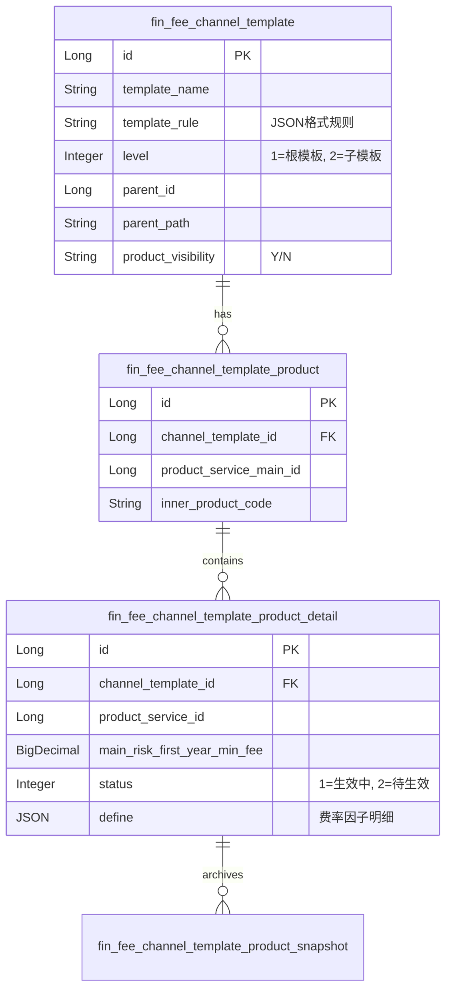
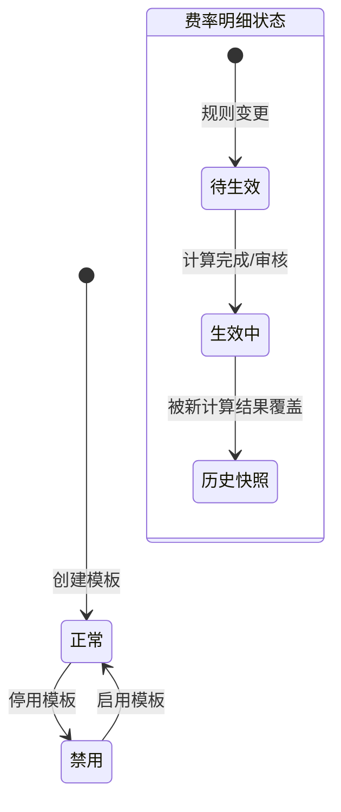

# Finance模块 业务逻辑详细文档（渠道费率模板）

**文档创建时间**: 2026-01-27
**文档版本**: V1.0
**参考格式**: 费率管理-渠道费率模板-业务文档.md

---

## 目录

- [一、模块职责](#一模块职责)
- [二、目录结构](#二目录结构)
- [三、功能清单](#三功能清单)
- [四、核心流程](#四核心流程)
- [五、数据模型](#五数据模型)
- [六、依赖关系](#六依赖关系)
- [七、RPC接口](#七rpc接口)
- [八、关键设计决策](#八关键设计决策)

---

## 一、模块职责

实现渠道侧费率模板的多级管理、产品规则配置以及费率的自动化/异步重算，支持基于主账号与非主账号的层级授权逻辑。

## 二、目录结构

```
lcyf-module-base/
└── lcyf-module-finance-api/              ← API 层（在 base 仓库）
    └── src/main/java/com/lcyf/cloud/module/finance/api/
        ├── pojo/
        │   ├── cmd/fee/channel/        ← 模板与产品命令对象
        │   ├── dto/fee/channel/        ← 费率模板/产品/规则 DTO
        │   ├── query/fee/channel/      ← 分页查询对象
        │   └── vo/fee/channel/         ← 视图对象
        └── rpc/                        ← RPC 接口定义（FinanceApi/FinanceApiV2）

lcyf-module-finance/
├── lcyf-module-finance-biz/              ← 业务层
│   └── src/main/java/com/lcyf/cloud/module/finance/biz/
│       ├── service/fee/channel/        ← 模板服务接口
│       │   └── impl/                   ← 核心实现（包含异步重算逻辑）
│       └── infrastructure/
│           ├── gateway/                ← 模板/产品/详情/快照网关
│           ├── mapper/                 ← MyBatis Mapper
│           ├── entity/                 ← DO 实体（@TableName 证据来源）
│           └── assembler/              ← 对象转换器
│
└── lcyf-module-finance-adapter/          ← 适配层
    └── src/main/java/com/lcyf/cloud/module/finance/adapter/
        ├── web/fee/channel/            ← 模板/产品 Controller
        └── rpc/                        ← FinanceApi/FinanceApiV2 实现
```

## 三、功能清单

| 功能 | 描述 | 入口 Controller | 核心 Service |
|------|------|-----------------|--------------|
| 模板分页查询 | 支持按创建者过滤的费率模板列表查询 | `FeeChannelTemplateController` | `IFeeChannelTemplateService` |
| 新增费率模板 | 根据账号层级自动判定 parentId 与 level | `FeeChannelTemplateController` | `IFeeChannelTemplateService` |
| 配置模板规则 | 设置计算规则并触发产品费率异步重算 | `FeeChannelTemplateController` | `IFeeChannelTemplateService` |
| 模板基本信息修改 | 修改名称、产品可见性规则 | `FeeChannelTemplateController` | `IFeeChannelTemplateService` |
| 模板删除/批量删除 | 校验用户关联状态后的物理/逻辑删除 | `FeeChannelTemplateController` | `IFeeChannelTemplateService` |
| 模板产品管理 | 模板下产品的增删、分页查询、全量查询 | `FeeChannelTemplateProductController` | `IFeeChannelTemplateProductService` |
| 模板产品费率维护 | 手动保存产品费率并同步下级模板 | `FeeChannelTemplateProductController` | `IFeeChannelTemplateProductService` |
| 查看产品费率 | 查询模板下产品具体的各险种费率明细 | `FeeChannelTemplateProductController` | `IFeeChannelTemplateProductService` |

## 四、核心流程

### 流程1: 创建费率模板（层级判定）

**触发条件**: 渠道侧用户点击"新增模板"
**入口**: `FeeChannelTemplateController.add()`

```
请求入口
│
├─ 1. Controller 接收请求
│     └─ FeeChannelTemplateController.add()
│         └─ 调用 Service.create(templateName, userCode, channelCode)
│
├─ 2. Service 处理业务逻辑
│     └─ FeeChannelTemplateServiceImpl.create()
│         ├─ 依赖 RPC: deptApi.getUserDept(userCode) 获取部门等级
│         ├─ 依赖 RPC: userApi.checkUserIsChannelMain(userCode) 判定主账号
│         ├─ 层级分支判定:
│         │   ├─ Case A: deptDto.getLevel()==1 && isChannelMain
│         │   │   └─ 设置 parentId=0, level=1 (根模板)
│         │   └─ Case B: 非主账号或层级 > 1
│         │       └─ 从 channelApi.getChannelUserRelDto 获取用户当前关联模板作为 parentId
│         └─ 数据持久化: gateway.save(addCmd) 并异步更新自身 id 到 parentPath
│
└─ 3. 返回结果
      └─ CommonResult.success()
```

### 流程2: 配置模板规则并异步重算费率

**触发条件**: 用户在管理端"配置模板规则"并提交
**入口**: `FeeChannelTemplateController.setConfig()`

```
请求入口
│
├─ 1. Controller 接收请求
│     └─ FeeChannelTemplateController.setConfig()
│         └─ 调用 Service.setConfig(updateCmd)
│
├─ 2. Service 执行更新与重算触发
│     └─ FeeChannelTemplateServiceImpl.setConfig()
│         ├─ 更新模板规则: gateway.updateById(updateCmd)
│         └─ 判定规则状态: if ruleStatus == ENABLE
│             └─ 获取所有产品: feeTemplateProductService.selectProductList(id)
│             └─ 异步循环触发: lcyfTaskExecutor.execute(() -> saveChannelTemplateProductFee)
│
├─ 3. 核心计算 Service (Async)
│     └─ FeeChannelTemplateProductServiceImpl.saveChannelTemplateProductFee()
│         ├─ 历史备份: dealEnableProductFee() 将原 Enabled 数据移至 snapshot 表
│         ├─ 费率源获取:
│         │   ├─ Case Level 1: 通过 productSalesApi.getChannelProductsTobList 获取 CX 费率
│         │   └─ Case Level > 1: 获取 parentChannelTemplateId 对应的明细作为基数
│         ├─ 规则应用: calcFeeByTemplateRules() 按 JSON 规则（比例等）计算新值
│         └─ 结果持久化: feeChannelTemplateProductDetailGateway.save()
│
└─ 4. 下级递归: 递归调用 saveChannelTemplateProductFee 更新所有子模板
```

## 五、数据模型

### 核心实体关系



### 状态流转



## 六、依赖关系

### 依赖的模块
| 模块 | 调用方式 | 用途 |
|------|----------|------|
| system | `@DubboReference DeptApi/ChannelApi/UserApi` | 获取用户部门层级、判定主账号、查询渠道关联模板 |
| product | `@DubboReference ProductServiceApi/ProductSalesApi` | 获取产品主/子费率信息、查询渠道可见产品列表 |
| finance | 内部调用 `IFeeTemplateServiceV2` | 获取橙芯基础费率（CX Fee）作为计算源 |

### 被依赖的模块
| 模块 | 调用方式 | 提供能力 |
|------|----------|----------|
| product-factory | `@DubboReference FinanceApi` | 提供 `getTemplateAllProductServiceMainIds` 用于过滤用户可见产品 |
| system | `@DubboReference FinanceApiV2` | 提供 `userTemplateChangeCallBack` 在用户关联模板变更时触发重算 |

## 七、RPC接口

### 对外提供的接口
| 接口 | 方法 | 用途 |
|------|------|------|
| `FinanceApi` | `getTemplateAllProductServiceMainIds` | 获取模板下可选或可见的产品 ID 列表 |
| `FinanceApi` | `getChannelTemplateProductFee` | 查询模板下产品的第一年最大费率（用于展示） |
| `FinanceApi` | `feeChannelTemplateProductChange` | 渠道整体或产品费率变更时的重算触发入口 |
| `FinanceApiV2` | `userTemplateChangeCallBack` | 账号费率模板变更后的异步数据更新回调 |

### 调用的外部接口
| 接口 | 方法 | 来源模块 |
|------|------|----------|
| `DeptApi` | `getUserDept(String userCode)` | system |
| `UserApi` | `checkUserIsChannelMain(String userCode)` | system |
| `ChannelApi` | `getChannelUserRelDto(Set<String> userCodes, ...)` | system |
| `ProductSalesApi` | `getChannelAllVisibleTobProducts(...)` | product |

## 八、关键设计决策

| 决策点 | 选择 | 原因 |
|--------|------|------|
| 费率存储 | 预计算存储 (`fin_fee_channel_template_product_detail`) | 避免 C 端查询时实时递归计算多级模板规则，提升接口响应速度 |
| 计算模型 | 异步重算 (`ThreadPoolTaskExecutor`) | 规则变更可能涉及大量产品和多级模板，同步处理会导致请求超时 |
| 历史溯源 | 历史快照表 (`snapshot`) | 业务要求费率变更后，旧订单需能关联到当时的费率快照，保证财务对账准确 |
| 模板可见性 | 继承过滤逻辑 (`productVisibility`) | Level > 1 的模板产品范围必须是 Level 1 的子集，保证数据一致性 |

## 扩展指南

| 场景 | 操作步骤 |
|------|----------|
| 新增费率因子 | 修改 `FeeChannelTemplateDefine` JSON 结构 → 更新 `calcFeeByTemplateRules` 逻辑 |
| 增加新的模板层级 | 理论支持多级，只需确保 `parentPath` 与 `level` 维护正确即可递归 |
| 调整异步策略 | 在 `lcyfTaskExecutor` 配置类中调整核心线程数或队列容量 |

## 常见问题

| 问题 | 解决方案 |
|------|----------|
| 为什么新加产品费率为 0？ | 检查模板规则是否为 ENABLE 状态，或上级模板/CX费率是否已配置 |
| 模板删除失败？ | 检查 `system` 模块中是否有用户仍关联该模板（`channelApi.getChannelTemplateUser`） |
| 费率重算不及时？ | 异步任务在队列中排队，可通过监控 `lcyfTaskExecutor` 队列长度排查 |

---

**文档生成时间**: 2026-01-27
**文档版本**: V1.0
**Service实现类**: `FeeChannelTemplateServiceImpl`
