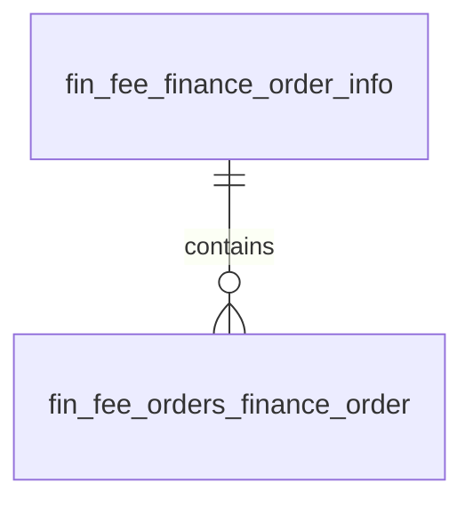

# Finance模块 业务逻辑详细文档（财务订单管理）

**文档创建时间**: 2026-01-28
**文档版本**: V1.0

---

## 模块职责

负责财务订单与财务子订单的管理端查询、导出与维护，并消费保单/续期/保全等消息生成财务结算订单。

## 核心功能入口

### Controller
- `FeeFinanceOrderInfoController.java` - 财务订单管理端入口
- `FeeOrdersFinanceOrderController.java` - 财务子订单管理端入口
- `FinanceConsumer.java` - MQ 消费者

### Service
- `IFeeFinanceOrderInfoService.java` - 财务订单服务接口
- `IFeeOrdersFinanceOrderService.java` - 财务子订单服务接口
- `IFeeFinanceOrderApplicationServ.java` - 财务订单生成应用服务

## 功能清单

| 功能 | 描述 | Controller |
|------|------|-----------|
| 财务订单分页 | 财务订单分页查询 | `FeeFinanceOrderInfoController` |
| 财务订单导出 | 财务订单列表导出 | `FeeFinanceOrderInfoController` |
| 财务订单详情 | 查询财务订单详情 | `FeeFinanceOrderInfoController` |
| 新增财务订单 | 新增财务订单 | `FeeFinanceOrderInfoController` |
| 编辑财务订单 | 编辑财务订单 | `FeeFinanceOrderInfoController` |
| 删除财务订单 | 删除财务订单 | `FeeFinanceOrderInfoController` |
| 子订单分页 | 财务子订单分页查询 | `FeeOrdersFinanceOrderController` |
| 子订单导出 | 财务子订单导出 | `FeeOrdersFinanceOrderController` |

## 数据模型

## 关键设计决策

| 决策点 | 选择 | 原因 |
|--------|------|------|
| 子订单与差额管理 | 复用子订单接口 | 差额导入与分页复用同一子订单入口 |
| MQ 异步生成 | 消费消息生成订单 | 避免同步写入带来的耦合与延迟 |
| 同步记录表 | 独立记录 MQ 消费状态 | 支撑重放与补偿处理 |

---

**文档版本**: V1.0
