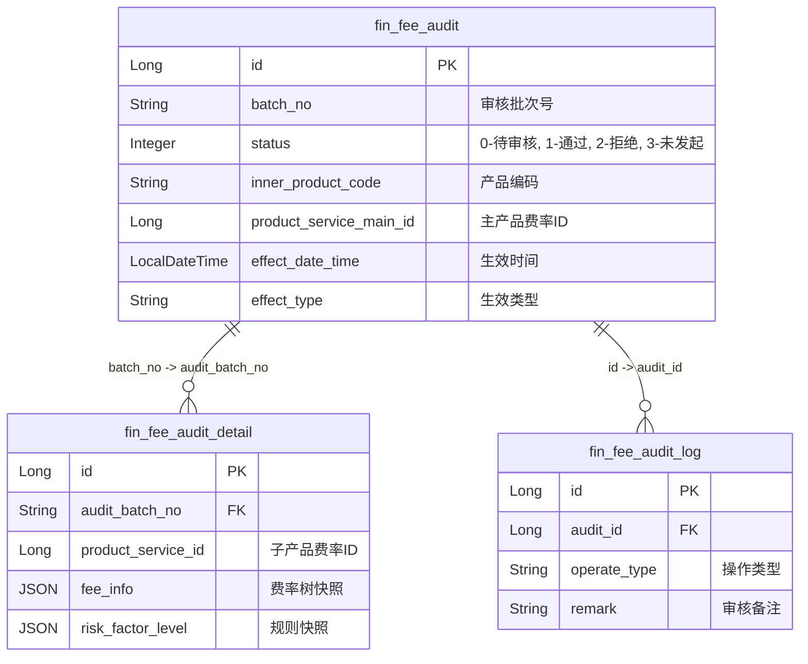
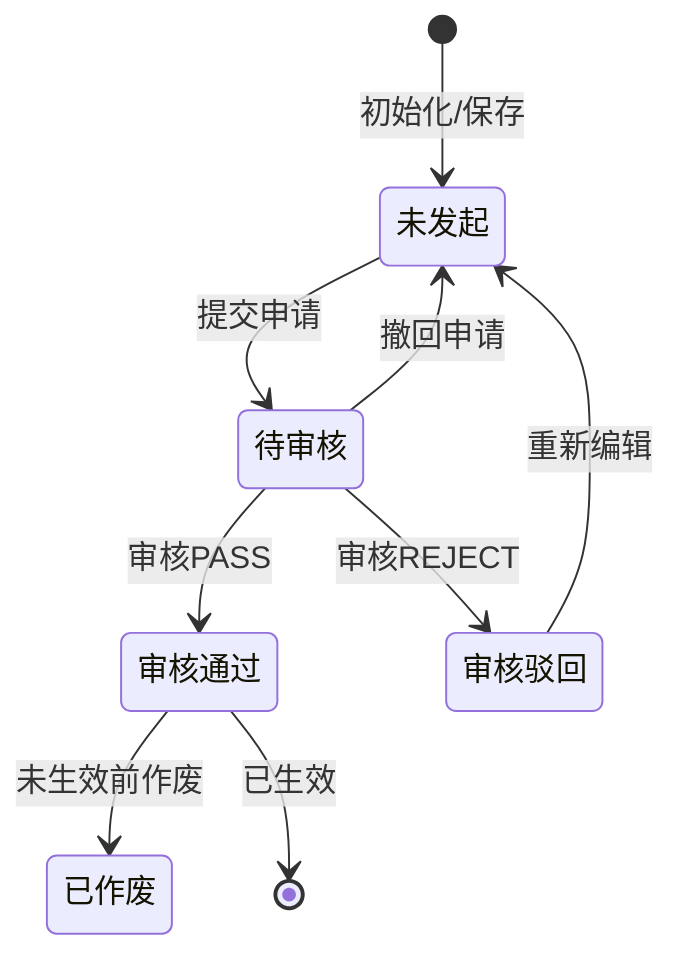

# Finance模块 业务逻辑详细文档（费率审核）

**文档创建时间**: 2026-01-28
**文档版本**: V1.0
**参考格式**: 费率管理-费率审核-业务文档.md

---

## 目录

- [一、模块职责](#一模块职责)
- [二、目录结构](#二目录结构)
- [三、功能清单](#三功能清单)
- [四、核心流程](#四核心流程)
- [五、数据模型](#五数据模型)
- [六、依赖关系](#六依赖关系)
- [七、RPC接口](#七rpc接口)
- [八、关键设计决策](#八关键设计决策)

---

## 一、模块职责

负责产品费率变更的审核流程管理，包括费率审核申请的提交、审核通过/驳回、作废、撤销以及审核日志的记录，确保费率变更的安全性和合规性。

## 二、目录结构

```
lcyf-module-finance/
├── lcyf-module-finance-biz/              ← 业务层
│   └── src/main/java/com/lcyf/cloud/module/finance/biz/
│       ├── service/fee/                  ← 服务接口
│       │   ├── IFeeAuditService.java
│       │   └── impl/
│       │       └── FeeAuditServiceImpl.java
│       └── infrastructure/fee/
│           ├── gateway/                  ← 数据网关
│           │   ├── FeeAuditGateway.java
│           │   ├── FeeAuditDetailGateway.java
│           │   └── FeeAuditLogGateway.java
│           ├── mapper/                   ← MyBatis Mapper
│           │   ├── FeeAuditMapper.java
│           │   ├── FeeAuditDetailMapper.java
│           │   └── FeeAuditLogMapper.java
│           ├── entity/                   ← DO 实体
│           │   ├── FeeAuditDo.java
│           │   ├── FeeAuditDetailDo.java
│           │   └── FeeAuditLogDo.java
│           └── assembler/                ← 对象转换器
│               └── FeeAuditAssembler.java

└── lcyf-module-finance-adapter/          ← 适配层
    └── src/main/java/com/lcyf/cloud/module/finance/adapter/
        └── web/fee/                      ← HTTP Controller
            └── FeeAuditController.java
```

## 三、功能清单

| 功能 | 描述 | 入口 Controller | 核心 Service |
|------|------|-----------------|--------------|
| 分页查询 | 分页查询费率审核记录 | `FeeAuditController` | `IFeeAuditService` |
| 详情查询 | 获取单条审核记录详情 | `FeeAuditController` | `IFeeAuditService` |
| 详情查询（不含供应商） | 获取详情并过滤掉供应商相关费率 | `FeeAuditController` | `IFeeAuditService` |
| 提交审核 | 提交费率审核申请，支持按批次处理 | `FeeAuditController` | `IFeeAuditService` |
| 审核操作 | 对费率变更进行审核通过或驳回 | `FeeAuditController` | `IFeeAuditService` |
| 作废操作 | 对已审核通过但尚未生效的费率进行作废 | `FeeAuditController` | `IFeeAuditService` |
| 撤销审核 | 撤销处于"待审核"状态的申请 | `FeeAuditController` | `IFeeAuditService` |
| 过往审核记录 | 查询指定记录的过往审核日志 | `FeeAuditController` | `IFeeAuditService` |
| 过往审核记录（不含供应商） | 查询审核日志并过滤供应商费率 | `FeeAuditController` | `IFeeAuditService` |
| 删除审核记录 | 删除处于"未发起"状态的审核记录 | `FeeAuditController` | `IFeeAuditService` |

## 四、核心流程

### 流程1: 提交审核 (submitFeeAudit)

**触发条件**: 用户在管理后台修改费率后点击"提交审核"
**入口**: `FeeAuditController.submitFeeAudit()`

```
请求入口
│
├─ 1. Controller 接收请求
│     └─ FeeAuditController.submitFeeAudit()
│         ├─ 参数校验: @Valid FeeSubmitAuditCmd
│         └─ 调用 Service: feeAuditService.submitFeeAudit()
│
├─ 2. Service 处理业务
│     └─ FeeAuditServiceImpl.submitFeeAudit()
│         ├─ 业务校验: 校验费率生效时间、加锁检查、校验活动冲突 (validActivity)
│         ├─ 版本处理: 迭代计算费率等级版本号 (processVersion)
│         ├─ 数据持久化:
│         │     ├─ 保存审核主记录: feeAuditGateway.save()
│         │     └─ 保存费率树快照: feeAuditDetailGateway.save()
│         └─ 事务同步: 注册事务提交后回调，调用 systemApi.auditReach 发送推送
│
├─ 3. 返回结果
│       └─ CommonResult.success(auditId)
```

### 流程2: 审核通过 (audit - PASS)

**触发条件**: 审核人员在待办任务中点击"通过"
**入口**: `FeeAuditController.audit()`

```
请求入口
│
├─ 1. Controller 接收请求
│     └─ FeeAuditController.audit()
│         └─ 调用 Service: feeAuditService.audit()
│
├─ 2. Service 处理业务
│     └─ FeeAuditServiceImpl.audit()
│         ├─ 状态校验: 必须为"待审核"状态
│         ├─ 处理审核通过逻辑: processFeeAuditPass()
│         │     ├─ 校验待生效冲突: 检查是否存在其他待生效费率
│         │     └─ 保存正式费率: feeTemplateServiceV2.saveFeeTree()
│         ├─ 记录日志: addFeeAuditLog()
│         └─ 事务同步:
│               ├─ 发送审核结果推送: systemApi.auditReach()
│               └─ 同步渠道费率: productFeeRateSyncService.syncEffectFeeMessage()
│
└─ 3. 返回结果
      └─ CommonResult.success(true)
```

## 五、数据模型

### 核心实体关系



### 状态流转



## 六、依赖关系

### 依赖的模块
| 模块 | 调用方式 | 用途 |
|------|----------|------|
| system | `@DubboReference SystemApi/UserApi` | 获取用户信息、发送审核消息推送 |
| product | `@DubboReference ProductApi/ProductServiceApi` | 获取产品、险种信息及子费率列表 |

### 被依赖的模块
| 模块 | 调用方式 | 提供能力 |
|------|----------|----------|
| 核心同步服务 | `productFeeRateSyncService` | 审核通过后同步生效费率到核心 |
| 渠道费率 | `feeChannelTemplateProductService` | 费率变更后回调渠道模板更新 |

## 七、RPC接口

### 对外提供的接口
*本模块主要通过 Controller 提供 Web 接口。*

### 调用的外部接口
| 接口 | 方法 | 来源模块 |
|------|------|----------|
| `UserApi` | `getUserBaseInfo` | system |
| `SystemApi` | `auditReach` | system |
| `ProductApi` | `getProductRisk` | product |
| `ProductServiceApi` | `getProductServiceListByMainId` | product |

## 八、关键设计决策

| 决策点 | 选择 | 原因 |
|--------|------|------|
| 版本管理 | 迭代 `next_version` | 费率变更采用版本化管理，审核通过后生成新版本，支持时间轴生效 |
| 异步通知 | `TransactionSynchronization` | 确保在数据库事务提交后才发送推送和 RPC 调用，避免分布式事务不一致 |
| 费率快照 | `fin_fee_audit_detail` | 将审核时的费率树以 JSON 形式快照存储，防止原始规则修改影响审核溯源 |
| 锁定机制 | Redisson | 提交审核时检查费率锁定状态，防止并发修改冲突 |

## 扩展指南

| 场景 | 操作步骤 |
|------|----------|
| 增加审核字段 | 修改 `FeeAuditDo` → 修改 `FeeAuditGateway` → 更新 `FeeAuditAssembler` → 更新前端 DTO/VO |
| 调整审核流程 | 修改 `FeeAuditServiceImpl.audit()` 中的 `status` 逻辑和相关校验逻辑 |
| 增加审核后置动作 | 在 `FeeAuditServiceImpl.audit()` 的 `afterCommit` 回调中增加相应逻辑 |

## 常见问题

| 问题 | 解决方案 |
|------|----------|
| 审核通过但费率没生效 | 检查 `effect_date_time` 是否晚于当前时间，处于"待生效"状态的费率需等待定时任务触发或时间到达 |
| 提示"不支持变更因子结构" | 检查产品当前是否有"进行中"或"未开始"的加佣活动，活动期间禁止变更基础因子结构 |
| 无法作废 | 只有已通过审核但尚未到达 `effect_date_time` 的记录才支持作废操作 |

---

**文档生成时间**: 2026-01-28
**文档版本**: V1.0
**Service实现类**: `FeeAuditServiceImpl`
