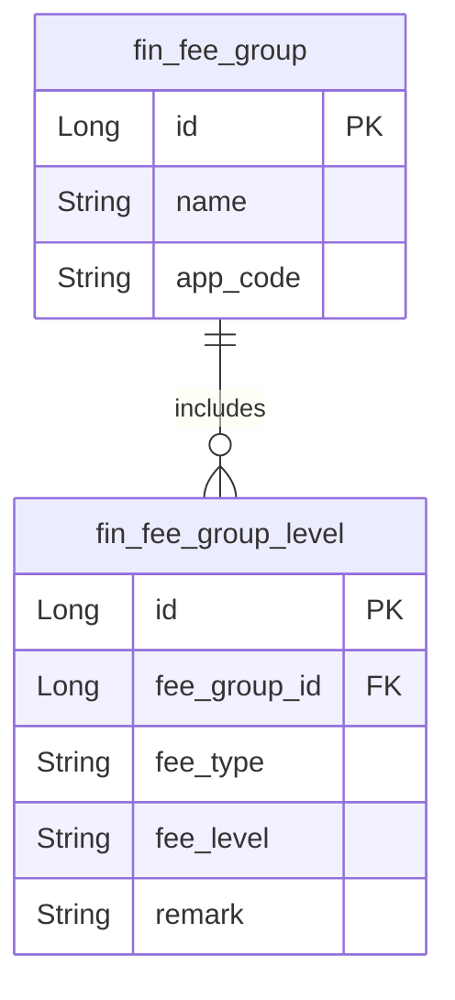

# Finance模块 业务逻辑详细文档（费率基础管理）

**文档创建时间**: 2026-01-28
**文档版本**: V1.0

---

## 一、模块职责

负责财务域中"费率基础管理"的费率因子定义查询与费率等级分组管理，不涵盖费率定义、费率等级规则配置、费率同步、费率审核、渠道模板等内容。

## 二、核心功能

### Controller 层
- `FinanceFeeController.java` - 因子定义查询入口
- `FeeGroupController.java` - 费率等级分组体系管理

### Service 层
- `IFeeTemplateService.java` - 因子与基础查询能力接口
- `IFeeGroupService.java` - 费率等级分组与等级定义 CRUD 接口

### Gateway 层
- `FeeFactorDefineGateway.java` - 因子定义数据访问
- `FeeGroupGateway.java` - 费率等级分组数据访问
- `FeeGroupLevelGateway.java` - 费率分组等级数据访问

### 实体层
- `FeeFactorDefineDo.java` - `fin_fee_factor_define` 费率维度因子定义
- `FeeGroupDo.java` - `fin_fee_group` 费率等级分组
- `FeeGroupLevelDo.java` - `fin_fee_group_level` 分组等级关系定义

## 三、功能清单

| 功能 | 描述 | 入口 Controller | 核心 Service |
|------|------|-----------------|--------------|
| 获取可用因子 | 查询费率计算中可用的维度因子定义列表 | `FinanceFeeController` | `IFeeTemplateService` |
| 获取因子 Map | 查询以因子编码为 key 的因子定义映射 | `FinanceFeeController` | `IFeeTemplateService` |
| 分组详情 | 根据 ID 获取费率等级分组详情 | `FeeGroupController` | `IFeeGroupService` |
| 新增分组 | 创建费率等级分组 | `FeeGroupController` | `IFeeGroupService` |
| 编辑分组 | 修改费率等级分组信息 | `FeeGroupController` | `IFeeGroupService` |
| 删除分组 | 删除指定费率等级分组 | `FeeGroupController` | `IFeeGroupService` |
| 查询分组等级列表 | 查询分组下的费率等级列表 | `FeeGroupController` | `IFeeGroupService` |
| 分组新增等级 | 在分组下新增费率等级定义 | `FeeGroupController` | `IFeeGroupService` |
| 分组更新等级 | 更新分组下费率等级元数据 | `FeeGroupController` | `IFeeGroupService` |

## 四、核心流程

### 流程1: 查询可用费率因子

```
请求入口
│
├─ 1. Controller 接收请求
│     └─ FinanceFeeController.queryFeeFactor()
│         └─ 调用 Service: feeTemplateService.getFeeFactor()
│
├─ 2. Service 处理业务
│     └─ FeeTemplateServiceImpl.getFeeFactor()
│         └─ 调用 Gateway: FeeFactorDefineGateway.selectListFeeFactor()
│
└─ 3. 返回结果
      └─ CommonResult.success(List<FeeFactorDefineDto>)
```

### 流程2: 查询分组等级列表

```
请求入口
│
├─ 1. Controller 接收请求
│     └─ FeeGroupController.queryFeeLevelList()
│         └─ 调用 Service: feeGroupService.getLevelByGroupId(feeGroupId)
│
├─ 2. Service 处理业务
│     └─ FeeGroupServiceImpl.getLevelByGroupId()
│         └─ 调用 Gateway: FeeGroupLevelGateway.selectListByGroupId(groupId)
│
└─ 3. 返回结果
      └─ CommonResult.success(List<FeeGroupLevelDto>)
```

## 五、数据模型

### 核心实体关系



## 六、关键设计决策

| 决策点 | 选择 | 原因 |
|--------|------|------|
| 数据检索 | BeanSearcher | Gateway 层使用 BeanSearcher 支持动态条件检索 |
| 对象转换 | Assembler | Assembler 统一 DTO/DO 转换 |
| 异常处理 | ServiceException | 业务校验失败时抛出统一异常 |

## 七、扩展指南

| 场景 | 操作步骤 |
|------|----------|
| 新增因子定义 | 在 `fin_fee_factor_define` 新增因子 → 按需补充 finance-api 的枚举/接口因子编码映射 |
| 新增分组/等级 | 调用 `FeeGroupController` 的新增分组/等级接口，或在 Service 层复用 `IFeeGroupService` |
| 调整分组校验 | 修改 `FeeGroupServiceImpl` 中分组/等级重复校验逻辑 |

## 八、常见问题

| 问题 | 解决方案 |
|------|----------|
| 分组等级列表为空 | 确认 `fin_fee_group_level` 中因子处于启用状态，分组 id 由调用方传入 |
| 因子列表缺失 | 确认 `fin_fee_factor_define` 中因子处于启用状态 |

---

**文档生成时间**: 2026-01-28
**文档版本**: V1.0
