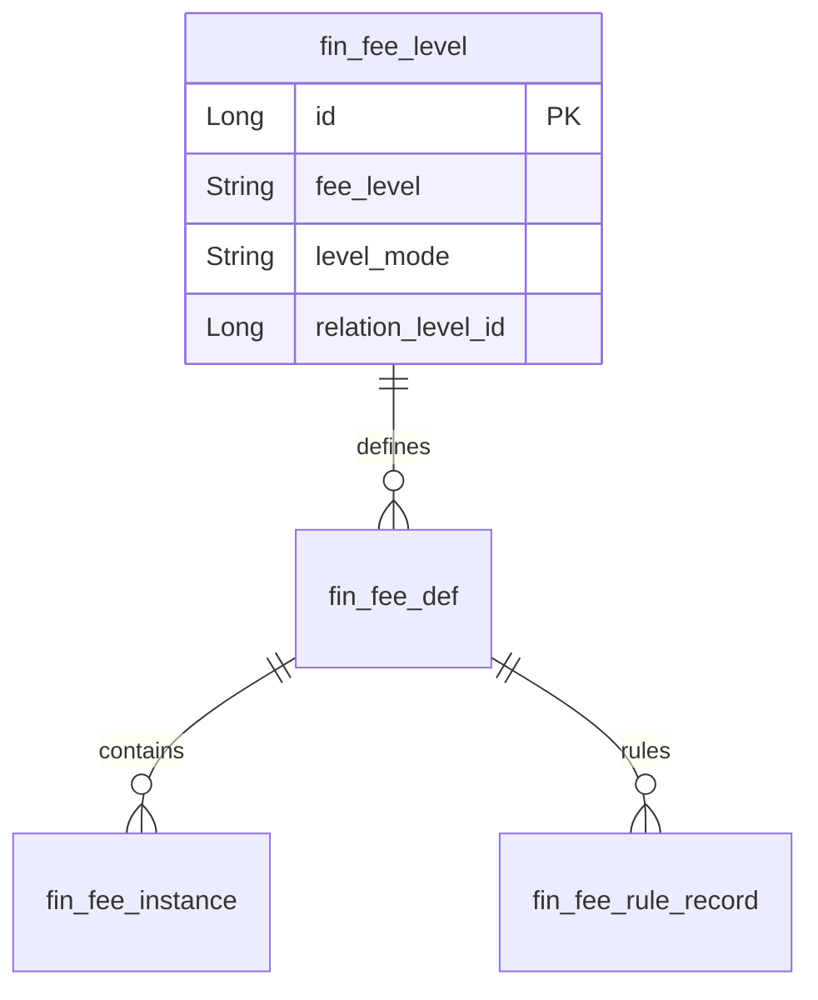

# Finance模块 业务逻辑详细文档（费率等级）

**文档创建时间**: 2026-01-28
**文档版本**: V1.0

---

## 模块职责

负责费率等级的新增、编辑、删除与查询，并提供经代公司关联的费率等级列表与产品关联查询能力。

## 核心功能入口

### Controller
- `FeeLevelController.java` - 费率等级管理入口

### Service
- `IFeeLevelService.java` - 费率等级领域服务接口
- `FeeLevelServiceImpl.java` - 业务实现（校验/关联复制/同步）

### Gateway
- `FeeLevelGateway.java` - 费率等级数据访问
- `FeeDefGateway.java` - 费率定义数据访问
- `FeeDefSnapshotGateway.java` - 费率定义历史快照
- `FeeInstanceGateway.java` - 费率实例数据访问
- `FeeInstanceSnapshotGateway.java` - 费率实例历史快照
- `FeeDefVersionRecordGateway.java` - 费率版本记录
- `FeeRuleRecordGateway.java` - 费率规则记录

## 功能清单

| 功能 | 描述 | 入口 Controller |
|------|------|-----------------|
| 分页查询费率等级 | 费率等级分页查询（支持动态条件） | `FeeLevelController` |
| 新增费率等级 | 创建费率等级 | `FeeLevelController` |
| 编辑费率等级 | 修改费率等级 | `FeeLevelController` |
| 删除费率等级 | 删除费率等级 | `FeeLevelController` |
| 查看费率 | 查询费率等级下的费率明细 | `FeeLevelController` |
| 查看关联产品 | 查询费率等级关联产品列表 | `FeeLevelController` |
| 经代公司等级列表 | 查询经代公司关联的费率等级 | `FeeLevelController` |

## 核心流程

### 流程1: 费率等级分页查询

**入口**: `FeeLevelController.page()`

```
请求 → 参数验证 → Service.getFeeLevelPage()
  → 调用 Gateway.selectPage()
  → 调用 RPC: userApi.getTenantIgnoreUserNamesByIds()
  → 返回结果
```

### 流程2: 新增费率等级

**入口**: `FeeLevelController.add()`

```
请求 → 校验经代公司/名称/排序
  → 生成等级编码: redissonCollection.generateCode()
  → 持久化: feeLevelGateway.save()
  → 若关联类型：异步复制费率定义/实例/规则并触发同步
  → 返回结果
```

## 数据模型

### 核心实体



## 关键设计决策

| 决策点 | 选择 | 原因 |
|--------|------|------|
| 等级编码生成 | Redisson 分布式编码 | 保证全局唯一且可追溯 |
| 关联类型等级 | 异步复制费率定义/实例/规则 | 避免同步复制造成长事务与响应延迟 |
| 删除校验 | 渠道/团队/活动关联校验 | 避免删除仍被引用的费率等级 |

---

**文档版本**: V1.0
