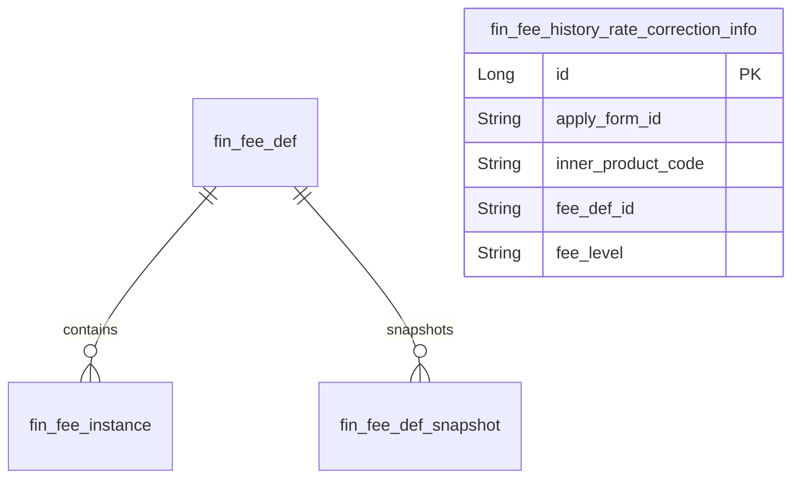

# Finance模块 业务逻辑详细文档（费率同步）

**文档创建时间**: 2026-01-28
**文档版本**: V1.0

---

## 模块职责

负责费率同步与历史费率修复相关的内部/管理端入口，包括 toA 系统费率同步、历史费率初始化与修复记录维护。

## 核心功能入口

### Controller
- `FinanceToaSyncController.java` - toA 系统费率同步入口（inner）
- `FinanceSyncHistoryController.java` - 历史费率同步入口（inner）
- `FeeHistoryRateCorrectionInfoController.java` - 历史费率修复记录维护入口

### Service
- `IFeeProductService.java` - toA 费率同步服务接口
- `IFinanceSyncHistoryService.java` - 历史费率同步服务接口
- `IFeeHistoryRateCorrectionInfoService.java` - 历史费率修复记录服务接口

## 功能清单

| 功能 | 描述 | 入口 Controller |
|------|------|-----------------|
| 同步费率规则 | toA 同步费率规则 | `FinanceToaSyncController` |
| 同步系统费率 | toA 同步系统费率 | `FinanceToaSyncController` |
| 初始化供应商费率等级 | 初始化历史同步基础数据 | `FinanceSyncHistoryController` |
| 同步费率等级 | 同步历史费率等级 | `FinanceSyncHistoryController` |
| 一次性同步历史费率 | 历史费率批量同步 | `FinanceSyncHistoryController` |
| 历史费率修复分页 | 修复记录分页查询 | `FeeHistoryRateCorrectionInfoController` |
| 新增修复记录 | 新增历史费率修复记录 | `FeeHistoryRateCorrectionInfoController` |

## 核心流程

### 流程1: toA 同步费率规则

**入口**: `FinanceToaSyncController.toaSyncFeeRule()`

```
请求 → 设置租户上下文(DEFAULT)
  → Service.toaSyncFeeRule(cmd)
  → 返回结果
```

### 流程2: 历史费率一次性同步

**入口**: `FinanceSyncHistoryController.syncHistoryFee()`

```
请求 → Service.syncHistoryFee(cmd)
  → 返回结果
```

## 数据模型



## 关键设计决策

| 决策点 | 选择 | 原因 |
|--------|------|------|
| 同步入口拆分 | toA 同步 vs 历史同步 | 同步对象与调用方不同，职责隔离 |
| 同步入口类型 | inner + auth | toA/历史同步为内部接口；修复记录为管理端接口 |
| 修复记录持久化 | 独立修复表 | 支撑历史费率追溯与回溯修复 |

---

**文档版本**: V1.0
