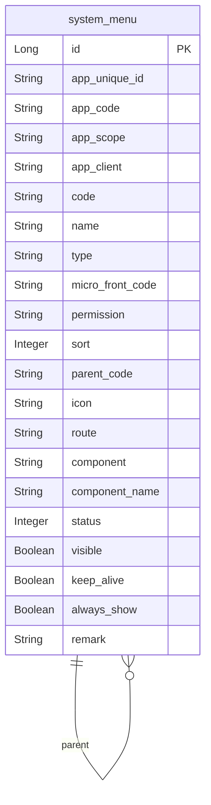
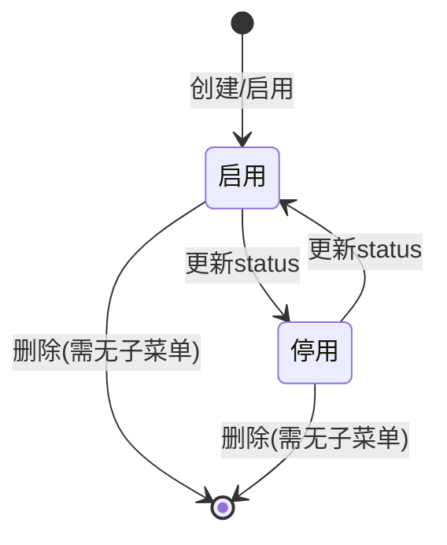

# 系统账号用户、组织架构以及权限-菜单 模块文档

> **文档目的**: 帮助 AI 大模型快速理解本模块业务逻辑和代码结构
> **更新时间**: 2026-01-27

---

## 模块职责

提供菜单（目录/菜单/按钮）管理能力，并支撑“角色授权菜单”“登录后获取可见菜单”等权限体系：
- 管理后台维护 `system_menu`（新增/更新/删除/详情/列表）
- 删除菜单时联动清理角色已授予的菜单权限
- 支持按应用获取“可分配菜单树（simple）”用于角色授权 UI

边界：本文档聚焦“菜单管理”；角色与权限分配在“系统账号用户、组织架构以及权限-账号用户/数据/脱敏”等文档中关联说明。

## 目录结构

```
lcyf-module-system/
├── lcyf-module-system-adapter/
│   └── src/main/java/com/lcyf/cloud/module/system/adapter/
│       └── web/system/menu/
│           └── MenuController.java
│
└── lcyf-module-system-biz/
    └── src/main/java/com/lcyf/cloud/module/system/biz/
        ├── service/system/menu/
        │   ├── IMenuService.java
        │   └── impl/system/menu/
        │       └── MenuServiceImpl.java
        └── infrastructure/
            ├── entity/system/menu/
            │   └── MenuDo.java
            └── gateway/system/menu/
                └── MenuGateway.java
```

## 功能清单

| 功能 | 描述 | 入口 Controller | 核心 Service |
|------|------|-----------------|--------------|
| 菜单列表查询 | 按条件查询菜单列表（默认 appUniqueId=当前登录 app） | `MenuController.queryMenuList()` | `IMenuService.getMenuList()` |
| 创建菜单 | 校验 code 唯一、父菜单合法、排序默认；补齐 appCode/appScope/appClient | `MenuController.createMenu()` | `IMenuService.createMenu()` |
| 更新菜单 | 校验存在；code 变更需更新子节点 parentCode；目录类型清空 permission | `MenuController.updateMenu()` | `IMenuService.modifyMenu()` |
| 删除菜单 | 校验无子菜单；删除后触发清理角色授权菜单 | `MenuController.deleteMenu()` | `IMenuService.deleteMenu()` |
| 菜单详情 | 查询单个菜单详情 | `MenuController.queryMenuDetails()` | `IMenuService.getMenuDetails()` |
| 获取可分配菜单树（simple） | 仅返回启用菜单；用于角色授权 | `MenuController.getSimpleMenuList()` | `IPermissionService.getAccountAppSimpleMenuTree()` |

## 核心入口文件

### Controller 层
| 文件 | 路径 | 职责 |
|------|------|------|
| `MenuController.java` | `lcyf-module-system/lcyf-module-system-adapter/src/main/java/com/lcyf/cloud/module/system/adapter/web/system/menu/MenuController.java` | 菜单 CRUD 与“角色可分配菜单树”接口 |

### Service 层
| 文件 | 路径 | 职责 |
|------|------|------|
| `IMenuService.java` | `lcyf-module-system/lcyf-module-system-biz/src/main/java/com/lcyf/cloud/module/system/biz/service/system/menu/IMenuService.java` | 菜单管理服务接口 |
| `MenuServiceImpl.java` | `lcyf-module-system/lcyf-module-system-biz/src/main/java/com/lcyf/cloud/module/system/biz/service/impl/system/menu/MenuServiceImpl.java` | 菜单管理实现（校验 + 组装 + 权限联动处理） |

### Gateway 层
| 文件 | 路径 | 职责 |
|------|------|------|
| `MenuGateway.java` | `lcyf-module-system/lcyf-module-system-biz/src/main/java/com/lcyf/cloud/module/system/biz/infrastructure/gateway/system/menu/MenuGateway.java` | `system_menu` 的查询/保存/更新/删除与树相关查询 |

### 实体层
| 文件 | 对应表 | 说明 |
|------|--------|------|
| `MenuDo.java` | `system_menu` | 菜单表（应用信息、code/parentCode、route/component、permission、sort、状态等） |

## 核心流程

### 流程1: 创建菜单（补齐应用信息 + 父菜单校验）

**触发条件**: 管理后台创建菜单/按钮
**入口**: `MenuController.createMenu()`

- HTTP：`POST /api/v1/system/auth/menu/create`

```
请求入口
│
├─ 1. Controller
│     └─ MenuController.createMenu(cmd)
│
├─ 2. Service
│     └─ MenuServiceImpl.createMenu(cmd)
│         ├─ validateCode(code) 确保 system_menu.code 唯一
│         ├─ validateParentMenu(parentCode, code, type)
│         │   ├─ parentCode!=自身
│         │   ├─ 父菜单存在
│         │   ├─ 父菜单类型必须 DIR/MENU
│         │   └─ BUTTON 不能挂在 DIR 下
│         ├─ sort 为空则 menuGateway.selectMaxSort(parentCode)
│         ├─ applicationGateway.selectByUniqueId(appUniqueId) -> appCode/appScope/appClient
│         ├─ DIR 类型清空 permission
│         └─ menuGateway.save(addCmd)
│
└─ 3. 返回
      └─ CommonResult.success(menuCode)
```

### 流程2: 删除菜单（校验无子菜单 + 清理角色权限）

**触发条件**: 管理后台删除菜单
**入口**: `MenuController.deleteMenu()`

- HTTP：`DELETE /api/v1/system/auth/menu/delete/{id}`

```
请求入口
│
├─ 1. Service 校验
│     └─ MenuServiceImpl.deleteMenu(id)
│         ├─ validateCodeMenu(id) 确保存在
│         ├─ validateHasChildMenu(code) 子菜单数量必须为 0
│         ├─ menuGateway.delete(id)
│         └─ permissionService.processMenuDeleted(code)
│
└─ 2. 返回
      └─ CommonResult.success(true)
```

## 数据模型

### 核心实体关系



### 状态流转



## 依赖关系

### 依赖的模块
| 模块 | 调用方式 | 用途 |
|------|----------|------|
| 权限模块 | `IPermissionService` | 删除菜单时清理角色授权；获取可分配菜单树 |
| 应用模块 | `ApplicationGateway` | 创建菜单时补齐 appCode/appScope/appClient |

### 被依赖的模块
| 模块 | 调用方式 | 提供能力 |
|------|----------|----------|
| 角色管理/权限分配 | HTTP/本地调用 | 通过菜单树进行角色授权与登录后菜单渲染 |

## RPC 接口

### 对外提供的接口
| 接口 | 方法 | 用途 |
|------|------|------|
| （本子域未发现对外 Dubbo RPC） | - | - |

### 调用的外部接口
| 接口 | 方法 | 来源模块 |
|------|------|----------|
| （本子域未发现直接外部接口） | - | - |

## 关键设计决策

| 决策点 | 选择 | 原因 |
|--------|------|------|
| 菜单树结构 | `parent_code` 自关联 | 简化树查询与前端渲染
| 目录类型权限标识 | DIR 类型强制 `permission=""` | 目录只做导航节点，不参与细粒度权限控制
| 删除联动 | 删除菜单时 `permissionService.processMenuDeleted(code)` | 避免角色仍引用已删除菜单导致脏数据 |

## 扩展指南

| 场景 | 操作步骤 |
|------|----------|
| 新增菜单字段 | 扩展 `system_menu` 与 `MenuDo`，并同步 Assembler/DTO |
| 增加父子约束 | 在 `validateParentMenu/validateHasChildMenu` 增强校验 |
| 批量迁移菜单 code | 需同时更新子节点 parentCode（`menuGateway.updateParentCode`）并同步角色授权数据 |

## 常见问题

| 问题 | 解决方案 |
|------|----------|
| 为什么按钮不能挂在目录下？ | `MenuServiceImpl.validateParentMenu` 对 BUTTON+DIR 组合直接抛错 |
| 为什么删除菜单提示“存在子菜单”？ | `MenuServiceImpl.validateHasChildMenu` 会检查 `menuGateway.selectCountByParentCode` |
