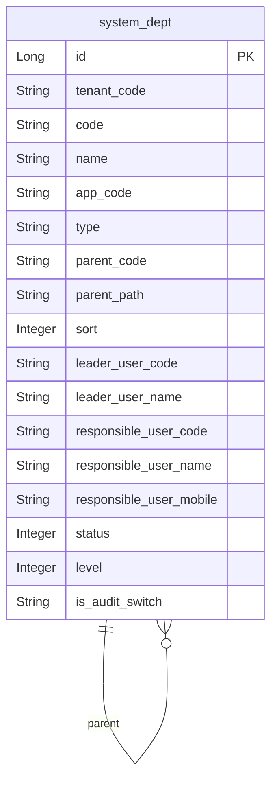
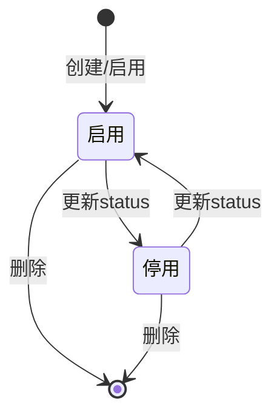

# 系统账号用户、组织架构以及权限-组织架构 模块文档

> **文档目的**: 帮助 AI 大模型快速理解本模块业务逻辑和代码结构
> **更新时间**: 2026-01-27

---

## 模块职责

提供“部门（组织树）”相关的组织架构管理能力，并作为数据权限、人员归属、账号查询的重要基础：
- 创建/更新/删除部门
- 查询部门列表/详情、精简列表
- 查询应用下部门树、租户/渠道/团队维度树
- 设置部门团队长、注册审核开关等部门配置

边界：
- 你已确认“岗位（post）”当前不纳入组织架构文档（代码中 PostController 处于注释状态）。
- 渠道/团队等业务组织在“组织机构-*”系列文档中展开，本篇聚焦 `system_dept` 与部门树能力。

## 目录结构

```
lcyf-module-system/
├── lcyf-module-system-adapter/
│   └── src/main/java/com/lcyf/cloud/module/system/adapter/
│       └── web/system/dept/
│           └── DeptController.java
│
└── lcyf-module-system-biz/
    └── src/main/java/com/lcyf/cloud/module/system/biz/
        ├── service/system/dept/
        │   └── IDeptService.java
        │   └── impl/system/dept/
        │       └── DeptServiceImpl.java
        └── infrastructure/entity/system/dept/
            └── DeptDo.java

lcyf-framework/
└── lcyf-framework-starter-dataPermission/
    └── src/main/java/com/lcyf/cloud/framework/dataPermission/infrastructure/mapper/
        └── DataPermissionConfigMapper.java
```

## 功能清单

| 功能 | 描述 | 入口 Controller | 核心 Service |
|------|------|-----------------|--------------|
| 创建部门 | 默认补齐 appCode/tenantCode；创建部门 | `DeptController.addDept()` | `IDeptService.createDept()` |
| 查询部门列表 | 查询部门列表（可选是否统计用户数） | `DeptController.queryDeptList()` | `IDeptService.getDeptList()` |
| 更新部门名称 | 更新部门名称 | `DeptController.updateDept()` | `IDeptService.modifyDeptName()` |
| 删除部门 | 删除部门 | `DeptController.deleteDept()` | `IDeptService.deleteDept()` |
| 部门详情 | 查询部门详情 | `DeptController.queryDeptDetails()` | `IDeptService.getDeptDetails()` |
| 设置部门团队长 | 设置部门 leaderUser | `DeptController.updateDeptLeaderUser()` | `IDeptService.modifyDeptLeaderUser()` |
| 部门精简列表 | 即展端查询精简部门列表 | `DeptController.queryDeptSimpleList()` | `IDeptService.queryDeptSimpleListToJz()` |
| 应用下部门树 | 橙芯查询应用下部门树（需应用-租户关联） | `DeptController.queryApplicationDeptTree()` | `IDeptService.queryApplicationDeptTree()` |
| 注册审核设置 | 更新部门注册审核开关 | `DeptController.updateAuditSetting()` | `IDeptService.modifyIsAuditSwitch()` |
| 租户/渠道/团队树查询 | 橙芯多视角查询树结构 | `DeptController.queryTreeToTenant()` / `queryTreeToChannel()` / `queryTreeToTeam()` | `IDeptService.getInnerTreeBy*()` |

## 核心入口文件

### Controller 层
| 文件 | 路径 | 职责 |
|------|------|------|
| `DeptController.java` | `lcyf-module-system/lcyf-module-system-adapter/src/main/java/com/lcyf/cloud/module/system/adapter/web/system/dept/DeptController.java` | 部门管理入口：增删改查、树查询、团队长设置、审核开关 |

### Service 层
| 文件 | 路径 | 职责 |
|------|------|------|
| `IDeptService.java` | `lcyf-module-system/lcyf-module-system-biz/src/main/java/com/lcyf/cloud/module/system/biz/service/system/dept/IDeptService.java` | 部门服务接口（创建/树查询/配置等） |
| `DeptServiceImpl.java` | `lcyf-module-system/lcyf-module-system-biz/src/main/java/com/lcyf/cloud/module/system/biz/service/impl/system/dept/DeptServiceImpl.java` | 部门服务实现（树结构与业务规则） |

### Gateway 层
| 文件 | 路径 | 职责 |
|------|------|------|
| （部门相关 Gateway/Mapper 在 dept 子包内，本文档以 Controller/Service 入口为主） | - | - |

### 实体层
| 文件 | 对应表 | 说明 |
|------|--------|------|
| `DeptDo.java` | `system_dept` | 部门表（code/name/parentCode/path/负责人/状态/层级等） |

## 核心流程

### 流程1: 创建部门（默认补齐 appCode/tenantCode）

**触发条件**: 即展端创建部门
**入口**: `DeptController.addDept()`

- HTTP：`POST /api/v1/system/auth/dept/create`

```
请求入口
│
├─ 1. Controller 填充默认值
│     └─ DeptController.addDept(cmd)
│         ├─ cmd.appCode 为空 -> LoginUtil.appCode()
│         └─ cmd.tenantCode 为空 -> LoginUtil.tenantCode()
│
├─ 2. Service
│     └─ deptService.createDept(cmd)
│
└─ 3. 返回
      └─ CommonResult.success(deptCode)
```

### 流程2: 查询部门树（应用维度）

**触发条件**: 橙芯查询某应用在某租户下的部门树
**入口**: `DeptController.queryApplicationDeptTree()`

- HTTP：`GET /api/v1/system/auth/dept/query/application/dept/tree?tenantCode=...&appUniqueId=...`

```
请求入口
│
├─ 1. Controller 校验应用-租户关联
│     └─ applicationService.getApplicationRelaTenant(tenantCode, appUniqueId)
│
├─ 2. Service
│     └─ deptService.queryApplicationDeptTree(tenantCode, appUniqueId, rootDeptCode, appCode)
│
└─ 3. 返回
      └─ CommonResult.success(DeptDto tree)
```

## 数据模型

### 核心实体关系



### 状态流转



## 依赖关系

### 依赖的模块
| 模块 | 调用方式 | 用途 |
|------|----------|------|
| 应用模块 | `IApplicationService` | 查询应用-租户关联与 rootDeptCode |
| 数据权限模块 | SQL/间接依赖 | 数据权限组件会通过 `system_user_dept_rel`、`system_dept` 构建 dept 范围（见 DataPermissionConfigMapper） |

### 被依赖的模块
| 模块 | 调用方式 | 提供能力 |
|------|----------|----------|
| 用户/人员/组织机构模块 | 本地查询/权限过滤 | 部门树作为用户归属、团队归属、数据权限的基础 |

## RPC 接口

### 对外提供的接口
| 接口 | 方法 | 用途 |
|------|------|------|
| （本子域未发现对外 Dubbo RPC） | - | - |

### 调用的外部接口
| 接口 | 方法 | 来源模块 |
|------|------|----------|
| （本子域未发现直接外部接口） | - | - |

## 关键设计决策

| 决策点 | 选择 | 原因 |
|--------|------|------|
| 部门树模型 | `parent_code` 自关联 + `parent_path` 路径 | 支撑树查询与下级范围计算 |
| 多视角树查询 | tenant/channel/team 分别提供树接口 | 满足橙芯不同管理视角 |

## 扩展指南

| 场景 | 操作步骤 |
|------|----------|
| 增加部门配置项 | 扩展 `system_dept` 与 `DeptDo`，并在 `DeptServiceImpl` 维护更新逻辑 |
| 数据权限联动 | 若新增部门维度字段用于权限，需要同步 dataPermission 模块的 range 计算与拦截器注入 |

## 常见问题

| 问题 | 解决方案 |
|------|----------|
| 为什么 queryApplicationDeptTree 会报“应用信息不存在”？ | Controller 会先校验 `applicationService.getApplicationRelaTenant`，为空则抛错 |
| DeptController 同时有即展与橙芯接口，是否会混用？ | Controller 内通过不同接口路径区分使用场景，并且部分接口会默认补齐 appCode/tenantCode |
