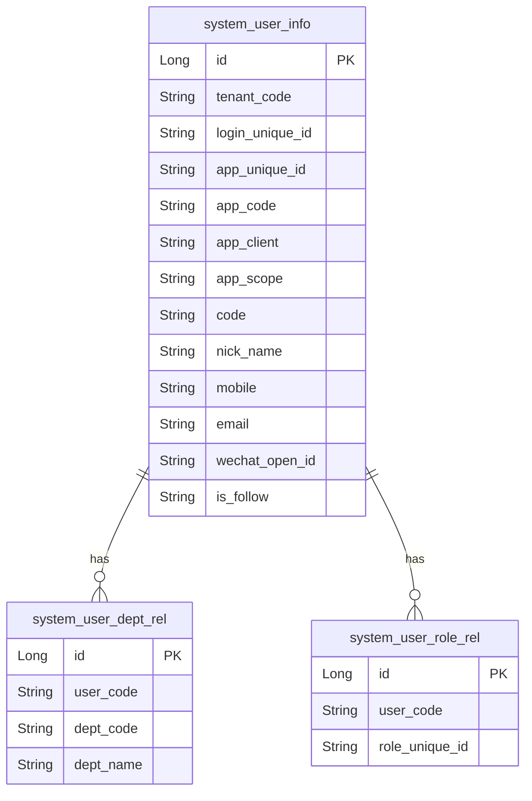
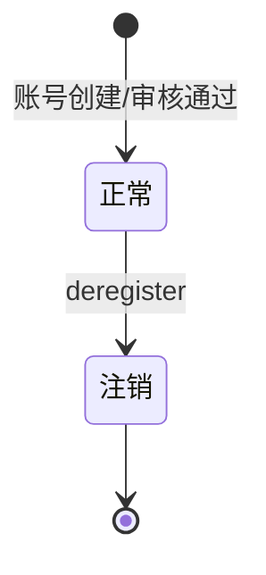

# 系统账号用户、组织架构以及权限-账号用户 模块文档

> **文档目的**: 帮助 AI 大模型快速理解本模块业务逻辑和代码结构
> **更新时间**: 2026-01-27

---

## 模块职责

提供系统内“账号/用户”相关的管理能力，覆盖：
- 用户信息查询与更新（基础信息、详情）
- 团队/渠道维度的用户列表查询（按部门、按团队）
- 团队负责人创建账号（即展业务端）
- 账号注销、密码修改
- 账号审核（审核列表、审核、审核记录）
- 微信 openId 绑定/解绑、是否关注公众号查询

边界：本文档聚焦“用户账号管理”能力；登录认证本身、权限菜单分配、数据权限等在其他文档描述。

## 目录结构

```
lcyf-module-system/
├── lcyf-module-system-adapter/
│   └── src/main/java/com/lcyf/cloud/module/system/adapter/
│       └── web/auth/
│           └── UserInfoController.java
│
└── lcyf-module-system-biz/
    └── src/main/java/com/lcyf/cloud/module/system/biz/
        ├── service/auth/user/
        │   ├── IUserInfoService.java
        │   └── impl/auth/user/
        │       └── UserInfoServiceImpl.java
        └── infrastructure/entity/auth/user/
            ├── UserInfoDo.java
            ├── UserDeptRelDo.java
            └── UserRoleRelDo.java
```

## 功能清单

| 功能 | 描述 | 入口 Controller | 核心 Service |
|------|------|-----------------|--------------|
| 团队账号列表 | 业务后台团队账号分页 | `UserInfoController.queryChannelUserPage()` | `IUserInfoService.toAInnerChannelUserPage()` |
| 部门用户分页 | 渠道后台按部门/渠道查询用户分页 | `UserInfoController.queryUserAgentPage()` | `IUserInfoService.getUserAgentPage()` |
| 部门用户精简列表 | 渠道后台按部门/渠道查询精简列表 | `UserInfoController.queryUserAgentList()` | `IUserInfoService.getUserSimpList()` |
| 用户分页列表（业务后台） | toA 内部用户分页 | `UserInfoController.toAInnerPage()` | `IUserInfoService.toAInnerPage()` |
| 团队负责人创建账号 | 即展(业务端)创建账号（设置 appScope/appCode/client 等） | `UserInfoController.toAOuterCreate()` | `IUserInfoService.toAOuterCreate()` |
| 修改用户基本信息 | 更新用户基础信息 | `UserInfoController.update()` | `IUserInfoService.modify()` |
| 账号注销 | 注销用户账号 | `UserInfoController.deregister()` | `IUserInfoService.deregister()` |
| 当前用户详情 | 获取当前登录用户详情 | `UserInfoController.details()` | `IUserInfoService.get()` |
| 用户详情（按 id） | 查询用户详情 | `UserInfoController.queryDetails()` | `IUserInfoService.get()` |
| 用户详情（按 userCode） | 通过用户编码查询详情 | `UserInfoController.queryDetailsByUserCode()` | `IUserInfoService.getUserDetailsInfo()` |
| 账号审核统计/分页/审核 | 审核状态统计、分页查询、执行审核 | `UserInfoController.queryAccountAuditCount()` / `accountAuditPage()` / `audit()` | `IUserInfoService.getAccountAuditCount()` / `getAccountAuditPage()` / `audit()` |
| 审核记录列表 | 查询某账号审核记录 | `UserInfoController.auditRecord()` | `IUserInfoService.getAccountAuditRecordPage()` |
| 获取邀请人信息 | 通过用户编码查询邀请人 | `UserInfoController.queryInviterInfo()` | `IUserInfoService.getAccountInviterInfo()` |
| 修改密码 | 修改用户密码 | `UserInfoController.updatePassword()` | （实现位于 `UserInfoServiceImpl`） |
| 微信 openId 绑定/解绑 | 绑定或解除绑定 openId | `UserInfoController.wechatBindOpenId()` / `wechatUnbindOpenId()` | `IUserInfoService.wechatBindOpenId()` / `wechatUnbindOpenId()`（方法在 ServiceImpl 内） |
| 是否关注公众号 | 查询是否关注即展公众号 | `UserInfoController.isFollowJZOfficialAccount()` | `IUserInfoService.isFollowJZOfficialAccount()`（方法在 ServiceImpl 内） |

## 核心入口文件

### Controller 层
| 文件 | 路径 | 职责 |
|------|------|------|
| `UserInfoController.java` | `lcyf-module-system/lcyf-module-system-adapter/src/main/java/com/lcyf/cloud/module/system/adapter/web/auth/UserInfoController.java` | 用户/账号管理入口（列表、创建、审核、注销、密码、微信绑定等） |

### Service 层
| 文件 | 路径 | 职责 |
|------|------|------|
| `IUserInfoService.java` | `lcyf-module-system/lcyf-module-system-biz/src/main/java/com/lcyf/cloud/module/system/biz/service/auth/user/IUserInfoService.java` | 用户服务接口（用户查询/创建/审核/注销等） |
| `UserInfoServiceImpl.java` | `lcyf-module-system/lcyf-module-system-biz/src/main/java/com/lcyf/cloud/module/system/biz/service/impl/auth/user/UserInfoServiceImpl.java` | 用户服务实现（依赖多个 Gateway/外部能力，如短信、微信、OSS 等） |

### Gateway 层
| 文件 | 路径 | 职责 |
|------|------|------|
| （涉及多个 Gateway：UserInfoGateway/LoginInfoGateway/UserDeptRelGateway/UserRoleRelGateway 等，入口在 ServiceImpl 中统一编排） | - | - |

### 实体层
| 文件 | 对应表 | 说明 |
|------|--------|------|
| `UserInfoDo.java` | `system_user_info` | 用户信息主表（loginUniqueId、app、手机号、证件、微信、银行等信息） |
| `UserDeptRelDo.java` | `system_user_dept_rel` | 用户与部门关联（userCode <-> deptCode） |
| `UserRoleRelDo.java` | `system_user_role_rel` | 用户与角色关联（userCode <-> roleUniqueId） |

## 核心流程

### 流程1: 团队负责人创建账号（即展业务端）

**触发条件**: 即展(业务端)团队负责人创建账号
**入口**: `UserInfoController.toAOuterCreate()`

- HTTP：`POST /api/v1/system/auth/user/toA/outer/create`

```
请求入口
│
├─ 1. Controller 填充上下文
│     └─ UserInfoController.toAOuterCreate(cmd)
│         ├─ cmd.tenantCode = LoginUtil.tenantCode()
│         ├─ cmd.appScope   = BUSINESS
│         ├─ cmd.appCode    = JI_ZHAN
│         └─ cmd.appClient  = BUSINESS
│
├─ 2. Service
│     └─ IUserInfoService.toAOuterCreate(cmd, LoginUtil.userCode())
│
└─ 3. 返回
      └─ CommonResult.success(true)
```

### 流程2: 账号注销

**触发条件**: 管理后台/业务后台注销账号
**入口**: `UserInfoController.deregister()`

- HTTP：`DELETE /api/v1/system/auth/user/deregister?id={id}`

```
请求入口
│
├─ 1. Controller
│     └─ UserInfoController.deregister(id)
│
└─ 2. Service
      └─ IUserInfoService.deregister(id)
          （具体注销策略在 UserInfoServiceImpl 内实现）
```

## 数据模型

### 核心实体关系



### 状态流转



## 依赖关系

### 依赖的模块
| 模块 | 调用方式 | 用途 |
|------|----------|------|
| 角色/权限模块 | 本地 Service/Gateway | 查询/绑定角色，影响菜单与数据权限 |
| 短信/微信/OSS 等 | 本地 Service/客户端 | 用于账号审核通知、微信绑定、影像存储等（具体在 UserInfoServiceImpl） |

### 被依赖的模块
| 模块 | 调用方式 | 提供能力 |
|------|----------|----------|
| 组织/人员相关模块 | HTTP/本地调用 | 账号创建与信息查询作为基础能力被复用 |

## RPC 接口

### 对外提供的接口
| 接口 | 方法 | 用途 |
|------|------|------|
| （本子域未发现对外 Dubbo RPC） | - | - |

### 调用的外部接口
| 接口 | 方法 | 来源模块 |
|------|------|----------|
| （微信/短信等外部依赖将在“外部系统-微信/短信”文档中描述） | - | - |

## 关键设计决策

| 决策点 | 选择 | 原因 |
|--------|------|------|
| 账号维度模型 | `login_unique_id` 与用户信息绑定 | 支持多应用、多客户端统一识别账号 |
| 团队负责人创建账号默认参数 | Controller 强制写入 appScope/appCode/appClient | 防止前端伪造，保证业务端创建逻辑一致 |

## 扩展指南

| 场景 | 操作步骤 |
|------|----------|
| 增加用户字段 | 扩展 `system_user_info` 与 `UserInfoDo`，并同步 DTO/Assembler/Service |
| 增加新的账号审核流程 | 在 `UserInfoServiceImpl` 增加审核状态机与通知逻辑，复用现有 audit 接口 |
| 新增第三方绑定 | 按“微信 openId”模式增加字段与绑定接口，注意租户/应用隔离 |

## 常见问题

| 问题 | 解决方案 |
|------|----------|
| 为什么有多种用户列表接口？ | `UserInfoController` 同时面向业务后台/渠道后台/管理后台，按不同视角提供不同分页与精简查询 |
| toAOuterCreate 为什么要固定 appCode=JI_ZHAN？ | Controller 侧强制设置，避免账号被创建到错误的应用域/客户端 |
