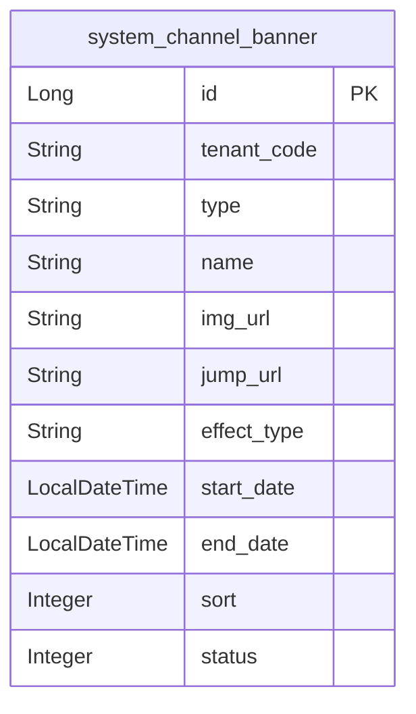
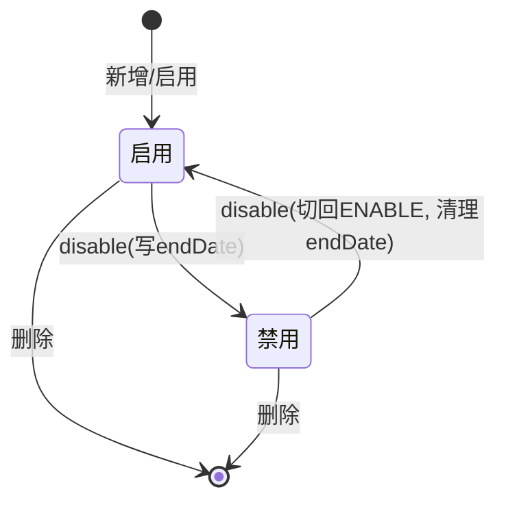

# 配置管理-渠道banner 模块文档

> **文档目的**: 帮助 AI 大模型快速理解本模块业务逻辑和代码结构
> **更新时间**: 2026-01-27

---

## 模块职责

提供“渠道 banner”配置管理与对外查询能力，核心包括：
- 管理后台：查询配置、增删改、启禁用（并维护排序）
- 对外查询：云服首页 banner（外部接口，带限流）与云服渠道端 banner

边界：本文档只覆盖 `system_channel_banner` 的 banner 管理；即展 banner（`system_jz_banner`）属于“配置管理-即展”。

## 目录结构

```
lcyf-module-system/
├── lcyf-module-system-adapter/
│   └── src/main/java/com/lcyf/cloud/module/system/adapter/
│       └── web/system/base/
│           └── ChannelBannerController.java
│
└── lcyf-module-system-biz/
    └── src/main/java/com/lcyf/cloud/module/system/biz/
        ├── service/system/base/
        │   ├── IChannelBannerService.java
        │   └── impl/system/base/
        │       └── ChannelBannerServiceImpl.java
        │
        └── infrastructure/
            ├── entity/system/base/
            │   └── ChannelBannerDo.java
            ├── gateway/system/base/
            │   └── ChannelBannerGateway.java
            └── mapper/system/base/
                └── ChannelBannerMapper.java
```

## 功能清单

| 功能 | 描述 | 入口 Controller | 核心 Service |
|------|------|-----------------|--------------|
| 查询 banner 配置 | 返回按 type 分组的 bannerMap，按 sort 排序 | `ChannelBannerController.queryChannelBannerConfig()` | `IChannelBannerService.getChannelBannerConfig()` |
| 新增 banner | 校验启用数量<=6；immediately 自动填 startDate；sort 追加到末尾 | `ChannelBannerController.addBanner()` | `IChannelBannerService.add()` |
| 更新 banner | 校验存在；处理 effectType 立即/指定互转；可调整顺序并重排其他项 sort | `ChannelBannerController.updateBanner()` | `IChannelBannerService.modify()` |
| 删除 banner | 删除后重排剩余 sort | `ChannelBannerController.deleteBanner()` | `IChannelBannerService.delete()` |
| 启禁用 banner | 禁用写 endDate；启用需校验启用数量<=6 | `ChannelBannerController.disableBanner()` | `IChannelBannerService.disable()` |
| 云服首页 banner（外部） | 设置默认 tenant；限流；返回启用且 startDate<=now 的 banner | `ChannelBannerController.queryLcyfBanner()` | `IChannelBannerService.getLcyfBanner()` |
| 云服渠道端 banner | 返回启用且 startDate<=now 的 banner | `ChannelBannerController.queryLcyfChannelBanner()` | `IChannelBannerService.getLcyfChannelBanner()` |

## 核心入口文件

### Controller 层
| 文件 | 路径 | 职责 |
|------|------|------|
| `ChannelBannerController.java` | `lcyf-module-system/lcyf-module-system-adapter/src/main/java/com/lcyf/cloud/module/system/adapter/web/system/base/ChannelBannerController.java` | banner 配置维护与对外查询入口 |

### Service 层
| 文件 | 路径 | 职责 |
|------|------|------|
| `IChannelBannerService.java` | `lcyf-module-system/lcyf-module-system-biz/src/main/java/com/lcyf/cloud/module/system/biz/service/system/base/IChannelBannerService.java` | banner 服务接口 |
| `ChannelBannerServiceImpl.java` | `lcyf-module-system/lcyf-module-system-biz/src/main/java/com/lcyf/cloud/module/system/biz/service/impl/system/base/ChannelBannerServiceImpl.java` | banner 业务实现（数量校验、排序调整、启用时间处理） |

### Gateway 层
| 文件 | 路径 | 职责 |
|------|------|------|
| `ChannelBannerGateway.java` | `lcyf-module-system/lcyf-module-system-biz/src/main/java/com/lcyf/cloud/module/system/biz/infrastructure/gateway/system/base/ChannelBannerGateway.java` | banner 按 type/启用状态查询、批量更新、清理 endDate |

### 实体层
| 文件 | 对应表 | 说明 |
|------|--------|------|
| `ChannelBannerDo.java` | `system_channel_banner` | 渠道 banner（type、图片、跳转、effectType、start/end、sort、status；tenant 维度） |

## 核心流程

### 流程1: 新增 banner（启用数量上限 + 自动排序）

**触发条件**: 管理后台新增 banner
**入口**: `ChannelBannerController.addBanner()`

- HTTP：`POST /api/v1/system/auth/channelBanner/add`

```
请求入口
│
├─ 1. Controller
│     └─ ChannelBannerController.addBanner(addCmd)
│
├─ 2. Service
│     └─ ChannelBannerServiceImpl.add(addCmd)
│         ├─ oldBannerList = channelBannerGateway.selectByType(type) -> sort
│         ├─ 启用数量校验：ENABLE count + 1 <= 6
│         ├─ effectType=IMMEDIATELY -> startDate=now；ASSIGN -> startDate 必填
│         ├─ sort = last.sort + 1
│         ├─ channelBannerGateway.save(addCmd)
│         └─ 返回 getNewestBanner(type)
│
└─ 3. 返回
      └─ 最新的同 type banner 列表（按 sort）
```

### 流程2: 调整 banner 顺序（重排其他项 sort）

**触发条件**: 管理后台更新 banner 且 sort 发生变化
**入口**: `ChannelBannerController.updateBanner()`

- HTTP：`PUT /api/v1/system/auth/channelBanner/update`

```
请求入口
│
├─ 1. Service 校验与重排
│     └─ ChannelBannerServiceImpl.modify(updateCmd)
│         ├─ 查询当前记录存在性
│         ├─ 若 sort 变化：遍历同 type 旧列表，为“非当前项”重置 sort
│         ├─ channelBannerGateway.updateBatchById(updateCmdList)
│         └─ channelBannerGateway.updateById(updateCmd)
│
└─ 2. 返回
      └─ 最新的同 type banner 列表
```

## 数据模型

### 核心实体关系



### 状态流转



## 依赖关系

### 依赖的模块
| 模块 | 调用方式 | 用途 |
|------|----------|------|
| 租户上下文 | `TenantContextHolder` | 外部查询接口设置默认 tenant（云服首页 banner） |
| 限流组件 | `@RateLimiter(name = "outer-banner-lcyf")` | 对外 banner 查询限流保护 |

### 被依赖的模块
| 模块 | 调用方式 | 提供能力 |
|------|----------|----------|
| 云服前台/渠道端 | HTTP | 读取 banner 列表用于首页展示 |

## RPC 接口

### 对外提供的接口
| 接口 | 方法 | 用途 |
|------|------|------|
| （本子域未发现对外 Dubbo RPC） | - | - |

### 调用的外部接口
| 接口 | 方法 | 来源模块 |
|------|------|----------|
| （本子域未发现直接外部 RPC） | - | - |

## 关键设计决策

| 决策点 | 选择 | 原因 |
|--------|------|------|
| 启用数量限制 | 每个 type 最多 6 张启用 banner | 控制首页资源加载与运营可控性 |
| 生效时间处理 | immediately 自动写 startDate=now；指定生效必须提供 startDate | 统一生效语义，避免不明确的展示时间 |
| 对外查询过滤 | 仅返回 status=ENABLE 且 startDate<=now | 防止未到生效时间的 banner 被外部接口展示 |

## 扩展指南

| 场景 | 操作步骤 |
|------|----------|
| 增加新的 banner 类型 | 扩展 `ChannelBannerTypeEnum` 并在 `getChannelBannerConfig` 中保持分组逻辑 |
| 增加展示过滤规则 | 在 `ChannelBannerGateway.selectByTypeAndEnable` 增加条件（例如 endDate>=now） |
| 调整启用数量上限 | 修改 `ChannelBannerServiceImpl` 中的数量校验逻辑（目前写死 6） |

## 常见问题

| 问题 | 解决方案 |
|------|----------|
| 为什么新增/启用会报“最多支持6张启用的banner”？ | `ChannelBannerServiceImpl.add/modify/disable` 都会对 ENABLE 数量做上限校验 |
| 为什么外部接口要 set 默认 tenant？ | `ChannelBannerController.queryLcyfBanner` 调用前 `TenantContextHolder.setTenantCode(SystemConstants.DEFAULT_TENANT_CODE)`，确保查询在默认租户下执行 |
