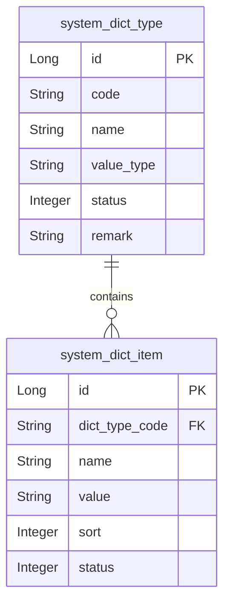
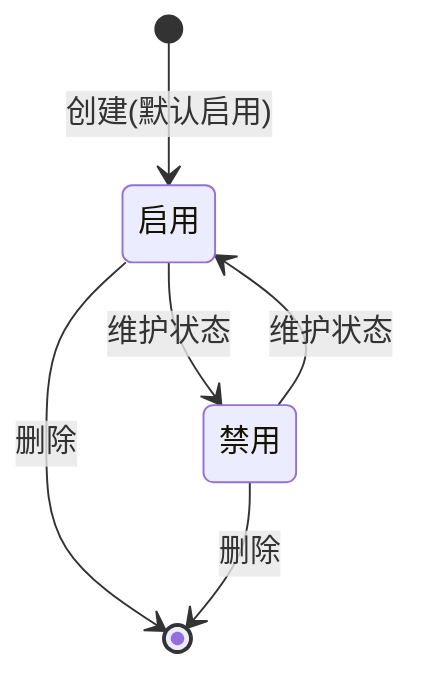

# 配置管理-字典 模块文档

> **文档目的**: 帮助 AI 大模型快速理解本模块业务逻辑和代码结构
> **更新时间**: 2026-01-27

---

## 模块职责

提供字典类型与字典项的管理能力：
- 字典类型（system_dict_type）：维护字典类型 code/name/valueType/status/remark
- 字典项（system_dict_item）：维护某字典类型下的可选项 value/name/sort/status
- 支持字典加载聚合接口：一次性加载所有启用的类型与项，并按类型分组返回

边界：本文档只覆盖系统模块内的字典管理（管理后台）。

## 目录结构

```
lcyf-module-system/
├── lcyf-module-system-adapter/
│   └── src/main/java/com/lcyf/cloud/module/system/adapter/
│       └── web/system/base/
│           └── DictController.java
│
└── lcyf-module-system-biz/
    └── src/main/java/com/lcyf/cloud/module/system/biz/
        ├── service/system/base/
        │   ├── IDictService.java
        │   └── impl/system/base/
        │       └── DictServiceImpl.java
        │
        └── infrastructure/
            ├── entity/system/base/
            │   ├── DictTypeDo.java
            │   └── DictItemDo.java
            ├── gateway/system/base/
            │   ├── DictTypeGateway.java
            │   └── DictItemGateway.java
            ├── assembler/system/base/
            │   └── DictAssembler.java
            └── mapper/system/base/
                ├── DictTypeMapper.java
                └── DictItemMapper.java
```

## 功能清单

| 功能 | 描述 | 入口 Controller | 核心 Service |
|------|------|-----------------|--------------|
| 加载字典 | 返回所有启用字典类型及其字典项（按 type code 分组） | `DictController.loadDict()` | `IDictService.loadDict()` |
| 字典类型分页 | 分页查询字典类型（BeanSearcher） | `DictController.pageDictType()` | `IDictService.getDictTypePage()` |
| 新增字典类型 | 校验 code/name 唯一后新增 | `DictController.addDictType()` | `IDictService.createDictType()` |
| 更新字典类型 | 校验 code/name 唯一后更新 | `DictController.updateDictType()` | `IDictService.modifyDictType()` |
| 删除字典类型 | 若存在字典项则拒绝删除 | `DictController.deleteDictType()` | `IDictService.deleteDictType()` |
| 字典项分页 | 分页查询字典项（BeanSearcher） | `DictController.pageDictItem()` | `IDictService.getDictItemPage()` |
| 新增字典项 | 校验 name/value 在同 type 下唯一；sort 为空则自动递增 | `DictController.addDictItem()` | `IDictService.createDictItem()` |
| 更新字典项 | 校验 name/value 在同 type 下唯一 | `DictController.updateDictItem()` | `IDictService.modifyDictItem()` |
| 删除字典项 | 物理删除 | `DictController.deleteDictItem()` | `IDictService.deleteDictItem()` |

## 核心入口文件

### Controller 层
| 文件 | 路径 | 职责 |
|------|------|------|
| `DictController.java` | `lcyf-module-system/lcyf-module-system-adapter/src/main/java/com/lcyf/cloud/module/system/adapter/web/system/base/DictController.java` | 字典类型/字典项的管理接口入口 |

### Service 层
| 文件 | 路径 | 职责 |
|------|------|------|
| `IDictService.java` | `lcyf-module-system/lcyf-module-system-biz/src/main/java/com/lcyf/cloud/module/system/biz/service/system/base/IDictService.java` | 字典服务接口定义 |
| `DictServiceImpl.java` | `lcyf-module-system/lcyf-module-system-biz/src/main/java/com/lcyf/cloud/module/system/biz/service/impl/system/base/DictServiceImpl.java` | 字典业务实现（校验 + 组装 + Gateway 调用） |

### Gateway 层
| 文件 | 路径 | 职责 |
|------|------|------|
| `DictTypeGateway.java` | `lcyf-module-system/lcyf-module-system-biz/src/main/java/com/lcyf/cloud/module/system/biz/infrastructure/gateway/system/base/DictTypeGateway.java` | 字典类型的分页查询、唯一性校验、保存 |
| `DictItemGateway.java` | `lcyf-module-system/lcyf-module-system-biz/src/main/java/com/lcyf/cloud/module/system/biz/infrastructure/gateway/system/base/DictItemGateway.java` | 字典项的分页查询、唯一性校验、最大 sort 查询、保存 |

### 实体层
| 文件 | 对应表 | 说明 |
|------|--------|------|
| `DictTypeDo.java` | `system_dict_type` | 字典类型（code/name/valueType/status/remark） |
| `DictItemDo.java` | `system_dict_item` | 字典项（dictTypeCode/name/value/sort/status） |

## 核心流程

### 流程1: 加载字典（按类型聚合）

**触发条件**: 系统启动/前端需要字典下拉项
**入口**: `DictController.loadDict()`

```
请求入口
│
├─ 1. Controller
│     └─ DictController.loadDict()
│
├─ 2. Service
│     └─ DictServiceImpl.loadDict()
│         ├─ DictTypeGateway.selectAllEnabled()
│         ├─ DictItemGateway.selectAllEnabled()
│         ├─ itemGroupByDictTypeCode = groupBy(dictTypeCode)
│         └─ 为每个 DictType 绑定 itemList（按 sort 排序）
│
└─ 3. 返回
      └─ Map<dictTypeCode, DictTypeSimpleDto>
```

### 流程2: 删除字典类型（存在字典项则拒绝）

**触发条件**: 管理后台删除字典类型
**入口**: `DictController.deleteDictType()`

```
请求入口
│
├─ 1. Controller
│     └─ DictController.deleteDictType(id)
│
├─ 2. Service
│     └─ DictServiceImpl.deleteDictType(id)
│         ├─ checkDictTypeExists(id)
│         ├─ dictItemGateway.countDictItemByCode(dictType.code) > 0 ? throw DICT_TYPE_HAS_CHILDREN
│         └─ dictTypeGateway.removeById(id)
│
└─ 3. 返回
      └─ CommonResult.success(true)
```

## 数据模型

### 核心实体关系



### 状态流转



## 依赖关系

### 依赖的模块
| 模块 | 调用方式 | 用途 |
|------|----------|------|
| BeanSearcher | Maven 依赖 | `DictTypeGateway.selectPage` / `DictItemGateway.selectPage` 动态条件分页检索 |
| MyBatis-Plus | Maven 依赖 | 读写字典表 |

### 被依赖的模块
| 模块 | 调用方式 | 提供能力 |
|------|----------|----------|
| system(其他子域) | 本地 Service 调用 | 通过字典 code 获取下拉项/枚举解释（调用方通常使用 loadDict 返回结果） |

## RPC 接口

### 对外提供的接口
| 接口 | 方法 | 用途 |
|------|------|------|
| （本子域未发现对外 RPC） | - | - |

### 调用的外部接口
| 接口 | 方法 | 来源模块 |
|------|------|----------|
| （本子域未发现直接外部 RPC） | - | - |

## 关键设计决策

| 决策点 | 选择 | 原因 |
|--------|------|------|
| 唯一性校验位置 | Service 层调用 Gateway.exists* 校验 | 防止重复 code/name/value，错误码统一在 service 抛出 |
| loadDict 返回结构 | Map<dictTypeCode, DictTypeSimpleDto> | 前端按 code 快速索引，减少二次遍历 |
| 字典项排序 | sort 字段；新增时 sort 为空则 maxSort+1 | 保证 UI 展示顺序稳定且可控 |

## 扩展指南

| 场景 | 操作步骤 |
|------|----------|
| 新增字典类型字段 | 修改 `DictTypeDo`/表结构 → 更新 Assembler/DTO（如需） |
| 新增字典项字段 | 修改 `DictItemDo`/表结构 → 更新 Assembler/DTO（如需） |
| 调整 loadDict 聚合逻辑 | 修改 `DictServiceImpl.loadDict()`（注意排序与分组） |

## 常见问题

| 问题 | 解决方案 |
|------|----------|
| 删除字典类型提示“存在子项” | 先删除该类型下所有字典项（`DictItemGateway.countDictItemByCode` 校验） |
| 字典项 sort 不传会怎样？ | `DictServiceImpl.createDictItem` 会取该类型下 maxSort 并自动 +1 |
