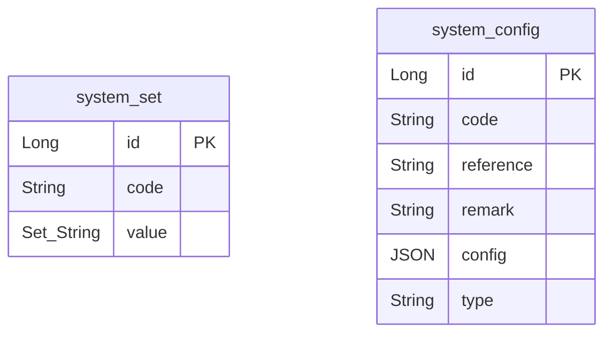
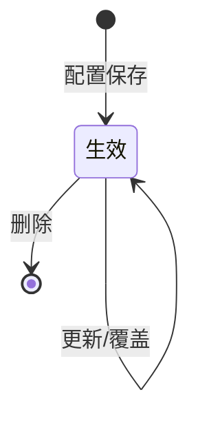

# 配置管理-系统 模块文档

> **文档目的**: 帮助 AI 大模型快速理解本模块业务逻辑和代码结构
> **更新时间**: 2026-01-27

---

## 模块职责

提供系统级配置与系统设置能力：
- 系统设置（system_set）：以 code 为键、value 为 Set<String> 的配置项维护与查询
- 系统配置（system_config）：以 code 为键、config(JSON) 为值的配置项维护、分页查询，并支撑其他业务（如按牌照获取域名/配置）读取系统配置

边界：本文档只覆盖“系统设置/系统配置”这部分能力；渠道 banner、即展首页配置、字典等在各自子文档中展开。

## 目录结构

```
lcyf-module-system/
├── lcyf-module-system-adapter/
│   └── src/main/java/com/lcyf/cloud/module/system/adapter/
│       └── web/system/base/
│           └── SystemSetController.java
│
└── lcyf-module-system-biz/
    └── src/main/java/com/lcyf/cloud/module/system/biz/
        ├── service/system/base/
        │   ├── ISystemSetService.java
        │   ├── ISystemConfigService.java
        │   └── impl/system/base/
        │       ├── SystemSetServiceImpl.java
        │       └── SystemConfigServiceImpl.java
        │
        └── infrastructure/
            ├── config/
            │   └── SystemConfig.java
            ├── entity/system/base/
            │   └── SystemSetDo.java
            ├── gateway/system/base/
            │   ├── SystemSetGateway.java
            │   └── SystemConfigGateway.java
            └── mapper/system/base/
                ├── SystemSetMapper.java
                └── SystemConfigMapper.java
```

## 功能清单

| 功能 | 描述 | 入口 Controller | 核心 Service |
|------|------|-----------------|--------------|
| 系统设置更新 | 按 code 更新 system_set.value（Set<String>） | `SystemSetController.updateSet()` | `ISystemSetService.modify()` |
| 系统设置查询 | 按 code 查询 system_set | `SystemSetController.get()` | `ISystemSetService.get()` |
| 系统配置分页 | 分页/条件检索 system_config（BeanSearcher） | `SystemSetController.pageConfig()` | `ISystemConfigService.page()` |
| 系统配置新增 | 按 code 新增 system_config | `SystemSetController.addConfig()` | `ISystemConfigService.create()` |
| 系统配置更新 | 按 id 更新 system_config | `SystemSetController.updateConfig()` | `ISystemConfigService.modify()` |
| 系统配置删除 | 按 id 删除 system_config | `SystemSetController.deleteConfig()` | `ISystemConfigService.delete()` |
| 系统配置查询(JSON) | 按 code 读取 system_config.config(JSON) | `SystemSetController.getConfig()` | `ISystemConfigService.getSystemConfig()` |
| 按牌照取域名/配置 | 根据 LicensePlateEnum 映射系统配置 code 取域名 | （无直接 Controller） | `ISystemConfigService.getLcDomainByLicensePlate()` / `getConfigByLicensePlate()` |

## 核心入口文件

### Controller 层
| 文件 | 路径 | 职责 |
|------|------|------|
| `SystemSetController.java` | `lcyf-module-system/lcyf-module-system-adapter/src/main/java/com/lcyf/cloud/module/system/adapter/web/system/base/SystemSetController.java` | 系统设置/系统配置的管理接口入口 |

### Service 层
| 文件 | 路径 | 职责 |
|------|------|------|
| `ISystemSetService.java` | `lcyf-module-system/lcyf-module-system-biz/src/main/java/com/lcyf/cloud/module/system/biz/service/system/base/ISystemSetService.java` | 系统设置服务接口 |
| `SystemSetServiceImpl.java` | `lcyf-module-system/lcyf-module-system-biz/src/main/java/com/lcyf/cloud/module/system/biz/service/impl/system/base/SystemSetServiceImpl.java` | 系统设置服务实现（委托 Gateway） |
| `ISystemConfigService.java` | `lcyf-module-system/lcyf-module-system-biz/src/main/java/com/lcyf/cloud/module/system/biz/service/system/base/ISystemConfigService.java` | 系统配置服务接口 |
| `SystemConfigServiceImpl.java` | `lcyf-module-system/lcyf-module-system-biz/src/main/java/com/lcyf/cloud/module/system/biz/service/impl/system/base/SystemConfigServiceImpl.java` | 系统配置服务实现（分页/新增/更新/按牌照取域名） |

### Gateway 层
| 文件 | 路径 | 职责 |
|------|------|------|
| `SystemSetGateway.java` | `lcyf-module-system/lcyf-module-system-biz/src/main/java/com/lcyf/cloud/module/system/biz/infrastructure/gateway/system/base/SystemSetGateway.java` | system_set 的查询/更新封装 |
| `SystemConfigGateway.java` | `lcyf-module-system/lcyf-module-system-biz/src/main/java/com/lcyf/cloud/module/system/biz/infrastructure/gateway/system/base/SystemConfigGateway.java` | system_config 的查询/分页/按 code 更新封装 |

### 实体层
| 文件 | 对应表 | 说明 |
|------|--------|------|
| `SystemSetDo.java` | `system_set` | 系统设置（code + Set<String> value） |
| `SystemConfig.java` | `system_config` | 系统配置（code + config(JSON) + reference/remark/type） |

## 核心流程

### 流程1: 查询系统配置(JSON)

**触发条件**: 前端/调用方需要按 code 获取配置 JSON
**入口**: `SystemSetController.getConfig()`

```
请求入口
│
├─ 1. Controller 接收请求
│     └─ SystemSetController.getConfig(code)
│
├─ 2. Service 处理业务
│     └─ SystemConfigServiceImpl.getSystemConfig(code)
│
├─ 3. Gateway 数据操作
│     └─ SystemConfigGateway.selectSystemConfig(code)
│         └─ SystemConfigMapper.selectOne(... where code=?)
│
└─ 4. 返回结果
      └─ CommonResult.success(JSONObject)
```

### 流程2: 获取牌照对应的系统域名

**触发条件**: 业务需要根据签约主体（牌照）定位对应系统域名（例如跨系统调用）
**入口**: `SystemConfigServiceImpl.getLcDomainByLicensePlate()`（无直接 Controller）

```
业务调用
│
├─ 1. 根据 licensePlate 做枚举映射
│     └─ SystemConfigServiceImpl.getLcDomainByLicensePlate(licensePlate)
│         ├─ LicensePlateEnum.LCBD -> SYSTEM_CONFIG_LCYF_CODE
│         ├─ LicensePlateEnum.DFDD -> SYSTEM_CONFIG_DFDD_CODE
│         └─ LicensePlateEnum.MS   -> SYSTEM_CONFIG_MS_CODE
│
├─ 2. 查询 system_config.config
│     └─ SystemConfigGateway.selectSystemConfig(code)
│
└─ 3. 反序列化并返回
      └─ JSONObject -> LcyfConfig -> config.getDomain()
```

## 数据模型

### 核心实体关系



### 状态流转



## 依赖关系

### 依赖的模块
| 模块 | 调用方式 | 用途 |
|------|----------|------|
| data access(MyBatis-Plus) | Maven 依赖 | 读写 system_set/system_config |
| BeanSearcher | Maven 依赖 | `SystemConfigGateway.selectPage` 动态条件分页检索 |

### 被依赖的模块
| 模块 | 调用方式 | 提供能力 |
|------|----------|----------|
| system(内部其他业务) | 本地 Service 调用 | 通过 `ISystemConfigService.getSystemConfig` 获取业务配置（如合同签署配置、法大大配置等） |

## RPC 接口

### 对外提供的接口
| 接口 | 方法 | 用途 |
|------|------|------|
| （本子域未发现对外 RPC） | - | - |

### 调用的外部接口
| 接口 | 方法 | 来源模块 |
|------|------|----------|
| （本子域未发现直接外部 RPC） | - | - |

## 关键设计决策

| 决策点 | 选择 | 原因 |
|--------|------|------|
| 配置存储 | `system_config.config` 使用 JSON 字段 | 支持不同业务配置结构，配合 `reference` 映射 DTO |
| 分页查询 | BeanSearcher | 支持动态条件，Controller 直接透传查询参数 Map |
| 系统设置 value 类型 | `Set<String>` + `SetStringTypeHandler` | 支持一个 code 对应多个值（例如牌照白名单） |

## 扩展指南

| 场景 | 操作步骤 |
|------|----------|
| 新增系统配置项 | 在 `system_config` 插入 code/config；必要时补充 DTO 并在业务侧解析 |
| 新增系统设置项 | 在 `system_set` 插入 code/value；通过 `SystemSetController` 更新与读取 |
| 增加分页筛选字段 | 确认 `SystemConfig`/`SystemSetDo` 字段已映射；前端传参后由 BeanSearcher 解析 |

## 常见问题

| 问题 | 解决方案 |
|------|----------|
| 查询参数怎么传？ | 分页查询接口使用 `MapUtils.flat(request.getParameterMap())` 透传给 Gateway/BeanSearcher |
| system_config 的 JSON 怎么映射成对象？ | 业务侧通过 `JSONObject.parseObject(..., XxxConfig.class)` 映射（示例：`SystemConfigServiceImpl.getLcDomainByLicensePlate`） |
