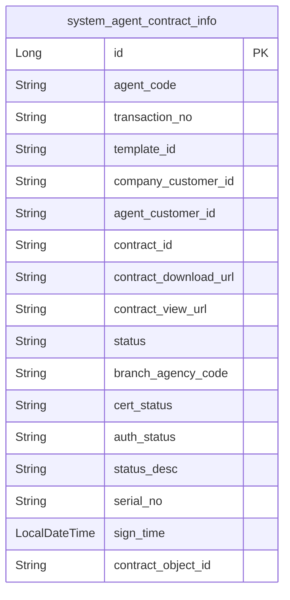
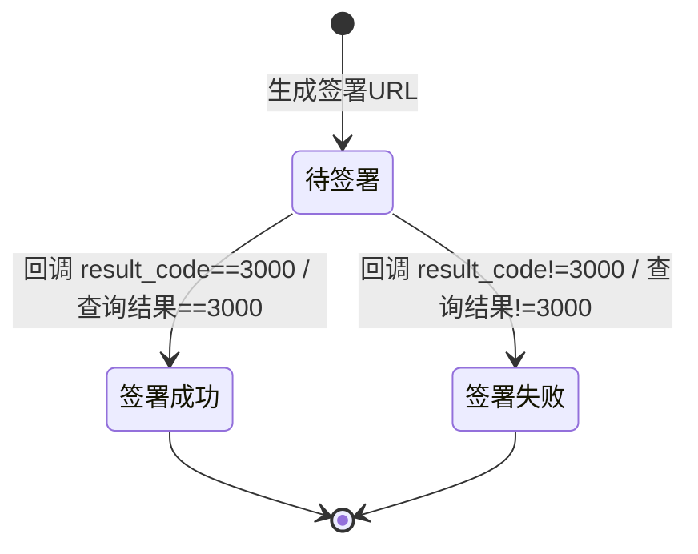

# 外部系统-代理人签署合同 模块文档

> **文档目的**: 帮助 AI 大模型快速理解本模块业务逻辑和代码结构
> **更新时间**: 2026-01-27

---

## 模块职责

对接第三方法大大（Fadada）实现“代理人线上实名认证 + 合同签署”闭环：
- 生成合同（填充模板）
- 触发个人认证/手动签署，获取签署 URL
- 接收法大大回调（签署结果、实名认证结果）
- 下载已签署合同 PDF 并上传 OSS，更新代理人/合同状态

边界：
- 本文档只覆盖“代理人签署合同”相关接口与核心流程；代理人入职主流程、机构变更等其他环节在“人员管理-代理人”等文档展开。

## 目录结构

```
lcyf-module-base/
└── lcyf-module-system-api/
    └── src/main/java/com/lcyf/cloud/module/system/api/
        ├── rpc/
        │   └── FadadaApi.java
        └── pojo/cmd/person/agent/flow/signContract/
            ├── AgentContractSignNotifyCmd.java
            └── AgentContractAuthNotifyCmd.java

lcyf-module-system/
├── lcyf-module-system-adapter/
│   └── src/main/java/com/lcyf/cloud/module/system/adapter/
│       └── web/
│           ├── person/agent/
│           │   └── AgentControllerV2.java
│           └── notify/
│               └── AgentSignNotifyController.java
│
└── lcyf-module-system-biz/
    └── src/main/java/com/lcyf/cloud/module/system/biz/
        ├── service/person/agent/
        │   ├── IAgentServiceV2.java
        │   └── impl/person/agent/
        │       └── AgentServiceImplV2.java
        └── infrastructure/entity/person/agent/
            └── AgentContractInfoDo.java
```

## 功能清单

| 功能 | 描述 | 入口 Controller | 核心 Service |
|------|------|-----------------|--------------|
| 获取签署 URL | 校验入职状态/黑名单/线上签署牌照 → 注册/生成合同/个人认证签署 → 返回 URL | `AgentControllerV2.querySignContractUrl()` | `IAgentServiceV2.getSignContractUrl()` |
| 查询签署状态 | 调用法大大查询签署结果；成功则下载合同上传 OSS 并更新状态 | `AgentControllerV2.querySignContractStatus()` | `IAgentServiceV2.getSignContractStatus()` |
| 签署结果回调 | 校验摘要；成功则下载合同上传 OSS，并更新代理人/合同记录 | `AgentSignNotifyController.signContract()` | `IAgentServiceV2.notifySignContract()` |
| 实名认证回调 | 校验摘要（当前实现标注“不影响合同签署”） | `AgentSignNotifyController.realAuth()` | `IAgentServiceV2.notifyRealAuth()` |

## 核心入口文件

### Controller 层
| 文件 | 路径 | 职责 |
|------|------|------|
| `AgentControllerV2.java` | `lcyf-module-system/lcyf-module-system-adapter/src/main/java/com/lcyf/cloud/module/system/adapter/web/person/agent/AgentControllerV2.java` | 提供签署 URL、签署状态查询等业务端接口 |
| `AgentSignNotifyController.java` | `lcyf-module-system/lcyf-module-system-adapter/src/main/java/com/lcyf/cloud/module/system/adapter/web/notify/AgentSignNotifyController.java` | 法大大回调入口（签署结果/实名认证结果） |

### Service 层
| 文件 | 路径 | 职责 |
|------|------|------|
| `IAgentServiceV2.java` | `lcyf-module-system/lcyf-module-system-biz/src/main/java/com/lcyf/cloud/module/system/biz/service/person/agent/IAgentServiceV2.java` | 代理人业务服务接口（包含签署相关方法） |
| `AgentServiceImplV2.java` | `lcyf-module-system/lcyf-module-system-biz/src/main/java/com/lcyf/cloud/module/system/biz/service/impl/person/agent/AgentServiceImplV2.java` | 签署核心实现：注册/生成合同/签署、回调处理、合同上传与状态更新 |

### Gateway 层
| 文件 | 路径 | 职责 |
|------|------|------|
| （签署链路涉及多个 Gateway，本文档只列关键表实体；Gateway 具体实现以 `AgentServiceImplV2` 依赖为准） | - | - |

### 实体层
| 文件 | 对应表 | 说明 |
|------|--------|------|
| `AgentContractInfoDo.java` | `system_agent_contract_info` | 代理人合同信息（交易流水号、合同 id、下载/查看 URL、签署状态、oss objectId 等） |

## 核心流程

### 流程1: 获取代理人签署合同链接

**触发条件**: 代理人在业务端需要进入线上签署
**入口**: `AgentControllerV2.querySignContractUrl()`

- HTTP：`GET /api/v2/system/auth/agent/function/querySignContractUrl/{agentCode}`
- 调用：`agentServiceV2.getSignContractUrl(agentCode, appCode)`

```
请求入口
│
├─ 1. Controller
│     └─ AgentControllerV2.querySignContractUrl(agentCode)
│
├─ 2. Service
│     └─ AgentServiceImplV2.getSignContractUrl(agentCode, appCode)
│         ├─ 校验代理人存在、入职状态（WAIT_SIGN_AGREEMENT / CHANGE_CONTRACT_SIGNING_WAIT）
│         ├─ 若合同锁(contractLock)=Y 且已有 contractSignUrl，直接返回
│         ├─ checkAgentBlacklist(agentDto, appCode)
│         ├─ 读取分支机构合同配置：system_config[branchCode] -> BranchAgencyContractConfig
│         ├─ 校验线上签署牌照：system_set[ONLINE_SIGN_CONTRACT_LICENSE_PLATE] 包含 licenseCode
│         ├─ 读取法大大配置：system_config[SYSTEM_CONFIG_FADADA_CODE] -> FadadaConfig
│         ├─ fddRegister(...) -> customerId
│         ├─ generateContract(...) -> contractId + download/view url
│         ├─ personVerifySign(...) -> url + transactionNo
│         ├─ saveContractInfo(...)：写入合同信息/更新代理人 contractId、contractLock、contractSignUrl
│         └─ 返回签署 url
│
└─ 3. 返回
      └─ CommonResult.success(url)
```

### 流程2: 法大大签署结果回调（下载合同并上传 OSS）

**触发条件**: 法大大完成签署后回调业务系统
**入口**: `AgentSignNotifyController.signContract()`

- HTTP：`POST /api/v1/system/agent/notify/signContract`
- 调用：`agentServiceV2.notifySignContract(cmd)`

```
回调入口
│
├─ 1. Controller
│     └─ AgentSignNotifyController.signContract(AgentContractSignNotifyCmd)
│
├─ 2. Service
│     └─ AgentServiceImplV2.notifySignContract(cmd)
│         ├─ 读取法大大配置（system_config[SYSTEM_CONFIG_FADADA_CODE]）
│         ├─ FddEncryptUtil.getMsgDigest(...) 校验 msg_digest
│         ├─ 根据 transaction_id 查合同信息（查不到则走“临时合同”分支）
│         ├─ 若 result_code != 3000：视为签署失败，直接返回 true（状态仍保持待签署）
│         ├─ fadadaApi.downloadContractToByteArray(contractDownloadUrl)
│         ├─ aliOssClientV2.upload(... bytes ...)
│         ├─ 更新代理人入职状态：WAIT_SIGN_AGREEMENT -> WAIT_INFO_AUDIT（并解锁 contractLock）
│         └─ 更新合同签约时间/oss objectId
│
└─ 3. 返回
      └─ CommonResult.success(true)
```

## 数据模型

### 核心实体关系



### 状态流转



## 依赖关系

### 依赖的模块
| 模块 | 调用方式 | 用途 |
|------|----------|------|
| system-config | 本地 Service/Gateway | 读取分支合同配置、法大大配置、线上签署牌照白名单 |
| OSS | `AliOssClientV2.upload` | 上传已签署合同 PDF |
| 法大大 | `FadadaApi`（Forest HTTP） | 注册/个人认证签署/生成合同/签章/查询结果/下载合同 |

### 被依赖的模块
| 模块 | 调用方式 | 提供能力 |
|------|----------|----------|
| 人员管理-代理人 | HTTP 调用 / 本地调用 | 使用签署 URL/回调更新入职流程状态 |

## RPC 接口

### 对外提供的接口
| 接口 | 方法 | 用途 |
|------|------|------|
| （本子域未发现对外 Dubbo RPC） | - | - |

### 调用的外部接口
| 接口 | 方法 | 来源模块 |
|------|------|----------|
| `FadadaApi` | `register/personVerify/generateContract/autoSign/queryAgentSignResult/downloadContractToByteArray` | `lcyf-module-system-api` |

## 关键设计决策

| 决策点 | 选择 | 原因 |
|--------|------|------|
| 回调验签 | `FddEncryptUtil.getMsgDigest` 校验摘要 | 防止伪造回调/篡改参数 |
| 签署结果处理 | 成功即下载合同并上传 OSS | 合同文件统一归档，避免依赖第三方长期存储 |
| 线上签署开关 | `system_set[ONLINE_SIGN_CONTRACT_LICENSE_PLATE]` 控制牌照是否支持线上签署 | 支持按牌照灰度/开关能力 |

## 扩展指南

| 场景 | 操作步骤 |
|------|----------|
| 新增签署渠道/签署产品 | 在 `system_config` 增加配置（如模板 id/公司 customerId/回调地址等）；在 `AgentAssembler` 参数组装处扩展 |
| 调整签署成功后的流程状态 | 修改 `AgentServiceImplV2.notifySignContract` / `getSignContractStatus` 中对 entryStatus 的更新逻辑 |
| 支持更多文件存储 | 替换/扩展 `AliOssClientV2` 上传实现，保持返回 objectId 写回合同表 |

## 常见问题

| 问题 | 解决方案 |
|------|----------|
| 为什么有“查询签署状态”接口，回调还不够吗？ | `AgentServiceImplV2.getSignContractStatus` 作为兜底：当回调丢失/延迟时，客户端可主动查询并触发下载+入库 |
| 回调 result_code!=3000 为什么直接返回 true？ | 当前实现选择“签署失败不打断回调处理”，代理人仍保持待签署状态，客户端可重试发起签署 |
