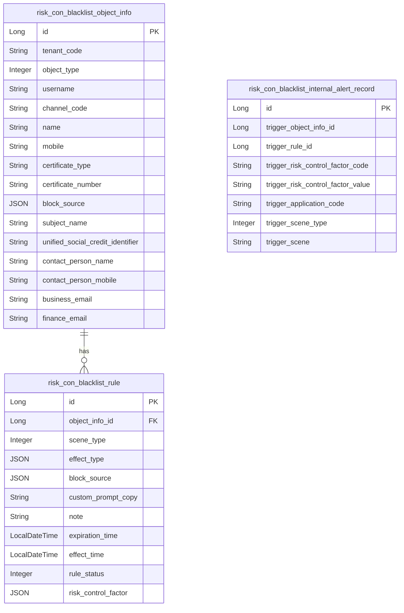
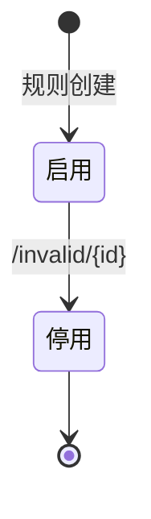

# 风控管理-黑名单 模块文档

> **文档目的**: 帮助 AI 大模型快速理解本模块业务逻辑和代码结构
> **更新时间**: 2026-01-27

---

## 模块职责

提供黑名单对象与黑名单规则管理能力，并为业务侧提供“拦截/提示”等风控控制依据：
- 黑名单对象信息：支持客户/代理人、业务账号、渠道/团队、外部渠道等多对象类型的黑名单维护
- 黑名单规则：按场景（sceneType）与效果（effectType：拦截/提示）配置规则，支持停用
- 内部告警邮件规则：配置与查询（用于内部告警）

边界：本文档只覆盖系统模块内“黑名单列表 + 黑名单规则 + 内部告警记录”相关能力；白名单、产品风控在各自子文档。

## 目录结构

```
lcyf-module-system/
├── lcyf-module-system-adapter/
│   └── src/main/java/com/lcyf/cloud/module/system/adapter/
│       └── web/riskCon/black/
│           ├── BlackListController.java
│           └── BlacklistRuleController.java
│
└── lcyf-module-system-biz/
    └── src/main/java/com/lcyf/cloud/module/system/biz/
        ├── service/riskCon/
        │   ├── IBlacklistObjectInfoService.java
        │   ├── IBlacklistRuleService.java
        │   └── IBlacklistInternalAlertService.java
        └── infrastructure/entity/riskCon/
            ├── BlacklistObjectInfoDo.java
            ├── BlacklistRuleDo.java
            └── BlacklistInternalAlertRecordDo.java
```

## 功能清单

| 功能 | 描述 | 入口 Controller | 核心 Service |
|------|------|-----------------|--------------|
| 内部告警邮件规则设置 | 设置内部告警邮件规则 | `BlackListController.setInternalAlertEmailRule()` | `IBlacklistInternalAlertService.setInternalAlertEmailRule()` |
| 内部告警邮件规则查询 | 查询内部告警邮件规则 | `BlackListController.getInternalAlertEmailRule()` | `IBlacklistInternalAlertService.getInternalAlertEmailRule()` |
| 黑名单分页（客户/代理人） | objectType 必填且合法；按 tenant 过滤 | `BlackListController.customerPage()` | `IBlacklistObjectInfoService.getCustomerPage()` |
| 黑名单分页（业务账号） | 按 tenant 过滤 | `BlackListController.accountPage()` | `IBlacklistObjectInfoService.getAccountPage()` |
| 黑名单分页（渠道） | 按 tenant 过滤 | `BlackListController.channelPage()` | `IBlacklistObjectInfoService.getChannelPage()` |
| 黑名单分页（团队） | 强制 objectType=CHANNEL_TO_A | `BlackListController.channelAPage()` | `IBlacklistObjectInfoService.getChannelAPage()` |
| 黑名单详情 | 按 id + tenant 查询 | `BlackListController.get()` | `IBlacklistObjectInfoService.get()` |
| 新增黑名单（客户/代理人） | mobile/card 至少一项；证件类型合法；客户需 blockSource | `BlackListController.add()` | `IBlacklistObjectInfoService.createCustomer()` |
| 新增黑名单（业务账号） | objectType 固定为 ACCOUNT | `BlackListController.accountAdd()` | `IBlacklistObjectInfoService.createAccount()` |
| 新增黑名单（渠道/团队） | objectType 由 cmd 指定 | `BlackListController.channelAdd()` | `IBlacklistObjectInfoService.createChannel()` |
| 新增黑名单（外部渠道） | 支持 force + 多字段可选 | `BlackListController.externalChanelAdd()` | `IBlacklistObjectInfoService.createExternalChanel()` |
| 编辑黑名单 | 按对象类型分入口 | `BlackListController.customerUpdate()` / `accountUpdate()` ... | `IBlacklistObjectInfoService.modify*()` |
| 黑名单规则列表 | 按 object_info_id 查询规则列表 | `BlacklistRuleController.page()` | `IBlacklistRuleService.getBlacklistRuleListByInfoId()` |
| 新增黑名单规则 | effectType 不能同时包含 PROMPT/INTERCEPT；LOGIN 场景强制 INTERCEPT | `BlacklistRuleController.add()` | `IBlacklistRuleService.create()` |
| 编辑黑名单规则 | 同新增的 effectType 校验 | `BlacklistRuleController.update()` | `IBlacklistRuleService.modify()` |
| 停用黑名单规则 | 按 id 停用 | `BlacklistRuleController.invalid()` | `IBlacklistRuleService.invalid()` |
| 黑名单规则详情 | 按 id 查询 | `BlacklistRuleController.detail()` | `IBlacklistRuleService.get()` |

## 核心入口文件

### Controller 层
| 文件 | 路径 | 职责 |
|------|------|------|
| `BlackListController.java` | `lcyf-module-system/lcyf-module-system-adapter/src/main/java/com/lcyf/cloud/module/system/adapter/web/riskCon/black/BlackListController.java` | 黑名单对象信息维护、内部告警规则维护 |
| `BlacklistRuleController.java` | `lcyf-module-system/lcyf-module-system-adapter/src/main/java/com/lcyf/cloud/module/system/adapter/web/riskCon/black/BlacklistRuleController.java` | 黑名单规则维护 |

### Service 层
| 文件 | 路径 | 职责 |
|------|------|------|
| `IBlacklistObjectInfoService.java` | `lcyf-module-system/lcyf-module-system-biz/src/main/java/com/lcyf/cloud/module/system/biz/service/riskCon/IBlacklistObjectInfoService.java` | 黑名单对象信息的分页/增改查等 |
| `IBlacklistRuleService.java` | `lcyf-module-system/lcyf-module-system-biz/src/main/java/com/lcyf/cloud/module/system/biz/service/riskCon/IBlacklistRuleService.java` | 黑名单规则的增改查/停用 |
| `IBlacklistInternalAlertService.java` | `lcyf-module-system/lcyf-module-system-biz/src/main/java/com/lcyf/cloud/module/system/biz/service/riskCon/IBlacklistInternalAlertService.java` | 内部告警邮件规则的配置/读取 |

### Gateway 层
| 文件 | 路径 | 职责 |
|------|------|------|
| （Gateway/Mapper 细节需继续从 ServiceImpl 定位） | - | - |

### 实体层
| 文件 | 对应表 | 说明 |
|------|--------|------|
| `BlacklistObjectInfoDo.java` | `risk_con_blacklist_object_info` | 黑名单对象信息（多对象类型；tenant 维度） |
| `BlacklistRuleDo.java` | `risk_con_blacklist_rule` | 黑名单规则（sceneType/effectType/blockSource/riskControlFactor 等） |
| `BlacklistInternalAlertRecordDo.java` | `risk_con_blacklist_internal_alert_record` | 黑名单内部告警记录 |

## 核心流程

### 流程1: 新增黑名单规则（登录场景强制拦截）

**触发条件**: 管理后台新增黑名单规则
**入口**: `BlacklistRuleController.add()`

- HTTP：`POST /api/v1/system/auth/blacklist/rule/add`

```
请求入口
│
├─ 1. Controller 校验
│     └─ BlacklistRuleController.add(addCmd)
│         ├─ effectType 不能同时包含 PROMPT 与 INTERCEPT
│         └─ 若 sceneType == LOGIN：强制 effectType = [INTERCEPT]
│
├─ 2. Service 落库
│     └─ IBlacklistRuleService.create(addCmd)
│
└─ 3. 返回
      ├─ success(status==1)
      └─ error(BLACKLIST_AGENT_SCENCE_SAME, payload=blacklistResultDto)
```

### 流程2: 新增黑名单对象（客户/代理人）

**触发条件**: 管理后台新增客户/代理人黑名单
**入口**: `BlackListController.add()`

- HTTP：`POST /api/v1/system/auth/blacklist/customer/add`

```
请求入口
│
├─ 1. Controller 校验
│     └─ BlackListController.add(addCmd)
│         ├─ mobile 与 certificateNumber 至少提供一项
│         ├─ certificateNumber 非空时 certificateType 必填
│         ├─ certificateType 必须在 IdTypeEnum.CODE_ARRAY
│         └─ 若 objectType==CUSTOMER：blockSource 必填
│
├─ 2. Service 创建
│     └─ IBlacklistObjectInfoService.createCustomer(cmd)
│
└─ 3. 返回
      ├─ success(status==1)
      └─ error(BLACKLIST_CUSTOMER_EXIST, payload=resultDto)
```

## 数据模型

### 核心实体关系



### 状态流转



## 依赖关系

### 依赖的模块
| 模块 | 调用方式 | 用途 |
|------|----------|------|
| TenantBaseDo/租户上下文 | 本地依赖 | 黑名单对象信息按 tenant 维度隔离（Controller 注入 tenantCode） |

### 被依赖的模块
| 模块 | 调用方式 | 提供能力 |
|------|----------|----------|
| 人员管理/登录等 | 本地调用 | 可能通过黑名单规则进行“拦截/提示”判断（例如签署合同前 checkAgentBlacklist） |

## RPC 接口

### 对外提供的接口
| 接口 | 方法 | 用途 |
|------|------|------|
| （本子域未发现对外 RPC） | - | - |

### 调用的外部接口
| 接口 | 方法 | 来源模块 |
|------|------|----------|
| （本子域未发现直接外部 RPC） | - | - |

## 关键设计决策

| 决策点 | 选择 | 原因 |
|--------|------|------|
| 登录场景规则效果 | 强制拦截 | 避免“登录仅提示”的安全风险，规则在 Controller 层直接纠正 |
| effectType 组合校验 | 禁止 PROMPT+INTERCEPT 同时存在 | 防止同一规则语义冲突 |
| 黑名单对象模型 | 多对象类型共表 + objectType 区分 | 统一查询/维护入口，降低表数量与复杂度 |

## 扩展指南

| 场景 | 操作步骤 |
|------|----------|
| 新增对象类型 | 在 `BlackListObjectTypeEnum` 扩展，并在 `BlackListController` 增加对应分页/新增入口或复用现有入口 |
| 增加新的场景类型 | 在 `BlackListRuleSceneTypeEnum` 扩展，并在 rule 的校验/执行链路补齐处理 |
| 规则执行链路细化 | 从 `IBlacklistRuleService` 实现定位 factor chain / filter chain 的执行入口，补充到“核心流程” |

## 常见问题

| 问题 | 解决方案 |
|------|----------|
| customer/page 为什么要求 objectType？ | `BlackListController.customerPage` 会校验 objectType 非空且必须在 `BlackListObjectTypeEnum.CODE_ARRAY`，否则返回 `BLACKLIST_OBJECT_TYPE_ERROR` |
| 新增客户黑名单为什么要求 blockSource？ | 当前实现对“客户”要求必须提供拉黑来源；代理人分支则写入空列表 |
