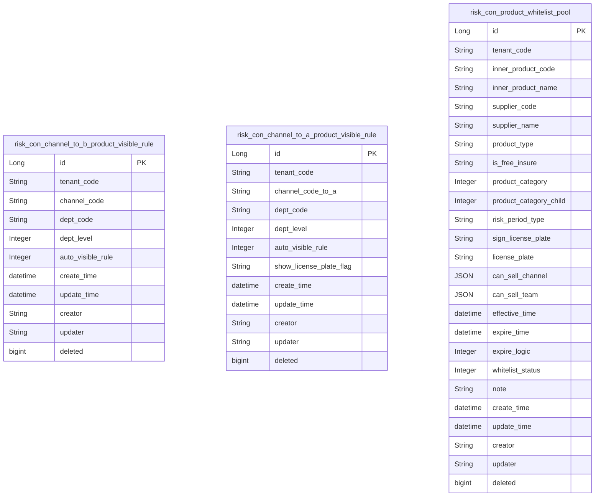
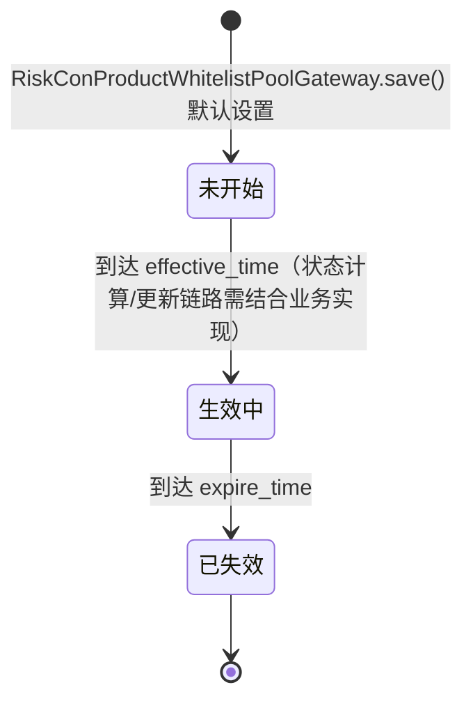

# 风控管理-产品风控 模块文档

> **文档目的**: 帮助 AI 大模型快速理解本模块业务逻辑和代码结构
> **更新时间**: 2026-01-27

---

## 模块职责

提供“产品可见性风控”能力：
- 渠道（ToB）维度：配置渠道产品自动可见规则（autoVisibleRule），并在渠道创建时默认初始化为“全量自动可见”
- 团队（ToA）维度：配置团队产品自动可见规则（autoVisibleRule），并在团队创建时默认初始化
- 产品白名单池：维护“可见产品池”数据（risk_con_product_whitelist_pool），支持按产品维度查询、分页检索、批量新增/更新、按 id 删除
- 对外接口形态：既提供 HTTP Controller（管理端配置可见规则），也通过 Dubbo RPC（SystemApi/ChannelApi）提供规则查询能力给其他模块

边界：
- 本文档覆盖 system 模块内 `risk_con_channel_to_b_product_visible_rule` / `risk_con_channel_to_a_product_visible_rule` / `risk_con_product_whitelist_pool` 相关代码。
- 当前管理端 HTTP 仅暴露“可见规则”的 get/create；产品白名单池（risk_con_product_whitelist_pool）的 CRUD/分页目前未在 system 模块的 `adapter/web` 下发现对应 Controller 入口（证据：`lcyf-module-system/lcyf-module-system-adapter/src/main/java/com/lcyf/cloud/module/system/adapter/web` 内无 `pageWhiteList/createWhiteList/deleteWhiteList` 相关映射）。

## 目录结构

```
lcyf-module-base/
└── lcyf-module-system-api/
    └── src/main/java/com/lcyf/cloud/module/system/api/
        ├── enums/riskCon/
        │   ├── ProductChannelVisibleEnum.java
        │   ├── ProductWhiteListExpireEnum.java
        │   └── ProductWhiteListStatusEnum.java
        ├── pojo/
        │   ├── cmd/riskCon/product/
        │   │   ├── RiskConChannelTobProductVisibleRuleAddCmd.java
        │   │   ├── RiskConProductWhitelistPoolAddCmd.java
        │   │   └── RiskConProductWhitelistPoolUpdateCmd.java
        │   ├── cmd/team/
        │   │   └── ChannelToAProductVisibleRuleAddCmd.java
        │   ├── dto/riskCon/
        │   │   └── RiskConChannelTobProductVisibleRuleDto.java
        │   ├── dto/riskCon/product/
        │   │   └── RiskConProductWhitelistPoolDto.java
        │   ├── dto/team/
        │   │   └── ChannelToAProductVisibleRuleDto.java
        │   └── query/
        │       └── RiskConProductWhitelistPoolPageQuery.java
        └── rpc/
            ├── ChannelApi.java
            └── SystemApi.java

lcyf-module-system/
├── lcyf-module-system-adapter/
│   └── src/main/java/com/lcyf/cloud/module/system/adapter/
│       ├── web/riskCon/product/
│       │   └── ProductRiskController.java
│       └── rpc/
│           ├── ChannelApiImpl.java
│           └── SystemApiImpl.java
│
└── lcyf-module-system-biz/
    └── src/main/java/com/lcyf/cloud/module/system/biz/
        ├── service/riskCon/
        │   ├── IRiskConProductApplicationServ.java
        │   └── impl/riskCon/RiskConProductApplicationServImpl.java
        ├── application/impl/
        │   └── SystemConsumerApplicationServiceImpl.java
        └── infrastructure/
            ├── assembler/
            │   ├── ChannelToAProductVisibleRuleAssembler.java
            │   └── riskCon/
            │       ├── RiskConChannelTobProductVisibleRuleAssembler.java
            │       └── RiskConProductWhitelistPoolAssembler.java
            ├── gateway/
            │   ├── team/ChannelToAProductVisibleRuleGateway.java
            │   └── riskCon/
            │       ├── RiskConChannelTobProductVisibleRuleGateway.java
            │       └── RiskConProductWhitelistPoolGateway.java
            ├── mapper/
            │   ├── team/ChannelToAProductVisibleRuleMapper.java
            │   └── riskCon/
            │       ├── RiskConChannelTobProductVisibleRuleMapper.java
            │       └── RiskConProductWhitelistPoolMapper.java
            ├── mapper/xml/
            │   ├── ChannelToAProductVisibleRuleMapper.xml
            │   ├── RiskConChannelTobProductVisibleRuleMapper.xml
            │   └── RiskConProductWhitelistPoolMapper.xml
            └── entity/
                ├── team/ChannelToAProductVisibleRuleDo.java
                └── riskCon/product/
                    ├── RiskConChannelTobProductVisibleRuleDo.java
                    └── RiskConProductWhitelistPoolDo.java
```

## 功能清单

| 功能 | 描述 | 入口 Controller | 核心 Service |
|------|------|-----------------|--------------|
| 渠道（ToB）获取可见规则 | 按 channelCode 获取单条可见规则 | `ProductRiskController.getChannel2bVisibleRule()` | `IRiskConProductApplicationServ.getChannel2bVisibleRuleOne()` |
| 渠道（ToB）创建/更新可见规则 | 创建或更新 `risk_con_channel_to_b_product_visible_rule` | `ProductRiskController.createChannel2bVisibleRule()` | `IRiskConProductApplicationServ.createChannel2bVisibleRule()` |
| 团队（ToA）获取可见规则 | 按 channelCodeToA 获取单条可见规则 | `ProductRiskController.getChannelToAVisibleRule()` | `IRiskConProductApplicationServ.getChannelToAVisibleRuleOne()` |
| 团队（ToA）创建/更新可见规则 | 创建或更新 `risk_con_channel_to_a_product_visible_rule`（并补 deptCode/deptLevel） | `ProductRiskController.createChannelToAVisibleRule()` | `IRiskConProductApplicationServ.createChannelToAVisibleRule()` |
| 渠道初始化默认规则 | 渠道创建时写入默认“全量自动可见” | （非本 Controller）`ChannelToBServiceImpl.create()` | `IRiskConProductApplicationServ.createChannel2bVisibleRule()` |
| 团队初始化默认规则 | 团队创建时写入默认“全量自动可见” | （非本 Controller）`ChannelToAServiceImpl.createV2()` | `ChannelToAProductVisibleRuleGateway.save()` |
| 产品发布时自动分配给渠道 | 发布时按渠道规则计算 visibleStatus，写入“渠道-产品基础关系” | （非本 Controller）`ChannelTobProductServiceImpl.feeSalesStatusModify()` | `ChannelApi.getAllChannelVisibleRule()` |
| 产品发布时自动分配给团队 | 发布时按团队规则设置 visibleStatus，写入“团队-产品基础关系” | （非本 Controller）`ChannelToAProductServiceImpl.teamAssignProductWhenProductPublish()` | `ChannelApi.getAllTeamVisibleRule()` |
| 产品白名单池批量新增/更新 | 批量 upsert 白名单池数据 | （未发现 HTTP Controller） | `IRiskConProductApplicationServ.createWhiteList()` |
| 产品白名单池分页查询 | BeanSearcher 动态检索 | （未发现 HTTP Controller） | `IRiskConProductApplicationServ.pageWhiteList()` |
| 产品白名单池按 id 删除 | 删除前校验存在，否则抛 PRODUCT_NOT_EXIST | （未发现 HTTP Controller） | `IRiskConProductApplicationServ.deleteWhiteList()` |
| 产品信息同步更新白名单池 | 消费侧收到产品信息变更后更新部分字段 | （应用层调用）`SystemConsumerApplicationServiceImpl.modifyProductInfo()` | `RiskConProductWhitelistPoolGateway.updateProductInfoByInnerProductCode()` |
| Dubbo：获取所有渠道规则 | 提供给外部模块拉取全部渠道可见规则 | `ChannelApi.getAllChannelVisibleRule()` | `IRiskConProductApplicationServ.getAllChannel2bVisibleRule()` |
| Dubbo：获取所有团队规则 | 提供给外部模块拉取全部团队可见规则 | `ChannelApi.getAllTeamVisibleRule()` | `IRiskConProductApplicationServ.getAllTeamVisibleRule()` |
| Dubbo：查询团队规则单条 | 提供给外部模块按团队编码查询规则 | `SystemApi.getChannelToAVisibleRuleOne()` | `IRiskConProductApplicationServ.getChannelToAVisibleRuleOne()` |

## 核心入口文件

### Controller 层
| 文件 | 路径 | 职责 |
|------|------|------|
| `ProductRiskController.java` | `lcyf-module-system/lcyf-module-system-adapter/src/main/java/com/lcyf/cloud/module/system/adapter/web/riskCon/product/ProductRiskController.java` | 管理端配置与查询 ToB/ToA 产品可见规则 |

### Service 层
| 文件 | 路径 | 职责 |
|------|------|------|
| `IRiskConProductApplicationServ.java` | `lcyf-module-system/lcyf-module-system-biz/src/main/java/com/lcyf/cloud/module/system/biz/service/riskCon/IRiskConProductApplicationServ.java` | 产品风控聚合服务：可见规则 + 产品白名单池 |
| `RiskConProductApplicationServImpl.java` | `lcyf-module-system/lcyf-module-system-biz/src/main/java/com/lcyf/cloud/module/system/biz/service/impl/riskCon/RiskConProductApplicationServImpl.java` | 规则与白名单池的实现（主要委托 gateway） |

### Gateway 层
| 文件 | 路径 | 职责 |
|------|------|------|
| `RiskConChannelTobProductVisibleRuleGateway.java` | `lcyf-module-system/lcyf-module-system-biz/src/main/java/com/lcyf/cloud/module/system/biz/infrastructure/gateway/riskCon/RiskConChannelTobProductVisibleRuleGateway.java` | ToB 规则表访问：BeanSearcher 分页 + 按 channelCode 查询/写入 |
| `ChannelToAProductVisibleRuleGateway.java` | `lcyf-module-system/lcyf-module-system-biz/src/main/java/com/lcyf/cloud/module/system/biz/infrastructure/gateway/team/ChannelToAProductVisibleRuleGateway.java` | ToA 规则表访问：BeanSearcher 分页 + 按 channelCodeToA 查询/写入 |
| `RiskConProductWhitelistPoolGateway.java` | `lcyf-module-system/lcyf-module-system-biz/src/main/java/com/lcyf/cloud/module/system/biz/infrastructure/gateway/riskCon/RiskConProductWhitelistPoolGateway.java` | 产品白名单池访问：BeanSearcher 分页、按 id 删除、按 innerProductCode 批量查询、同步更新 |

### 实体层
| 文件 | 对应表 | 说明 |
|------|--------|------|
| `RiskConChannelTobProductVisibleRuleDo.java` | `risk_con_channel_to_b_product_visible_rule` | 渠道产品自动可见规则（channel_code、auto_visible_rule 等） |
| `ChannelToAProductVisibleRuleDo.java` | `risk_con_channel_to_a_product_visible_rule` | 团队产品自动可见规则（channel_code_to_a、auto_visible_rule、show_license_plate_flag） |
| `RiskConProductWhitelistPoolDo.java` | `risk_con_product_whitelist_pool` | 产品白名单池（inner_product_code、可售渠道/团队集合、有效期、状态等） |

## 核心流程

### 流程1: 管理端配置渠道（ToB）可见规则

**触发条件**: 管理端创建/更新渠道产品可见规则
**入口**: `ProductRiskController.createChannel2bVisibleRule()`

- HTTP：`POST /api/v1/system/auth/riskCon/product/channel2b/visible/rule/create`

```
请求入口
│
├─ 1. Controller 接收请求
│     └─ ProductRiskController.createChannel2bVisibleRule(cmd)
│
├─ 2. 聚合 Service 处理
│     └─ RiskConProductApplicationServImpl.createChannel2bVisibleRule(cmd)
│         ├─ 若 cmd.id 存在：RiskConChannelTobProductVisibleRuleGateway.updateById(cmd)
│         └─ 否则：RiskConChannelTobProductVisibleRuleGateway.save(cmd)
│             └─ assembler.convert(addCmd) -> Do -> repo.save
│
└─ 3. 返回
      └─ CommonResult.success(id)
```

### 流程2: 渠道创建时初始化默认“全量自动可见”规则

**触发条件**: 新增渠道（ToB）
**入口**: `ChannelToBServiceImpl.create()`

```
渠道创建
│
├─ 1. 生成 deptCode 并创建渠道/账号
│
├─ 2. 初始化渠道可见规则
│     └─ RiskConChannelTobProductVisibleRuleAddCmd.createByChannelInit(channelCode, deptCode)
│         └─ autoVisibleRule = ProductChannelVisibleEnum.ALL_YES
│     └─ IRiskConProductApplicationServ.createChannel2bVisibleRule(visibleRuleAddCmd)
│
└─ 3. 继续后续同步
```

### 流程3: 管理端配置团队（ToA）可见规则

**触发条件**: 管理端创建/更新团队产品可见规则
**入口**: `ProductRiskController.createChannelToAVisibleRule()`

- HTTP：`POST /api/v1/system/auth/riskCon/product/channelToA/visible/rule/create`

```
请求入口
│
├─ 1. Controller 注入 tenantCode
│     └─ ProductRiskController.createChannelToAVisibleRule(cmd)
│         └─ cmd.setTenantCode(LoginUtil.tenantCode())
│
├─ 2. 聚合 Service 校验团队存在并补充 dept 信息
│     └─ RiskConProductApplicationServImpl.createChannelToAVisibleRule(cmd)
│         ├─ ChannelToAGateway.selectChannelByCode(cmd.channelCodeToA)
│         │     └─ 不存在：抛 SystemErrorCodeConstants.CHANNEL_NOT_EXIST
│         ├─ cmd.setDeptCode(channelToADto.deptRootCode)
│         ├─ cmd.setDeptLevel(1)
│         ├─ 若 cmd.id 存在：ChannelToAProductVisibleRuleGateway.updateById(cmd)
│         └─ 否则：ChannelToAProductVisibleRuleGateway.save(cmd)
│
└─ 3. 返回
      └─ CommonResult.success(id)
```

### 流程4: 产品发布时按“可见规则”自动分配产品给渠道/团队

**触发条件**: 产品销售状态变为“在售”（发布）
**入口**:
- ToB：`ChannelTobProductServiceImpl.feeSalesStatusModify()` → `doChannelAssignProductWhenProductPublish()`
- ToA：`ChannelToAProductServiceImpl.teamAssignProductWhenProductPublish()`

```
产品发布
│
├─ 1. 拉取所有规则（跨模块 RPC）
│     ├─ ToB：ChannelApi.getAllChannelVisibleRule()
│     └─ ToA：ChannelApi.getAllTeamVisibleRule()
│
├─ 2. 计算 visibleStatus
│     ├─ 若无规则：默认 1（全量可见）
│     └─ autoVisibleRule != 1 时：转换为 0（不可见）
│
└─ 3. 写入“渠道/团队-产品基础关系”
      ├─ ToB：ChannelTobProductServiceImpl.createOrModifyChannelProductBase(..., visibleStatus, ...)
      └─ ToA：ChannelToAProductGateway.createOrModifyTeamProductBase(teamBiz, innerProductCode, salesStatus)
```

### 流程5: 产品信息变更同步到白名单池

**触发条件**: 消费侧接收到产品基础信息变更
**入口**: `SystemConsumerApplicationServiceImpl.modifyProductInfo(ProductBaseInfoDto)`

```
产品信息变更
│
├─ 1. 组装 RiskConProductWhitelistPoolUpdateCmd
│     └─ 仅更新 innerProductName/isFreeInsure/productCategory/productCategoryChild/riskPeriodType/productType 等
│
└─ 2. 按 innerProductCode 更新白名单池
      └─ RiskConProductWhitelistPoolGateway.updateProductInfoByInnerProductCode(updateCmd)
          └─ lambdaUpdate().eq(innerProductCode).update(Do)
```

## 数据模型

### 核心实体关系



### 状态流转



## 依赖关系

### 依赖的模块
| 模块 | 调用方式 | 用途 |
|------|----------|------|
| `BeanSearcher` | `beanSearcher.search(Do.class, Map)` | 规则表/白名单池 Map 参数动态检索分页 |
| 渠道/团队模块 | `ChannelToBServiceImpl`、`ChannelToAServiceImpl` | 创建渠道/团队时初始化默认可见规则 |
| `ChannelToAGateway` | 本地 gateway | 创建 ToA 规则时校验团队存在并取 deptRootCode |
| `lcyf-module-product-api` | `ProductErrorCodeConstants.PRODUCT_NOT_EXIST` | 删除白名单池时不存在则抛异常 |
| `lcyf-module-product-biz` | `@DubboReference ChannelApi` | 产品发布时拉取规则并写入渠道/团队-产品关系（visibleStatus） |

### 被依赖的模块
| 模块 | 调用方式 | 提供能力 |
|------|----------|----------|
| `lcyf-module-product-biz` | Dubbo RPC `ChannelApi` | 拉取渠道/团队可见规则用于产品发布时的自动分配与可见性写入 |
| 其他业务模块 | Dubbo RPC `ChannelApi/SystemApi` | 获取渠道/团队可见规则（具体使用点需结合调用方） |

## RPC 接口

### 对外提供的接口
| 接口 | 方法 | 用途 |
|------|------|------|
| `ChannelApi` | `getAllChannelVisibleRule()` | 拉取所有 ToB 渠道可见规则（`ChannelApiImpl.getAllChannelVisibleRule` 调用 `IRiskConProductApplicationServ.getAllChannel2bVisibleRule`） |
| `ChannelApi` | `getAllTeamVisibleRule()` | 拉取所有 ToA 团队可见规则（`ChannelApiImpl.getAllTeamVisibleRule` 调用 `IRiskConProductApplicationServ.getAllTeamVisibleRule`） |
| `SystemApi` | `getChannelToAVisibleRuleOne(String channelCodeToA)` | 按团队编码查询单条规则（`SystemApiImpl.getChannelToAVisibleRuleOne` 调用 `IRiskConProductApplicationServ.getChannelToAVisibleRuleOne`） |

### 调用的外部接口
| 接口 | 方法 | 来源模块 |
|------|------|----------|
| `ChannelApi` | `getAllChannelVisibleRule()` / `getAllTeamVisibleRule()` | system（本系统对外提供，调用方在 product-biz） |

## 关键设计决策

| 决策点 | 选择 | 原因 |
|--------|------|------|
| 规则配置的 HTTP 入口 | 单独 `ProductRiskController` | 将产品可见性规则与其他渠道/团队管理解耦，聚焦配置与查询 |
| 动态查询 | BeanSearcher | 多个 Gateway 直接用 `beanSearcher.search(Do.class, Map)` 统一分页检索风格 |
| 默认规则初始化 | 在渠道/团队创建时初始化 | 保证新渠道/团队具备可用默认规则，避免“无规则导致未知可见性” |
| 规则落地生效时机（已发现） | 产品发布时写 visibleStatus | `lcyf-module-product-biz` 在产品发布流程中拉取规则并写入渠道/团队-产品关系表（见“流程4”） |
| 白名单池删除校验 | 删除前校验存在 | 若不存在则抛 `ProductErrorCodeConstants.PRODUCT_NOT_EXIST`，避免 silent delete |

## 扩展指南

| 场景 | 操作步骤 |
|------|----------|
| 扩展 ToB/ToA 规则能力 | 在 Do/AddCmd/Dto 增加字段 → Assembler 映射 → Gateway 保存/查询 → Controller/Service 暴露 |
| 为白名单池增加管理端 HTTP | 参考 `ProductRiskController` 风格：Controller → IRiskConProductApplicationServ → RiskConProductWhitelistPoolGateway（注意 MapUtils.flat(request.getParameterMap()) 模式） |
| 增加白名单池筛选条件 | 扩展 `RiskConProductWhitelistPoolDo` 上 BeanSearcher 可检索字段 + 调用方传入 Map 条件 |

## 常见问题

| 问题 | 解决方案 |
|------|----------|
| 产品白名单池（risk_con_product_whitelist_pool）是否有 HTTP Controller？ | 当前已确认 `ProductRiskController` 只包含可见规则 get/create（`ProductRiskController.java:20` 起）。白名单池的 CRUD/分页方法在 `IRiskConProductApplicationServ`/`RiskConProductApplicationServImpl` 中存在，但在 `lcyf-module-system-adapter/src/main/java/com/lcyf/cloud/module/system/adapter/web` 下未检索到 `pageWhiteList/createWhiteList/deleteWhiteList` 等 HTTP 映射（例如 grep 关键字无结果）。 |
| 可见规则在哪里真正生效？ | 已确认在 `lcyf-module-product-biz` 的“产品发布（在售）”链路中生效：ToB `ChannelTobProductServiceImpl.doChannelAssignProductWhenProductPublish` 拉取 `ChannelApi.getAllChannelVisibleRule` 并将 autoVisibleRule 映射为 visibleStatus（默认无规则=全量可见）；ToA `ChannelToAProductServiceImpl.teamAssignProductWhenProductPublish` 拉取 `ChannelApi.getAllTeamVisibleRule` 并写入 visibleStatus。 |
| whitelistStatus / expireLogic 如何生效？ | `RiskConProductWhitelistPoolGateway.save` 会默认设置 `whitelistStatus = ProductWhiteListStatusEnum.UN_EFFECTIVE`。expireLogic 对应 `ProductWhiteListExpireEnum`；在业务侧如何更新状态/执行失效逻辑需结合调用方实现（当前未在仓库内发现明确的状态推进任务）。 |
