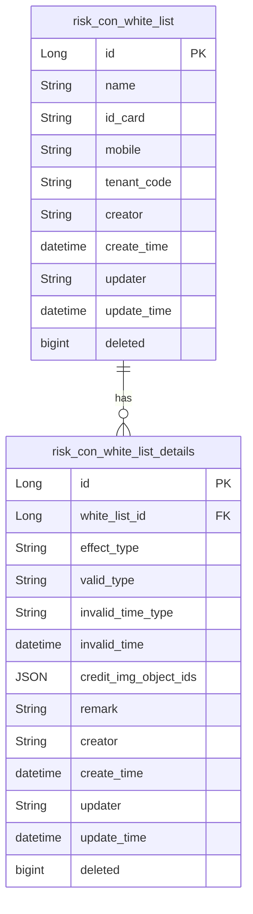
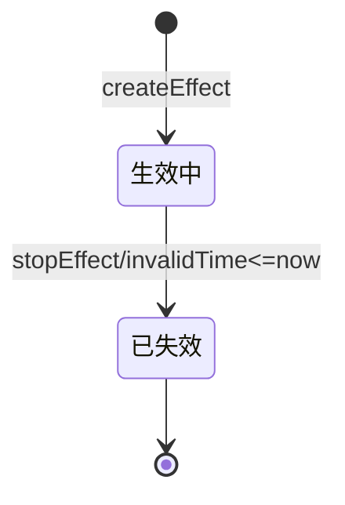

# 风控管理-白名单 模块文档

> **文档目的**: 帮助 AI 大模型快速理解本模块业务逻辑和代码结构
> **更新时间**: 2026-01-27

---

## 模块职责

提供白名单人员与白名单生效场景的管理与校验能力，并向外部（核心系统/内部接口）提供白名单校验与分页查询：
- 白名单基础信息：按「姓名/身份证号/手机号」维护人员白名单
- 白名单生效场景：按「effectType（生效场景）+ validType（验证要素）」配置生效期与凭证（OSS objectId 集合）
- 白名单校验：按「生效场景 + 身份要素（1/2/3要素）」判断当前是否存在“未过期的生效配置”
- 核心系统对接：提供 HX（核心系统）白名单分页、投保签名白名单分页、身份要素校验
- 临时批量导入：外部一次性导入白名单和场景，并将外部图片下载后上传到 OSS，落库 objectId

边界：本文档仅覆盖 system 模块内风控白名单（risk_con_white_list / risk_con_white_list_details）相关能力；黑名单见 `tmps/system/风控管理-黑名单.md`。

## 目录结构

```
lcyf-module-base/
└── lcyf-module-system-api/
    └── src/main/java/com/lcyf/cloud/module/system/api/
        ├── constants/
        │   └── SystemErrorCodeConstants.java
        ├── enums/riskCon/
        │   ├── WhiteListEffectStatusEnum.java
        │   ├── WhiteListEffectTypeEnum.java
        │   ├── WhiteListInvalidTimeEnum.java
        │   └── WhiteListValidTypeEnum.java
        └── pojo/
            ├── cmd/riskCon/white/
            │   ├── WhiteListAddCmd.java
            │   ├── WhiteListUpdateCmd.java
            │   ├── WhiteListDetailsAddCmd.java
            │   ├── WhiteListDetailsUpdateCmd.java
            │   └── WhiteListOuterCreateCmd.java
            ├── dto/riskCon/white/
            │   ├── WhiteListDto.java
            │   ├── WhiteListDetailsDto.java
            │   ├── WhiteListValidDto.java
            │   ├── WhiteListValidResultDto.java
            │   ├── WhiteListHxReqDto.java
            │   ├── WhiteListHxRespDto.java
            │   └── WhiteListHxApplySignRespDto.java
            └── query/riskCon/white/
                └── WhiteListPageQuery.java

lcyf-module-system/
├── lcyf-module-system-adapter/
│   └── src/main/java/com/lcyf/cloud/module/system/adapter/
│       └── web/
│           ├── riskCon/white/
│           │   └── WhiteListController.java
│           └── saas/
│               ├── WhiteListHxController.java
│               └── InnerHxController.java
│
└── lcyf-module-system-biz/
    └── src/main/java/com/lcyf/cloud/module/system/biz/
        ├── service/riskCon/
        │   ├── IWhiteListService.java
        │   └── impl/riskCon/WhiteListServiceImpl.java
        └── infrastructure/
            ├── assembler/riskCon/
            │   ├── WhiteListAssembler.java
            │   └── WhiteListDetailsAssembler.java
            ├── gateway/riskCon/
            │   ├── WhiteListGateway.java
            │   └── WhiteListDetailsGateway.java
            ├── mapper/riskCon/
            │   ├── WhiteListMapper.java
            │   └── WhiteListDetailsMapper.java
            ├── mapper/xml/
            │   ├── WhiteListMapper.xml
            │   └── WhiteListDetailsMapper.xml
            ├── entity/riskCon/
            │   ├── WhiteListDo.java
            │   ├── WhiteListDetailsDo.java
            │   └── WhiteListHxDo.java
            └── view/white/
                └── WhiteListView.java
```

## 功能清单

| 功能 | 描述 | 入口 Controller | 核心 Service |
|------|------|-----------------|--------------|
| 白名单分页（管理端） | 支持 Map 参数动态检索；可按 effectType 过滤 | `WhiteListController.page()` | `IWhiteListService.getWhiteListPage()` |
| 白名单场景列表（管理端） | 按 whiteListId 返回场景配置列表（含状态） | `WhiteListController.list()` | `IWhiteListService.getWhiteListDetailsList()` |
| 新增白名单（管理端） | 按三要素唯一性（name/idCard/mobile）去重 | `WhiteListController.add()` | `IWhiteListService.create()` |
| 编辑白名单（管理端） | 修改基础信息，并记录敏感数据变更对比 | `WhiteListController.update()` | `IWhiteListService.modify()` |
| 新增生效场景（管理端） | 校验白名单存在、校验重复场景、处理 invalidTime | `WhiteListController.addEffect()` | `IWhiteListService.createEffect()` |
| 编辑生效场景（管理端） | 同新增规则，记录变更对比 | `WhiteListController.updateEffect()` | `IWhiteListService.modifyEffect()` |
| 停用生效场景（管理端） | 将 invalidTime 置为当前时间（已过期则拒绝） | `WhiteListController.stopEffect()` | `IWhiteListService.stopEffect()` |
| 临时批量导入 | 外部导入白名单 + 场景；下载外部图片 -> OSS 上传 -> 存 objectId | `WhiteListController.tempBatchImport()` | `IWhiteListService.tempBatchImport()` |
| 白名单身份要素校验（HX/内部） | 按 effectType+validType+name(+idCard/mobile) 校验是否存在未过期配置 | `WhiteListHxController.authIdentityValid()` / `InnerHxController.innerIdentityValid()` | `IWhiteListService.valid()` |
| 白名单分页（HX/内部） | HX 白名单列表（validType!=1） | `WhiteListHxController.page()` / `InnerHxController.page()` | `IWhiteListService.getWhiteListPageByHx()` |
| 投保签名白名单分页（HX/内部） | HX 投保签名白名单（valid_type=1 & effect_type=2） | `WhiteListHxController.applySignPage()` / `InnerHxController.applySignPage()` | `IWhiteListService.getWhiteListApplySignPageByHx()` |

## 核心入口文件

### Controller 层
| 文件 | 路径 | 职责 |
|------|------|------|
| `WhiteListController.java` | `lcyf-module-system/lcyf-module-system-adapter/src/main/java/com/lcyf/cloud/module/system/adapter/web/riskCon/white/WhiteListController.java` | 管理端白名单/场景 CRUD + 临时批量导入 |
| `WhiteListHxController.java` | `lcyf-module-system/lcyf-module-system-adapter/src/main/java/com/lcyf/cloud/module/system/adapter/web/saas/WhiteListHxController.java` | 核心系统（需认证）白名单校验 + 分页查询 |
| `InnerHxController.java` | `lcyf-module-system/lcyf-module-system-adapter/src/main/java/com/lcyf/cloud/module/system/adapter/web/saas/InnerHxController.java` | 内部接口（Tenant ignore）白名单校验 + 分页查询 |

### Service 层
| 文件 | 路径 | 职责 |
|------|------|------|
| `IWhiteListService.java` | `lcyf-module-system/lcyf-module-system-biz/src/main/java/com/lcyf/cloud/module/system/biz/service/riskCon/IWhiteListService.java` | 白名单/场景的管理与校验能力接口 |
| `WhiteListServiceImpl.java` | `lcyf-module-system/lcyf-module-system-biz/src/main/java/com/lcyf/cloud/module/system/biz/service/impl/riskCon/WhiteListServiceImpl.java` | 业务实现：分页、CRUD、valid 校验、导入、HX 查询 |

### Gateway 层
| 文件 | 路径 | 职责 |
|------|------|------|
| `WhiteListGateway.java` | `lcyf-module-system/lcyf-module-system-biz/src/main/java/com/lcyf/cloud/module/system/biz/infrastructure/gateway/riskCon/WhiteListGateway.java` | 白名单主表访问：BeanSearcher 动态检索 + MyBatis 分页（HX） |
| `WhiteListDetailsGateway.java` | `lcyf-module-system/lcyf-module-system-biz/src/main/java/com/lcyf/cloud/module/system/biz/infrastructure/gateway/riskCon/WhiteListDetailsGateway.java` | 白名单详情访问：按 whiteListId/场景/要素查询、保存、更新 |

### 实体层
| 文件 | 对应表 | 说明 |
|------|--------|------|
| `WhiteListDo.java` | `risk_con_white_list` | 白名单人员基础信息（含 tenant_code + deleted） |
| `WhiteListDetailsDo.java` | `risk_con_white_list_details` | 生效场景配置（effect_type/valid_type/invalid_time/凭证 objectIds） |
| `WhiteListHxDo.java` | `risk_con_white_list`（用于 mapper resultMap） | HX 分页 SQL 的映射对象（包含来自 details 的字段） |
| `WhiteListView.java` | `risk_con_white_list`（BeanSearcher 视图） | BeanSearcher 动态查询视图，表别名为 `w` |

## 核心流程

### 流程1: 新增白名单 + 添加生效场景

**触发条件**: 管理端新增白名单人员，并为其配置可用场景
**入口**: `WhiteListController.add()` + `WhiteListController.addEffect()`

- HTTP：
  - `POST /api/v1/system/auth/whiteList/add` → `WhiteListAddCmd`
  - `POST /api/v1/system/auth/whiteList/add/effect` → `WhiteListDetailsAddCmd`

```
请求入口
│
├─ 1. 新增白名单（基础信息）
│     └─ WhiteListController.add(addCmd)
│         └─ WhiteListServiceImpl.create(addCmd)
│             ├─ 重复校验：WhiteListGateway.selectByNameAndMobileAndIdCard(name,idCard,mobile)
│             │     └─ 若存在：返回 CommonResult.error(WHITE_LIST_USER_INFO_EXISTS, payload=WhiteListDto)
│             └─ 落库：WhiteListGateway.save(addCmd)
│
├─ 2. 新增生效场景
│     └─ WhiteListController.addEffect(detailsAddCmd)
│         └─ WhiteListServiceImpl.createEffect(detailsAddCmd)
│             ├─ 白名单检查：whiteListCheck(whiteListId, validType)
│             │     ├─ 若白名单不存在：抛 WHITE_LIST_NOT_EXIST
│             │     └─ 若 validType=IDENTITY_3 且 mobile 缺失：抛 WHITE_LIST_MOBILE_NOT_EXIST
│             ├─ 重复校验：WhiteListDetailsGateway.selectByWhiteListIdAndEffectTypeAndValidType(whiteListId,effectType,validType)
│             │     └─ 若存在：返回 CommonResult.error(WHITE_LIST_DETAILS_USER_INFO_EXISTS, payload=WhiteListDetailsDto)
│             ├─ 失效时间处理：getInvalidTime(invalidTimeType, invalidTime)
│             │     ├─ CURRENT_DAY -> 当天 23:59:59
│             │     ├─ LONG_TERM -> 2099-01-01 23:59:59
│             │     └─ SPEC_TIME -> 必须传 invalidTime，否则抛 WHITE_LIST_SPEC_TIME_IS_NULL
│             └─ 落库：WhiteListDetailsGateway.save(detailsAddCmd)
│
└─ 3. 返回
      └─ CommonResult.success(id/void)
```

### 流程2: 白名单身份要素校验（valid）

**触发条件**: 核心系统/内部接口在关键业务节点发起身份校验
**入口**: 
- `WhiteListHxController.authIdentityValid()`（需认证）
- `InnerHxController.innerIdentityValid()`（内部 ignore tenant）

- HTTP：
  - `POST /api/v1/system/auth/hx/whiteList/identity/valid` → `WhiteListValidDto` → `WhiteListValidResultDto{isValidPass}`
  - `POST /api/v1/system/inner/hx/whiteList/identity/valid` → `WhiteListValidDto` → `WhiteListValidResultDto{isValidPass}`

```
请求入口
│
├─ 1. Controller 接收校验参数
│     └─ WhiteListHxController.authIdentityValid(whiteListValidDto)
│         └─ WhiteListServiceImpl.valid(whiteListValidDto)
│
├─ 2. Service 规则校验
│     └─ WhiteListServiceImpl.valid
│         ├─ 入参校验：ValidationUtils.validate(whiteListValidDto)
│         ├─ 根据姓名拉取白名单主表：WhiteListGateway.selectListByName(name)
│         ├─ 按 validType 分支选择可用 whiteListId 集合
│         │     ├─ IDENTITY_1：whiteListIds=全部
│         │     ├─ IDENTITY_2：要求 idCard 非空；whiteListIds=主表 idCard 匹配
│         │     └─ IDENTITY_3：要求 idCard+mobile 非空；whiteListIds=主表 idCard+mobile 匹配（并防止 NPE）
│         ├─ 查询详情表：WhiteListDetailsGateway.selectListByWhiteListId(whiteListIds,effectType,validType)
│         ├─ 过滤未过期：invalidTime > now
│         └─ 返回 true/false
│
└─ 3. 返回
      └─ CommonResult.success(WhiteListValidResultDto.builder().isValidPass(result).build())
```

### 流程3: 临时批量导入（外部一次性导入）

**触发条件**: 外部系统一次性导入白名单及其场景
**入口**: `WhiteListController.tempBatchImport()`

- HTTP：`POST /api/v1/system/auth/whiteList/temp/batch/import` → `List<WhiteListOuterCreateCmd>`

```
请求入口
│
├─ 1. Controller 接收批量数据
│     └─ WhiteListController.tempBatchImport(list)
│         └─ WhiteListServiceImpl.tempBatchImport(list)
│
├─ 2. Service 逐条处理（每条返回 name,cardNo,failMsg）
│     └─ WhiteListServiceImpl.tempBatchImport
│         ├─ create(WhiteListAddCmd) 创建白名单（失败抛异常）
│         ├─ 遍历 sceneList，构建 WhiteListDetailsAddCmd
│         │     ├─ sceneType=1 -> effectType=APPLY_AUTH
│         │     ├─ sceneType=2 -> effectType=ONBOARDING_SIGN
│         │     └─ sceneType=3 -> effectType=APPLY_SIGN
│         ├─ 证件图片处理：
│         │     ├─ InnerApi.downloadFile(url) 下载外部图片 bytes
│         │     ├─ AliOssClientV2.upload(appCode=CX, bytes, extension, true, CallbackParam)
│         │     └─ 收集 ossInfo.objectId -> creditImgObjectIds
│         └─ createEffect(detailsAddCmd) 创建场景
│
└─ 3. 返回
      └─ CommonResult.success(List<String>)
```

### 流程4: HX 白名单分页查询（含临时链接转换）

**触发条件**: 核心系统分页查询白名单/投保签名白名单
**入口**:
- `WhiteListHxController.page()` / `InnerHxController.page()` → `getWhiteListPageByHx`
- `WhiteListHxController.applySignPage()` / `InnerHxController.applySignPage()` → `getWhiteListApplySignPageByHx`

```
请求入口
│
├─ 1. Controller 进入 Service
│     └─ WhiteListServiceImpl.getWhiteListPageByHx(req)
│         ├─ WhiteListGateway.selectPageByHx(req)
│         │     └─ WhiteListMapper.xml#selectPageByHx
│         ├─ 遍历 creditImgObjectIds（objectId 集合）
│         │     └─ ToolsApi.getTempAccessUrl(objectId, 7200L, false)
│         └─ 将 objectId 集合替换为 tempUrls
│
└─ 2. 返回 PageResult<WhiteListHxRespDto>
```

## 数据模型

### 核心实体关系



### 状态流转



## 依赖关系

### 依赖的模块
| 模块 | 调用方式 | 用途 |
|------|----------|------|
| `lcyf-server-tools-api` | `ToolsApi.getTempAccessUrl` | HX 分页响应中将 OSS objectId 转为临时访问链接 | 
| `lcyf-framework-starter-oss` | `AliOssClientV2.upload` | 批量导入时上传外部图片到 OSS | 
| `lcyf-module-system-api` | `InnerApi.downloadFile` | 批量导入时下载外部图片 bytes | 
| `lcyf-framework-starter-sensitive-dataChange` | `IDataChangeRecordService.create/compare` | 修改白名单/场景时记录变更对比（COMPARE 模式） | 
| `lcyf-framework-starter-dal` | `TenantBaseDo/BaseDO` | 多租户与公共审计字段（create/update/deleted） | 

### 被依赖的模块
| 模块 | 调用方式 | 提供能力 |
|------|----------|----------|
| 人员管理（代理人/推广员等） | 本地依赖 `IWhiteListService.valid` | 在入职/身份校验链路中，可用白名单跳过三要素/二要素校验（示例见 Agent/Promoter 业务实现） |

## RPC 接口

### 对外提供的接口
| 接口 | 方法 | 用途 |
|------|------|------|
| （本子域未发现单独对外 RPC） | - | - |

### 调用的外部接口
| 接口 | 方法 | 来源模块 |
|------|------|----------|
| `InnerApi` | `downloadFile(String downloadUrl)` | `lcyf-module-base/lcyf-module-system-api` |
| `ToolsApi` | `getTempAccessUrl(String objectId, Long expireTime, Boolean isForceRegenerate)` | `lcyf-server-tools-api` |

## 关键设计决策

| 决策点 | 选择 | 原因 |
|--------|------|------|
| 分页查询（管理端） | BeanSearcher | Controller 将请求参数 `MapUtils.flat(request.getParameterMap())` 扁平化后交由 BeanSearcher 动态检索，减少手写筛选逻辑 |
| HX 分页查询 | MyBatis XML | HX 侧需要 DISTINCT + join details + 子查询 credit_img_object_ids，使用 `WhiteListMapper.xml` 保持 SQL 可控 |
| 失效机制 | invalidTime + stopEffect 置当前时间 | 统一以 “当前时间是否超过 invalidTime” 判断生效状态，停用无需额外状态字段 |
| 凭证图片存储 | OSS objectId Set + 临时链接转换 | 数据库存 objectId 集合，外部展示通过 ToolsApi 生成短期可访问 URL |

## 扩展指南

| 场景 | 操作步骤 |
|------|----------|
| 新增生效场景类型 | 在 `WhiteListEffectTypeEnum` 增加枚举项，并在前端/导入映射中补齐 sceneType -> effectType 的映射 |
| 新增验证要素类型 | 在 `WhiteListValidTypeEnum` 增加枚举项，并在 `WhiteListServiceImpl.valid` 的 switch 分支实现对应筛选逻辑 |
| 增加 HX 查询条件 | 扩展 `WhiteListHxReqDto` + `WhiteListAssembler.convertWhiteListHxDo` + `WhiteListMapper.xml` 的 <if> 条件 |

## 常见问题

| 问题 | 解决方案 |
|------|----------|
| 为什么场景状态不是一个字段？ | 代码以 `invalidTime` 与当前时间比较生成展示状态（见 `WhiteListServiceImpl.getWhiteListDetailsList`） |
| validType=三要素但白名单主表 mobile 为空怎么办？ | `createEffect/modifyEffect` 会做 `whiteListCheck`，当 validType=IDENTITY_3 且 mobile 缺失会抛 `WHITE_LIST_MOBILE_NOT_EXIST` |
| HX 返回的 creditImgObjectIds 为什么是 URL？ | `WhiteListServiceImpl.getWhiteListPageByHx/getWhiteListApplySignPageByHx` 会通过 `ToolsApi.getTempAccessUrl(..., 7200L, false)` 将 objectId 替换为临时链接 |
