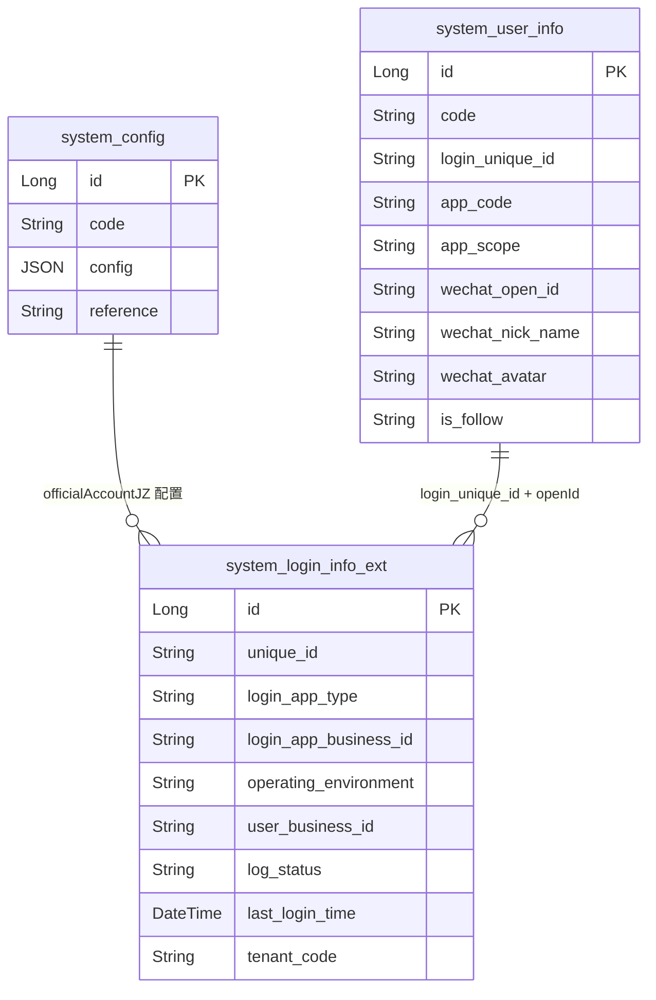
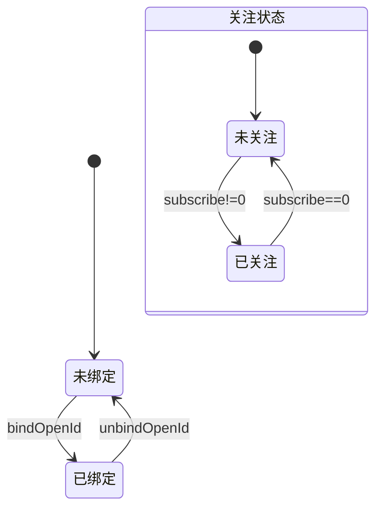

# 外部系统-微信 模块文档

> **文档目的**: 帮助 AI 大模型快速理解本模块业务逻辑和代码结构
> **更新时间**: 2026-01-27

---

## 模块职责

提供与“腾讯微信（公众号/网页授权/JS-SDK）”相关的对接能力，覆盖：
- 网页授权 code 换取 openId/用户信息（供前端进行绑定、或完成微信环境登录）
- 获取 JS-SDK 所需的 jsapi_ticket，并生成签名参数（nonceStr/timestamp/signature）
- 公众号接口配置校验回调（echoStr 原样返回）
- 公众号 access_token / jsapi_ticket 的 Redis 缓存与并发保护（本实现使用本地 ReentrantLock）
- 微信 openId 与系统用户的绑定/解绑、关注状态查询与落库（`system_user_info.is_follow`）
- 发送类目模板消息（如代理人入职/审核相关提醒），由业务侧构造模板报文并调用微信接口发送

边界：本文档聚焦微信对接链路（Controller/Service/Redis/WechatApi/用户绑定表字段）。代理人业务触发哪些模板消息、短信等属于“人员管理-代理人”等业务文档范畴，此处只描述其调用微信能力的方式与关键配置。

## 目录结构

```
lcyf-module-base/
└── lcyf-module-system-api/
    └── src/main/java/com/lcyf/cloud/module/system/api/
        ├── constants/
        │   └── SystemConstants.java
        ├── enums/
        │   ├── auth/login/
        │   │   └── LoginAppConfigEnum.java
        │   └── tencent/
        │       ├── WechatTemplateConfigEnum.java
        │       └── WechatRegisterSuccessConfigEnum.java
        ├── pojo/
        │   ├── cmd/auth/login/wechat/
        │   │   └── LoginWechatCmd.java
        │   └── cmd/auth/user/
        │       └── BindWechatOpenIdCmd.java
        └── rpc/
            └── WechatApi.java

lcyf-module-system/
├── lcyf-module-system-adapter/
│   └── src/main/java/com/lcyf/cloud/module/system/adapter/
│       ├── web/tencent/
│       │   └── WechatController.java
│       ├── web/notify/
│       │   └── TencentNotifyController.java
│       ├── web/auth/
│       │   ├── LoginController.java
│       │   └── UserInfoController.java
│       └── web/account/
│           └── AccountController.java
│
└── lcyf-module-system-biz/
    └── src/main/java/com/lcyf/cloud/module/system/biz/
        ├── config/
        │   ├── WechatOfficialAccountConfig.java
        │   └── WechatTemplateConfig.java
        ├── service/tencent/wechat/
        │   └── IWechatService.java
        ├── service/impl/tencent/wechat/
        │   └── WechatServiceImpl.java
        ├── service/impl/auth/login/
        │   └── SysUserLoginServiceImpl.java
        ├── service/impl/auth/user/
        │   └── UserInfoServiceImpl.java
        ├── infrastructure/entity/auth/user/
        │   └── UserInfoDo.java
        ├── infrastructure/entity/auth/login/
        │   └── LoginInfoExtDo.java
        └── util/
            └── WechatUtil.java
```

## 功能清单

| 功能 | 描述 | 入口 Controller | 核心 Service |
|------|------|-----------------|--------------|
| 获取 jsApiTicket（即展） | 获取 `jsapi_ticket` 并返回前端所需签名参数 | `WechatController.getJsApiTicket()` | `IWechatService.getJsApiTicketJZ()` |
| 获取 openId/用户信息 | 通过微信授权 code 换取用户 openId/昵称/头像 | `WechatController.getWechatUserInfo()` | `IWechatService.getWechatUserInfo()` |
| 公众号接口验证回调 | 微信“接口配置”验证，回显 `echostr` | `TencentNotifyController.officialAccountAuth()` | - |
| 微信登录（toA） | 微信授权登录：已绑定则发 token；未绑定返回微信信息供绑定 | `LoginController.loginWechat()` | `ISysUserLoginService.loginWechat()` |
| 绑定/解绑 openId | 绑定 openId 到用户信息；解绑清空微信字段 | `UserInfoController.wechatBindOpenId()` / `UserInfoController.wechatUnbindOpenId()` / `AccountController.wechatUnbindOpenId()` | `IUserInfoService.wechatBindOpenId()` / `wechatUnbindOpenId()` / `IAccountService.wechatUnbindOpenId()` |
| 查询是否关注公众号 | 调微信接口获取 subscribe 并回写 `system_user_info.is_follow` | `UserInfoController.isFollowJZOfficialAccount()` | `IUserInfoService.isFollowJZOfficialAccount()` |
| 发送模板消息 | 发送类目模板消息（业务侧组装报文） | （无直接 Controller） | `IWechatService.sendWechatTemplateCategoryMsg()` |

## 核心入口文件

### Controller 层

| 文件 | 路径 | 职责 |
|------|------|------|
| `WechatController.java` | `lcyf-module-system/lcyf-module-system-adapter/src/main/java/com/lcyf/cloud/module/system/adapter/web/tencent/WechatController.java` | 微信开放平台相关接口：jsApiTicket、openId/用户信息 |
| `TencentNotifyController.java` | `lcyf-module-system/lcyf-module-system-adapter/src/main/java/com/lcyf/cloud/module/system/adapter/web/notify/TencentNotifyController.java` | 微信回调：公众号接口验证 |
| `LoginController.java` | `lcyf-module-system/lcyf-module-system-adapter/src/main/java/com/lcyf/cloud/module/system/adapter/web/auth/LoginController.java` | 微信环境登录入口（`/toa/login/wechat`） |
| `UserInfoController.java` | `lcyf-module-system/lcyf-module-system-adapter/src/main/java/com/lcyf/cloud/module/system/adapter/web/auth/UserInfoController.java` | openId 绑定/解绑、关注状态查询 |
| `AccountController.java` | `lcyf-module-system/lcyf-module-system-adapter/src/main/java/com/lcyf/cloud/module/system/adapter/web/account/AccountController.java` | 账号通用接口：按 userCode 解绑 openId |

### Service 层

| 文件 | 路径 | 职责 |
|------|------|------|
| `IWechatService.java` | `lcyf-module-system/lcyf-module-system-biz/src/main/java/com/lcyf/cloud/module/system/biz/service/tencent/wechat/IWechatService.java` | 微信对接核心服务：token/ticket、授权用户信息、模板消息发送 |
| `WechatServiceImpl.java` | `lcyf-module-system/lcyf-module-system-biz/src/main/java/com/lcyf/cloud/module/system/biz/service/impl/tencent/wechat/WechatServiceImpl.java` | 实现：缓存 token/ticket，调用 WechatApi，与系统配置/Redis 交互 |
| `UserInfoServiceImpl.java` | `lcyf-module-system/lcyf-module-system-biz/src/main/java/com/lcyf/cloud/module/system/biz/service/impl/auth/user/UserInfoServiceImpl.java` | 用户侧：绑定/解绑 openId，查询关注状态并落库 |
| `SysUserLoginServiceImpl.java` | `lcyf-module-system/lcyf-module-system-biz/src/main/java/com/lcyf/cloud/module/system/biz/service/impl/auth/login/SysUserLoginServiceImpl.java` | 登录侧：微信授权登录，已绑定则发 token 并记录登录扩展 |
| `AccountServiceImpl.java` | `lcyf-module-system/lcyf-module-system-biz/src/main/java/com/lcyf/cloud/module/system/biz/service/impl/account/AccountServiceImpl.java` | 账号侧：按 userCode 解绑 openId |

### Gateway 层

| 文件 | 路径 | 职责 |
|------|------|------|
| （本子域未单独封装 WeChat Gateway） | - | WechatServiceImpl 直接调用 WechatApi + Redis + system_config |

### 实体层

| 文件 | 对应表 | 说明 |
|------|--------|------|
| `UserInfoDo.java` | `system_user_info` | 用户信息：存储 `wechat_open_id` / `wechat_nick_name` / `wechat_avatar` / `is_follow` 等 |
| `LoginInfoExtDo.java` | `system_login_info_ext` | 微信登录扩展：记录登录 app 类型、openId、最后登录时间、登录状态 |

## 核心流程

### 流程1: 获取 jsApiTicket（即展）并生成签名

**触发条件**: 前端需要调用 JS-SDK（如分享/扫一扫等）请求签名参数
**入口**: `WechatController.getJsApiTicket(url)`

```
请求入口
│
├─ 1. Controller
│     └─ WechatController.getJsApiTicket(url)
│         └─ wechatService.getJsApiTicketJZ(url)
│
└─ 2. Service
      └─ WechatServiceImpl.getJsApiTicketJZ(url)
          ├─ 读取公众号配置: system_config[SystemConstants.SYSTEM_CONFIG_WECHAT_OFFICIAL_ACCOUNT_JZ="officialAccountJZ"]
          ├─ 获取基础 token: getWechatToken(SystemConstants.REDIS_KEY_OFFICIAL_ACCOUNT_TOKEN_JZ_PREFIX, config)
          │     ├─ Redis 读: officialAccount:token:JZ:{appId}
          │     ├─ miss: 加锁 wechatOfficialAccountBasicTokenLock
          │     └─ wechatApi.getToken(domain, appId, secret) -> Redis 写入 (expires_in-300)*1000
          ├─ 获取 jsapi_ticket: getOfficialAccountJsApiTicket(token, SystemConstants.REDIS_KEY_OFFICIAL_ACCOUNT_TICKET_JZ_PREFIX, config)
          │     ├─ Redis 读: officialAccount:ticket:JZ:{appId}
          │     ├─ miss: 加锁 wechatOfficialAccountTicketLock
          │     └─ wechatApi.getJsTicket(domain, token) -> Redis 写入 (expires_in-300)*1000
          └─ 生成签名: sha1("jsapi_ticket=...&noncestr=...&timestamp=...&url=...")
```

### 流程2: 微信授权登录（已绑定则返回 token，未绑定返回微信信息）

**触发条件**: 微信环境（toA）使用授权 code 登录
**入口**: `LoginController.loginWechat()`

```
请求入口
│
├─ 1. Controller
│     └─ LoginController.loginWechat(LoginWechatCmd)
│         └─ loginService.loginWechat(cmd)
│
└─ 2. Service
      └─ SysUserLoginServiceImpl.loginWechat(cmd)
          ├─ 获取公众号配置: getWechatOfficialAccountConfig(cmd.getLoginAppConfigCode)
          ├─ 获取微信用户信息: wechatService.getWechatUserInfo(loginAppConfigCode, code)
          ├─ 判断是否已绑定: userInfoService.getByWechatOpenIdAndAppCodeAndAppScope(openId, appCode, appScope)
          ├─ 已绑定:
          │    ├─ doLoginByWechat(...) 生成 Token
          │    └─ saveLoginInfoExt(...) 记录 system_login_info_ext
          └─ 未绑定:
               └─ 返回 openId/昵称/头像，前端引导绑定
```

### 流程3: 绑定 openId + 记录微信登录扩展

**触发条件**: 前端完成授权后，将 openId/头像/昵称绑定到当前登录用户
**入口**: `UserInfoController.wechatBindOpenId()`

```
绑定入口
│
├─ 1. Controller
│     └─ UserInfoController.wechatBindOpenId(BindWechatOpenIdCmd)
│         └─ userInfoService.wechatBindOpenId(cmd, LoginUtil.userCode(), LoginUtil.appCode(), LoginUtil.appScope())
│
└─ 2. Service
      └─ UserInfoServiceImpl.wechatBindOpenId(cmd, userCode, appCode, appScope)
          ├─ 校验用户存在
          ├─ 校验 openId 未被其他用户绑定
          ├─ 更新用户微信字段: system_user_info.wechat_open_id/wechat_avatar/wechat_nick_name
          ├─ 读取公众号配置: system_config[officialAccountJZ]
          └─ 保存登录扩展: sysUserLoginService.saveLoginInfoExt(ENV_WECHAT, config, openId, user)
```

### 流程4: 查询是否关注公众号并回写 is_follow

**触发条件**: 前端查询用户是否关注公众号
**入口**: `UserInfoController.isFollowJZOfficialAccount()`

```
查询入口
│
├─ 1. Controller
│     └─ UserInfoController.isFollowJZOfficialAccount(wechatOpenId)
│         └─ userInfoService.isFollowJZOfficialAccount(wechatOpenId, LoginUtil.appCode(), LoginUtil.appScope())
│
└─ 2. Service
      └─ UserInfoServiceImpl.isFollowJZOfficialAccount(wechatOpenId, loginAppConfigCode, appScope)
          ├─ 读取公众号配置: system_config[officialAccountJZ]
          ├─ 调微信接口: wechatService.getBasicUserInfo(REDIS_KEY_OFFICIAL_ACCOUNT_TOKEN_JZ_PREFIX, config, openId)
          ├─ subscribe!=0 => 关注
          └─ 回写 system_user_info.is_follow（必要时记录数据变更）
```

## 数据模型

### 核心实体关系



### 状态流转



## 依赖关系

### 依赖的模块

| 模块 | 调用方式 | 用途 |
|------|----------|------|
| system_config | `ISystemConfigService.getSystemConfig()` | 读取公众号配置 `officialAccountJZ`、模板配置等 |
| Redis/Redisson | `RedissonObject` | 缓存 access_token、jsapi_ticket |
| Forest HTTP 客户端 | `WechatApi`（Forest 注解接口） | 调用微信开放平台/公众号接口（oauth2/token/ticket/userinfo/template） |
| 密码学摘要 | `DigestUtils.sha1Hex` | 生成 JS-SDK 签名 |

### 被依赖的模块

| 模块 | 调用方式 | 提供能力 |
|------|----------|----------|
| 人员管理/代理人等业务 | 本地 Service 调用 `IWechatService.sendWechatTemplateCategoryMsg` | 发送模板消息通知（如注册成功提醒/审核结果通知） |

## RPC 接口

### 对外提供的接口

| 接口 | 方法 | 用途 |
|------|------|------|
| （本子域未对外提供 RPC） | - | - |

### 调用的外部接口

| 接口 | 方法 | 来源模块 |
|------|------|----------|
| `WechatApi` | `getAuthorizationToken/getAuthorizationUserInfo/getToken/getBasicUserInfo/getJsTicket/sendWechatTemplateCategoryMsg` | `lcyf-module-base/lcyf-module-system-api` |

## 关键设计决策

| 决策点 | 选择 | 原因 |
|--------|------|------|
| token/ticket 缓存 | Redis + 本地锁（ReentrantLock） | 减少调用微信接口频次；避免并发穿透（注意：仅保证单进程并发安全） |
| Redis TTL | `expires_in - 300` 秒 | 预留 5 分钟 buffer，减少边缘过期导致的失败 |
| 用户绑定字段 | `system_user_info.wechat_open_id` 等 | 直接在用户信息表保存绑定关系，供登录/通知等场景使用 |
| 关注状态落库 | `system_user_info.is_follow` | 避免每次都实时调微信查询；同时支持数据变更记录 |

## 扩展指南

| 场景 | 操作步骤 |
|------|----------|
| 接入多个公众号配置 | 1) 在 `system_config` 增加不同公众号的配置 code 2) 扩展 `LoginAppConfigEnum` 的 configCode 映射 3) 调用侧传入对应 loginAppConfigCode |
| 新增模板消息类型 | 1) 在 `system_config` 增加模板配置（如 `WechatTemplateConfig.templateId`）2) 业务侧用 `WechatUtil` 或自建构造器组装 `WechatTemplateCategoryMsgReq` 3) 调用 `IWechatService.sendWechatTemplateCategoryMsg` |
| 改为分布式锁 | 将 `ReentrantLock` 替换为 Redis 分布式锁（需结合部署形态评估） |

## 常见问题

| 问题 | 解决方案 |
|------|----------|
| 为什么偶发获取 token/ticket 超时？ | `WechatServiceImpl` 使用 `tryLock(15s)`，等待超时会抛 `GET_WECHAT_TOKEN_LOCK_TIMEOUT`（并发高时可能触发） |
| 为什么已关注但接口返回未关注？ | 关注状态取自微信接口返回 `subscribe`，若用户取消关注或 openId 不匹配会返回未关注；服务会回写 `system_user_info.is_follow` |
| 解绑 openId 会清理哪些字段？ | 用户侧会清空 `wechat_open_id/wechat_avatar/wechat_nick_name`（见 `UserInfoServiceImpl.wechatUnbindOpenId` 与 `AccountServiceImpl.wechatUnbindOpenId`） |
